# HelioOps: Space Weather Advisories That Operators Can Act On

**HelioOps turns a solar storm into cited, machine verified instructions for aviation, power grid, maritime and telecom operators.** It watches coronagraph imagery for a coronal mass ejection, predicts the GPS error and HF radio blackout that the storm will cause, writes the action list each industry needs, and checks every number in that list against the published rulebooks before a human ever reads it.

**Live product: [helioops.dpdns.org](https://helioops.dpdns.org)**

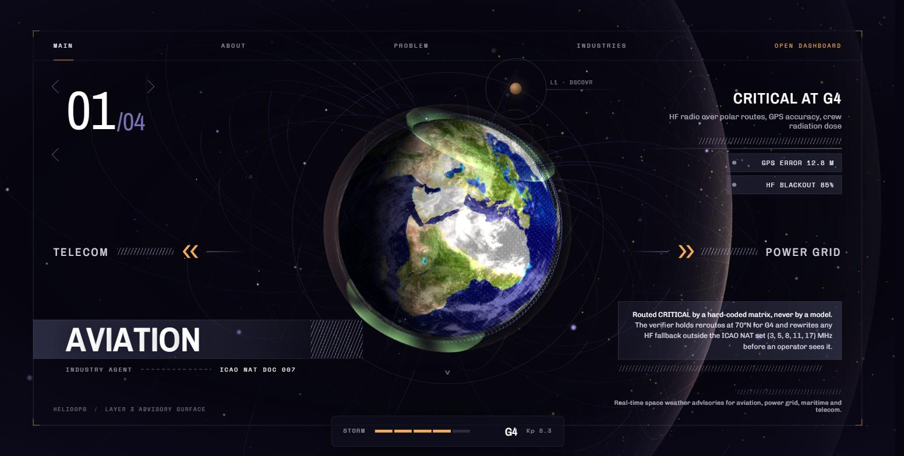

---

## Contents

1. [The 29 hours that nobody uses well](#1-the-29-hours-that-nobody-uses-well)
2. [What HelioOps does](#2-what-helioops-does)
3. [The website, page by page](#3-the-website-page-by-page)
4. [One storm, end to end, inside the console](#4-one-storm-end-to-end-inside-the-console)
5. [The numbers](#5-the-numbers)
6. [How it is built](#6-how-it-is-built)
7. [Where the safety comes from](#7-where-the-safety-comes-from)
8. [What is real and what is synthetic](#8-what-is-real-and-what-is-synthetic)
9. [Run it yourself](#9-run-it-yourself)
10. [API surface](#10-api-surface)
11. [Frequently asked questions](#11-frequently-asked-questions)
12. [Architecture documentation](#12-architecture-documentation)

---

## 1. The 29 hours that nobody uses well

The Sun throws a billion tonnes of magnetised plasma at Earth. Astronomers call it a coronal mass ejection, or CME. Coronagraphs on the CCOR-1 and SOHO spacecraft see it leave the Sun the moment it happens. The plasma then takes between fifteen and sixty hours to cross the ninety three million miles to Earth.

In the storm this project replays, the detector stamps the CME at **2024-10-10 12:34 UTC** and the arrival lands at **2024-10-11 18:00 UTC**. That gives the world **29 hours of warning**, and every hour of it is free. NOAA publishes the alerts. NASA publishes the CME kinematics through the DONKI database. GOES publishes the X-ray flare curve. DSCOVR publishes the solar wind speed and the magnetic field direction at the L1 point, a gravitational parking spot a million miles upstream of Earth.

The data is free and the warning is long. The gap sits at the last mile.

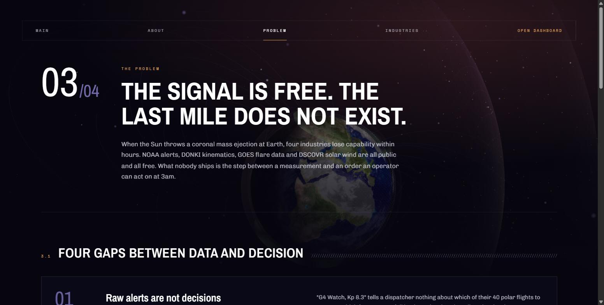

A dispatcher who receives "G4 Watch, Kp 8.3, R3 in progress" learns nothing about which of their forty polar flights to move, or which radio frequency to fall back to. The procedures that answer those questions exist, and they sit inside hundred page PDFs: ICAO NAT Doc 007 for the North Atlantic tracks, NERC TPL-007-4 for transformer protection, the IMO GMDSS manual for distress radio at sea. Nobody reads a hundred page PDF at three in the morning during an event.

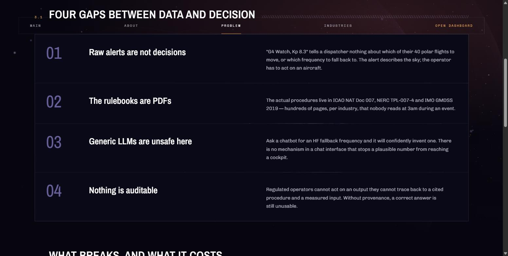

A general purpose chatbot fills that gap with confidence and no accountability. Ask one for an HF fallback frequency and it will invent a plausible number. Nothing in a chat window stops that invented number from reaching a cockpit. Regulated operators also cannot act on an answer they cannot trace back to a cited procedure and a measured input, so even a correct answer arrives unusable.

HelioOps closes all four gaps in one pipeline.

---

## 2. What HelioOps does

HelioOps runs a storm through five layers and hands back an action list per industry.

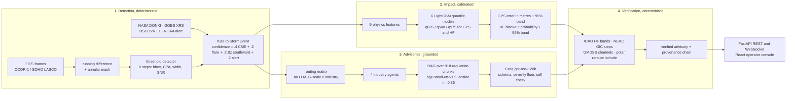

Two of those layers refuse to use a language model at all. The layer that decides **how bad the storm is for each industry** reads a fixed matrix built from the NOAA space weather scales. The layer that decides **whether the written advice is legal** parses every number the model produced and compares it against the regulation. The language model writes prose in the middle, between two walls of deterministic code.

---

## 3. The website, page by page

### Home

The landing page puts the storm on a 3D Earth and lets a visitor step through the four industries. Each slide names the capability at risk, the predicted GPS error and HF blackout, and the rule that governs the response.


### Problem

The problem page states the case in one line and then breaks it into the four gaps between a measurement and a decision.


### Industries

The industries page explains what each of the four sectors receives: a numbered action list with a time window and a cited source document, not a paragraph to interpret under pressure.

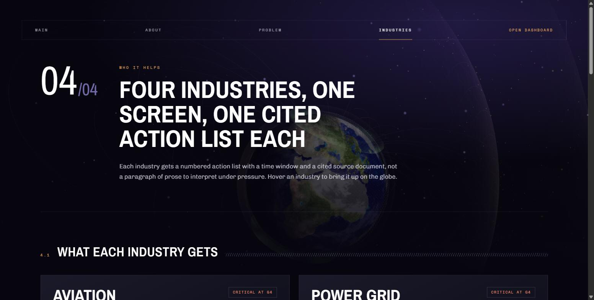

Each card names the guesswork the system removes and the exact verifier rule that guards it. Aviation reroute latitude holds at 78 degrees north for G3, 70 north for G4 and 60 north for G5. Grid operating steps match against TPL-007-4 Appendix B keywords or get blocked.

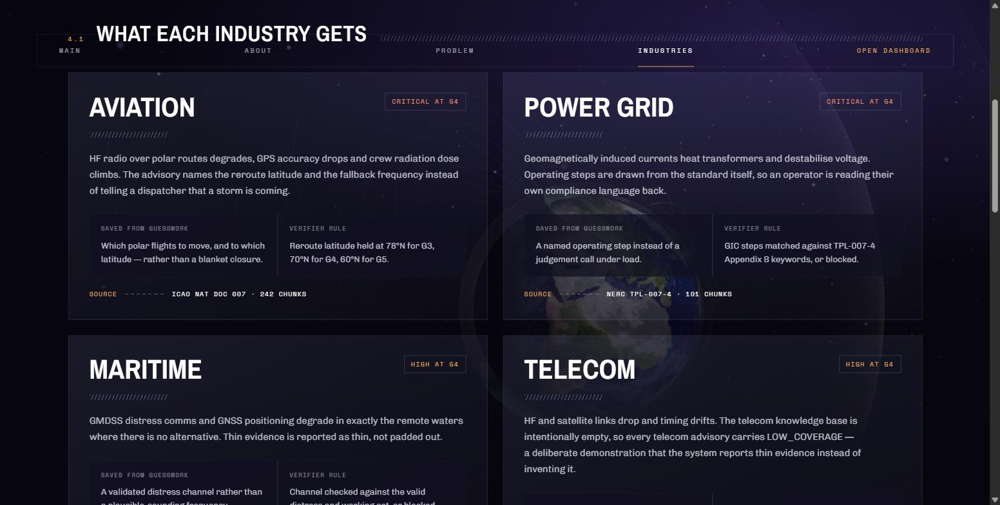

### About

The about page states the shape of the system in five figures: four industries, five pipeline stages, six step provenance, ten guardrail layers, and zero random number generation in detection.

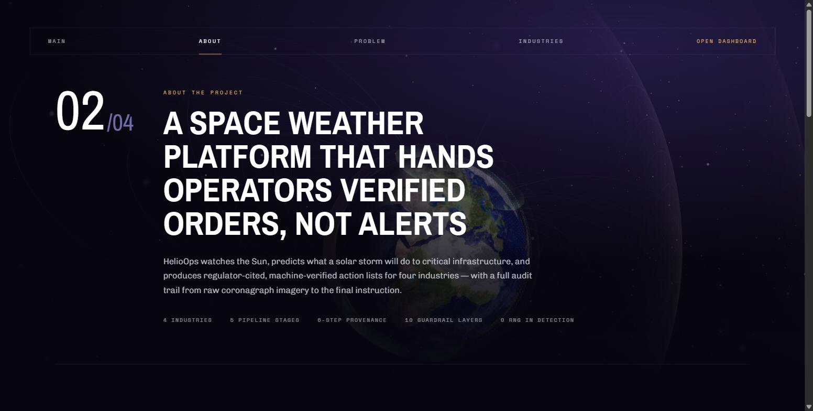

---

## 4. One storm, end to end, inside the console

The console lives at [helioops.dpdns.org/dashboard](https://helioops.dpdns.org/dashboard). Everything below comes from a single live run of the October 2024 G4 storm, captured while writing this document.

### 4.1 The pre-flight check

Press Run and HelioOps first tells you what the run will do before it does it. The pre-flight check reads the caches on disk and reports what is missing, what disagrees, and how long the run will take.

In this capture it raised one warning and two notes. The warning says the run will replay canned data because no preprocessed coronagraph frames sit in the container. The two notes say the GOES flare cache and the DSCOVR solar wind cache are absent, so the run will attempt a live fetch and fall back to documented defaults if that fetch fails.

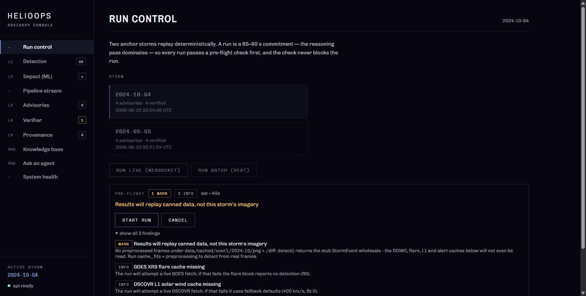

The check never blocks the run. It tells the truth and hands the decision to the operator.

### 4.2 Run control

Run control lists the two anchor storms that replay deterministically, October 2024 at G4 and May 2024 at G5. Each shows how many advisories the last run produced and when it produced them. One button streams the run live over a WebSocket, the other posts it as a single REST call.

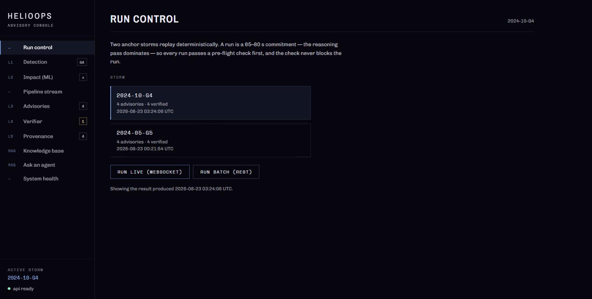

### 4.3 The pipeline stream

Press Start run and every stage reports itself as it happens. The stream below shows the four agents finishing, the maritime advisory arriving with a `HALLUCINATION_DETECTED` and a `CITATION_GAP` flag attached, the verifier rejecting a reroute latitude of 80 degrees north and correcting it to 70, the GMDSS frequency checks passing, and the run closing with four advisories.

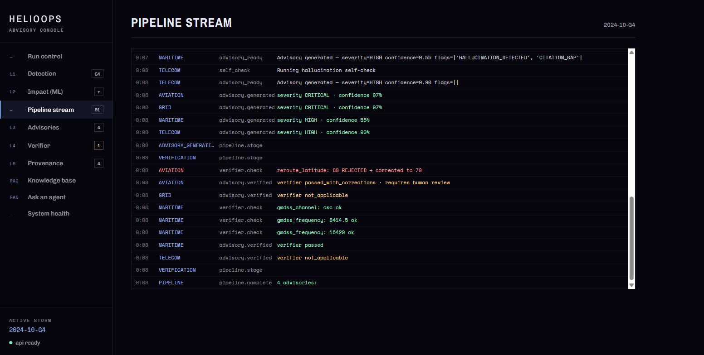

The run finished in **8 seconds**, start to verified output. The console reserves a 65 to 80 second budget because the model reasoning pass dominates the total under load.

### 4.4 Layer 1, detection

In plain terms, this layer looks at pictures of the Sun and finds the explosion.

The detector subtracts each coronagraph frame from the one before it, masks out the occulter disc that blocks the Sun itself, and hunts for the brightest connected blob in the ring that remains. It measures the blob's bounding box, its central position angle, its angular width and its signal to noise ratio. It then fuses that visual result with the NASA DONKI kinematics, the GOES flare class and the DSCOVR solar wind reading into one storm record.

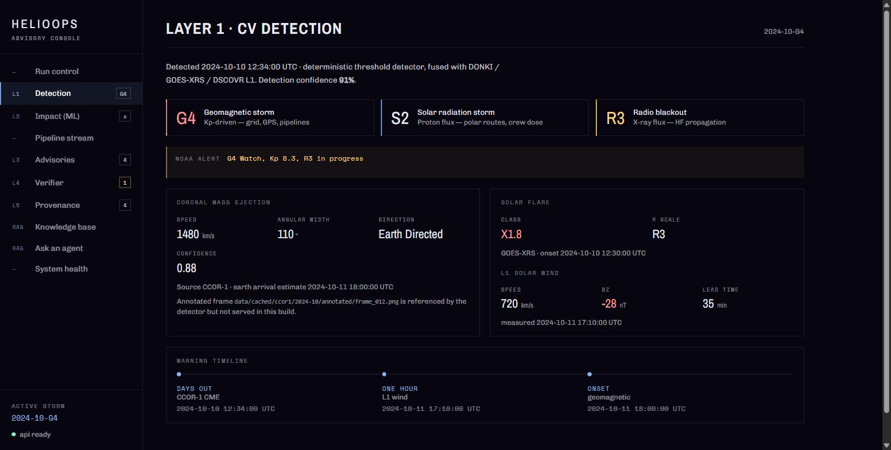

The captured storm reads: CME at **1480 km/s**, **110 degrees** wide, Earth directed, visual confidence **0.88**. Flare class **X1.8**, radio blackout scale **R3**. Solar wind at **720 km/s** with the interplanetary magnetic field pointing **28 nT southward**, which is the orientation that lets the storm couple into Earth's magnetosphere instead of sliding past it. Fused detection confidence lands at **91 percent**.

The detector uses no trained weights and no random numbers. The same frames produce the same bytes every single run.

### 4.5 Layer 2, impact prediction

In plain terms, this layer answers "how much will my GPS drift, and will my radio work".

Six LightGBM models run at once. Two predict the middle of the range, four predict the edges. That design is called quantile regression, and it matters because the model predicts the bounds directly rather than inferring an error bar after the fact.

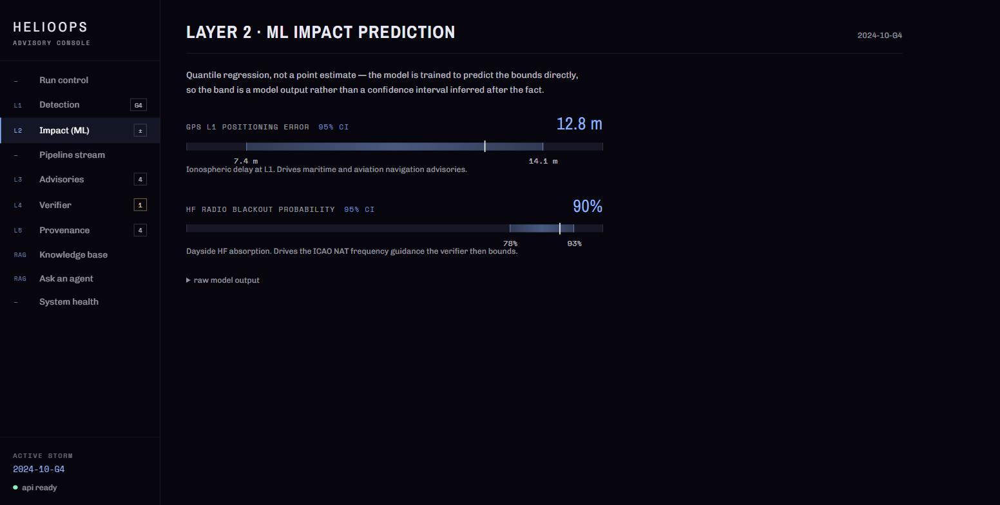

The captured storm predicts **12.8 m of GPS L1 positioning error**, with a 95 percent interval running from **7.4 m to 14.1 m**, and a **90 percent chance of HF radio blackout**, with a 95 percent interval of **78 to 93 percent**. Ionospheric delay drives the first number and dayside absorption drives the second. Both numbers feed the advisory layer directly.

### 4.6 Layer 3, the advisories

In plain terms, this layer writes the orders, and it quotes its sources.

A fixed matrix routes the storm first. At G4, aviation and grid come out CRITICAL, maritime and telecom come out HIGH. No language model touches that decision. Each triggered industry then gets an agent that retrieves the relevant regulation, writes a numbered action list, and cites the document behind every line.

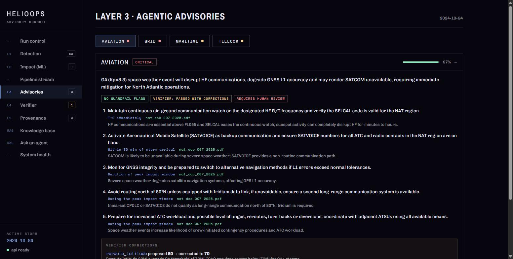

The aviation advisory arrived at **97 percent confidence** with **no guardrail flags** and five actions, each carrying a time window and a source. Action one keeps a continuous air to ground watch on the assigned HF frequency and verifies the SELCAL code. Action two activates satellite voice as backup within 30 minutes of storm arrival. Action four avoids routing north of 80 degrees unless an Iridium data link is fitted.

Read the bottom of that panel closely. The verifier corrected the reroute latitude the model proposed.

### 4.7 Layer 4, the verifier

In plain terms, this layer is the rulebook that outranks the model.

The verifier parses the numbers out of every action line and compares them against the published limits. It ran four deterministic checks across the four advisories in this storm and corrected one value.


The model proposed a reroute at **80 degrees north**. ICAO holds G4 storms to routes below **70 degrees north**. The verifier struck the model's number, enforced 70, recorded the reason, and marked the advisory `PASSED_WITH_CORRECTIONS` and `REQUIRES HUMAN REVIEW`. The three maritime GMDSS values, distress channel `dsc` and frequencies `8414.5` and `8291` kHz, matched the valid sets and passed unchanged.

This is the single most important screen in the product. A language model wrote an unsafe number, and code caught it before an operator saw it.

### 4.8 Layer 5, provenance

In plain terms, this layer is the receipt.

Every advisory carries a six step chain that links the final instruction back to the raw feed it came from. A regulated operator has to be able to produce that trail, and HelioOps produces it automatically.

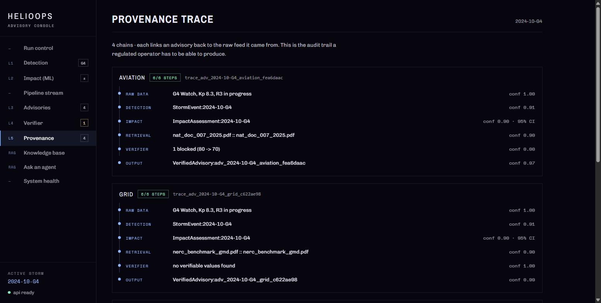

The aviation chain reads: raw NOAA alert at confidence 1.00, detection at 0.91, impact assessment with its 95 percent interval, retrieval from `nat_doc_007_2025.pdf` at 0.90, verifier reporting one blocked value with the 80 to 70 correction, and a verified advisory at 0.97. All four chains completed **6 of 6 steps**.

### 4.9 Ask an agent

In plain terms, this is a chat window that refuses to guess.

Each industry agent answers from the rulebooks it retrieves, and it says so plainly when the knowledge base does not cover the question. The screenshot below holds both behaviours in one frame.

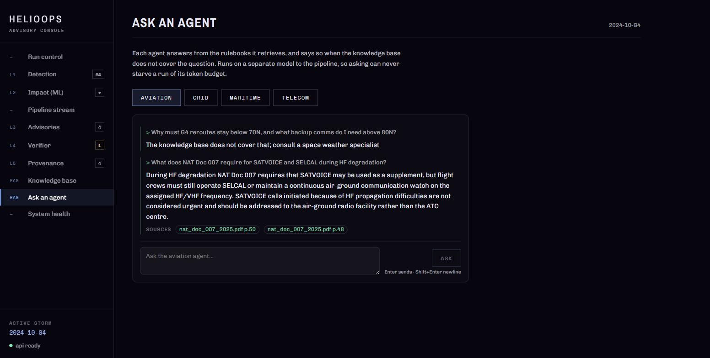

The first question mixed two topics and the agent declined it rather than inventing a bridge between them. The second question sat squarely inside ICAO NAT Doc 007, and the agent answered it in full with page level citations to **p.50** and **p.48**. The Ask feature runs on a separate model from the pipeline, so asking a question can never starve a running storm of its token budget.

### 4.10 System health

The health tab polls the backend every 15 seconds and shows one pill per dependency: the API itself, the detection layer, the six machine learning checkpoints, the GenAI module, and the knowledge base.

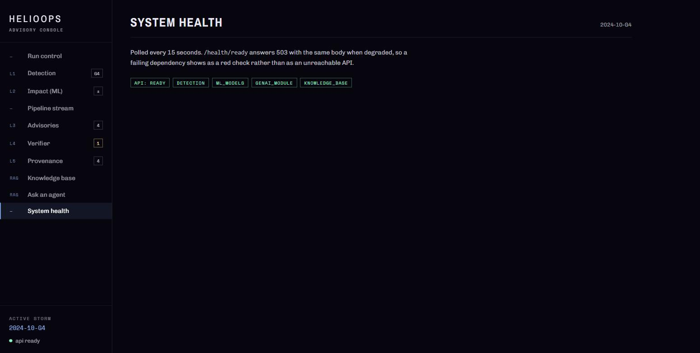

The readiness endpoint answers HTTP 503 with the same JSON body it uses for 200 when a dependency degrades. That design choice makes a failing dependency render as one red pill instead of an unreachable API, so an operator can see exactly which layer went down.

---

## 5. The numbers

| Measure | Value |
|---|---|
| Warning window in the captured storm | 29 hours from detection to arrival |
| Full pipeline run, live capture | 8 seconds, 51 streamed events |
| Advisories produced and verified | 4 of 4 |
| Fused detection confidence | 91 percent |
| Aviation advisory confidence | 97 percent |
| Provenance completeness | 6 of 6 steps on all 4 chains |
| Unsafe values caught by the verifier | 1 of 1 present |
| GPS L1 error prediction | 12.8 m, 95 percent interval 7.4 to 14.1 m |
| HF blackout prediction | 90 percent, 95 percent interval 78 to 93 percent |
| Prediction interval coverage, GPS | 95.9 percent against a nominal 95 percent |
| Prediction interval coverage, HF | 94.2 percent against a nominal 95 percent |
| Regulation corpus | 918 chunks across 5 collections |
| Corpus breakdown | aviation 242, maritime 214, telecom 195, impact matrix 166, grid 101 |
| Embedding model | BAAI/bge-small-en-v1.5, 384 dimensions |
| Machine learning checkpoints | 6 LightGBM quantile models, 470 KB total |
| Backend test suite | 284 tests |
| Random number generation in detection | 0 |

---

## 6. How it is built

### The stack

| Layer | Technology |
|---|---|
| API | Python 3.12, FastAPI, one process, REST plus WebSocket |
| Computer vision | NumPy, OpenCV, Astropy, SunPy, deterministic thresholding |
| Machine learning | LightGBM quantile regression, Optuna tuning, 15 trials per quantile |
| Retrieval | ChromaDB, sentence-transformers, tiktoken chunking at 512 tokens with 64 overlap |
| Generation | Groq, `openai/gpt-oss-120b` at temperature 0.1, `openai/gpt-oss-20b` as the auditor |
| Frontend | Vite, React 18, three.js, three dependencies total |
| Hosting | Hugging Face Space for the API, Vercel for the console, direct CORS between them |

### The repository

```
backend/          FastAPI monolith, one process serves everything
  cv/             layer 1: data_ingestion, image_threshold_algorithm, storm_event_generator
  ml/             layer 2: 6 quantile checkpoints plus the training pipeline
  genai/          layers 3 and 4: RAG advisories, guardrails, deterministic verifier
  embeddings/     the ChromaDB corpus build, run offline, output committed
  adapters/       the only import edge between the pipeline and the layers
  data/           regulation PDFs, the vector store, cached storm inputs
  tests/          284 tests
frontend/         Vite and React 18 console plus the marketing pages
deployment/       Dockerfiles, compose, Caddy, Terraform, Supabase schema
assets/           the screenshots in this document
```

### The one architectural rule

`backend/pipeline.py` never imports the CV, ML or GenAI layers directly. It calls four adapter objects that it owns, and `app.py` imports those same four objects. Exactly one of each exists in the process. Swapping a layer means writing one adapter, and the pipeline never notices.

---

## 7. Where the safety comes from

Ten guardrail layers stand between the model and the operator. Nine of them run without a language model at all.

1. **The routing matrix sets the floor.** G-scale times industry produces the severity, and it comes from the NOAA scales.
2. **Severity clamps upward only.** A model that reads a G5 as MEDIUM is wrong, so HelioOps raises it to the matrix floor and flags the mismatch. Under reporting is the direction that hurts people. The model stays free to raise severity above the floor because it sees storm specifics the matrix cannot.
3. **Schema validation runs on every generation.** A malformed advisory feeds its own errors back into the next attempt, up to three attempts.
4. **Citations get verified against the retrieved text.** HelioOps matches each reference to the chunks it actually retrieved. An unmatched citation costs confidence.
5. **A second model audits the first.** The self check reads the advisory against its own retrieved context and flags hallucination.
6. **A flag costs confidence.** A hallucination flag subtracts 0.25, so a flagged advisory can never outscore a clean one on the same screen.
7. **The verifier enforces the regulation.** ICAO HF bands, NERC GIC steps, GMDSS channels and polar reroute latitudes all get parsed and checked.
8. **Retrieval failure stays loud.** An empty collection logs a warning instead of quietly producing an ungrounded advisory that looks identical to a grounded one.
9. **Exhausted agents escalate.** When every attempt fails, HelioOps emits a valid ESCALATE_TO_SPECIALIST advisory. The pipeline never returns nothing and never returns silence.
10. **Provenance ships with the output.** Six steps, per advisory, every run.

---

## 8. What is real and what is synthetic

Credibility depends on this section being blunt.

**The detection layer is real and deterministic.** It runs real threshold computer vision over real coronagraph frames and fuses real NASA DONKI records. The container in the live deployment ships without the preprocessed image caches because those files are large, so the hosted demo replays a committed storm record. Pre-flight says exactly that, in those words, before every run.

**The impact layer trains on synthetic storms.** The generator builds 4,800 rows from physics coupling functions with a fixed seed, and the six models learn that function back. The prediction intervals are genuinely calibrated at 95.9 and 94.2 percent coverage. The R squared measures rule recovery on generated data, and it does not measure forecast skill against nature. The real data track was deleted from this repository because no public dataset supplies the labels it needed in the form it needed them.

**The advisory layer is real.** It retrieves from 918 chunks of genuine ICAO, NERC, ITU and IMO text and cites page numbers back into those documents.

**The verifier is real.** Its limits come from the standards themselves, and the screenshot in section 4.7 shows it overruling the model on a live run.

**Two of the four external feeds serve the wrong epoch.** The NOAA real time solar wind and GOES X-ray endpoints publish only the current moment and accept no date parameter, so a cached copy holds the day it was fetched rather than the day of the storm. NASA DONKI is the one external source that serves 2024. Pre-flight detects the mismatch and withholds those two feeds from the cross source comparison rather than reporting a false disagreement between instruments.

---

## 9. Run it yourself

```bash
# Backend, API on port 8000
pip install -r backend/requirements-dev.txt
uvicorn backend.app:app --reload

# Frontend, console on port 3000, proxied to the API
cd frontend && npm ci && npm run dev

# Or the whole stack in containers
docker compose -f deployment/docker-compose.yml up --build
```

Run every command from the repository root with `PYTHONPATH=.`. Copy `.env.example` to `.env` and set `GROQ_API_KEY`. Without that key the pipeline still runs detection and impact prediction, and it reports the missing key as a pre-flight finding.

```bash
curl -X POST localhost:8000/api/detect/2024-10-G4
curl -s localhost:8000/health/ready | python -m json.tool
```

Quality gates:

```bash
pytest backend/tests -q                    # 284 tests
ruff check backend/ --ignore=E501,F403,E402
python backend/ml/03_anchor_test.py        # physics gate, exits non-zero on failure
cd frontend && npm test
```

---

## 10. API surface

| Method | Path | Purpose |
|---|---|---|
| POST | `/api/detect/{storm_id}` | run the full five layer pipeline |
| GET | `/api/preflight/{storm_id}` | report what a run will do before it runs |
| GET | `/api/storms` | list the replayable storms |
| GET | `/api/result/{storm_id}` | read back the last completed run |
| GET | `/api/advisory/{advisory_id}` | one advisory with its provenance chain |
| POST | `/api/ask` | grounded follow up question against an advisory |
| GET | `/api/kb/sources` | list the source documents |
| GET | `/api/kb/source/{filename}` | open a cited document |
| WS | `/ws/stream` | live stage, agent, advisory and verifier events |
| GET | `/health`, `/health/live`, `/health/ready`, `/metrics` | probes and counters |

---

## 11. Frequently asked questions

**What is a coronal mass ejection?**
A coronal mass ejection is a cloud of magnetised plasma that the Sun throws into space. When one hits Earth it compresses the magnetosphere, drives currents through the ionosphere and the ground, and degrades satellite navigation, high frequency radio and power transmission.

**How much warning does a solar storm give?**
Light from the flare arrives in 8 minutes. The plasma cloud takes fifteen to sixty hours. The storm replayed in this project gave 29 hours between detection and arrival.

**What is the G scale?**
NOAA rates geomagnetic storms from G1 minor to G5 extreme, driven by the planetary K index. G4 corresponds to Kp 8.3 and G5 to Kp 9. HelioOps uses that scale as the authoritative severity floor for every industry.

**Why does a solar storm break GPS?**
Satellite navigation signals cross the ionosphere, and a storm changes the electron content of that layer. The changed delay shifts the computed position. HelioOps predicts that shift in metres with an explicit uncertainty band.

**Why does HF radio go down?**
High frequency radio bounces off the ionosphere to reach beyond the horizon. X-ray flux from the flare increases absorption on the sunlit side, and the signal dies in the absorbing layer instead of reflecting. Polar and North Atlantic aviation depends on that path.

**Who uses this?**
Four sectors: aviation dispatch and North Atlantic track planning, power grid operations, maritime distress communications, and telecom timing and satellite links.

**Does an AI write the safety instructions?**
An AI writes the prose. A fixed matrix sets the severity and deterministic code checks every number against the published standard. Section 4.7 shows that code overruling the model on a live run.

**What stops the AI from hallucinating a radio frequency?**
Four separate mechanisms: retrieval that grounds the answer in the regulation, citation matching against the retrieved text, a second model auditing the first, and a deterministic verifier that rejects any value outside the published set.

**Can I trace an advisory back to its source?**
Yes. Every advisory carries a six step provenance chain from the raw NOAA alert through detection, impact, retrieval and verification to the final output, with a confidence value at each step.

**Is the demo live?**
Yes. The console runs at [helioops.dpdns.org](https://helioops.dpdns.org) and the API answers at the Hugging Face Space behind it. Every screenshot in this document comes from that deployment.

---

## 12. Architecture documentation

Each layer documents itself, next to the code it describes.

| Document | Covers |
|---|---|
| [`backend/architecture.md`](backend/architecture.md) | API surface, the five pipeline stages, adapters, pre-flight, health, WebSocket contract |
| [`backend/cv/architecture.md`](backend/cv/architecture.md) | the eight detector steps, fusion weights, the fallback ladder |
| [`backend/ml/architecture.md`](backend/ml/architecture.md) | the nine feature vector, quantile calibration, the physics gate |
| [`backend/genai/architecture.md`](backend/genai/architecture.md) | routing matrix, agent loop, guardrails, verifier rules, model transport |
| [`backend/embeddings/architecture.md`](backend/embeddings/architecture.md) | corpus, chunking, collections, vector store discipline |
| [`frontend/architecture.md`](frontend/architecture.md) | console run flow, API base wiring, conventions |
| [`deployment/architecture.md`](deployment/architecture.md) | which Dockerfile builds where, and why each detail matters |
| [`AGENTS.md`](AGENTS.md) | project memory: current state, decisions, gotchas, changelog |
| [`CLAUDE.md`](CLAUDE.md) | how a coding agent should navigate this repository |

---

**HelioOps** turns 29 hours of free warning into four cited, verified, auditable action lists. Detection is deterministic, severity is deterministic, verification is deterministic, and the language model works between two walls that do not move.
