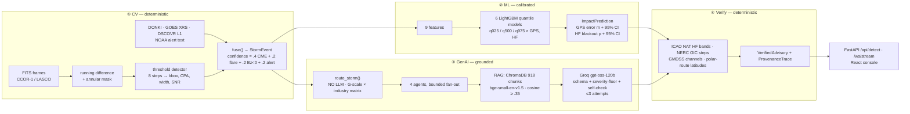

<!-- Front matter note: this block IS the Space config, so do not "tidy" it.
     sdk was `docker` with `app_port: 7860`. Docker Spaces now require a paid
     plan, so the API is served through the Gradio SDK instead — see app.py.
     `app_port` is a Docker-only key and does not apply here; a Gradio Space
     always serves on 7860. `sdk_version` is intentionally omitted so the Space
     uses its own pinned gradio rather than one this repo guesses wrong. -->


# HelioOps

**From coronagraph pixels to a cited, machine-verified operator instruction — in one pipeline.**

A solar storm is visible in coronagraph imagery ~15–60 hours before its effects reach Earth.
That window is spent on translation: someone has to turn "a CME left the Sun at 1332 km/s"
into "reroute NAT track B, expect HF loss on 8 MHz". HelioOps does that end to end and
refuses to guess — every advisory is retrieved from a regulatory corpus, cited, and checked
against published operational limits by code, not by a model.

Two anchor storms replay deterministically: **2024-10-G4** (CCOR-1) and **2024-05-G5** (SOHO/LASCO).

---

## The pipeline



The two stages that decide **how bad it is** and **whether the advice is legal** use no LLM.
The model writes prose between two deterministic walls.

## Quickstart

```bash
# Backend — API on :8000
pip install -r backend/requirements-dev.txt
uvicorn backend.app:app --reload

# Frontend — console on :3000 (proxies to :8000)
cd frontend && npm ci && npm run dev

# Or the whole stack
docker compose -f deployment/docker-compose.yml up --build
```

Everything runs from the repo root with `PYTHONPATH=.`. Copy `.env.example` → `.env` and set
`GROQ_API_KEY`; without it the pipeline still runs through CV + ML and reports the gap.

```bash
curl -X POST localhost:8000/api/detect/2024-10-G4   # 65-80s: the reasoning pass dominates
curl -s localhost:8000/health/ready | python -m json.tool
```

## Repository map

```
backend/          FastAPI monolith — one process serves everything
  cv/             ① detection: data_ingestion → image_threshold_algorithm → storm_event_generator
  ml/             ② impact: 6 LightGBM quantile checkpoints + synthetic training pipeline
  genai/          ③ + ④ RAG advisories, guardrails, deterministic verifier
  embeddings/     ChromaDB corpus build (offline; output committed)
  adapters/       the only import edge between pipeline.py and the layers
  data/           regulatory PDFs + chroma_db + cached storm inputs
  tests/          284 tests
frontend/         Vite + React 18 SPA: marketing pages + live operator console
deployment/       Dockerfiles, compose, Caddy, Terraform, Supabase schema
```

## Architecture docs

Each layer documents itself. Read the one you are touching:

| Doc | Covers |
|---|---|
| [`backend/architecture.md`](backend/architecture.md) | API surface, 5-stage pipeline, adapters, pre-flight, health, WS contract |
| [`backend/cv/architecture.md`](backend/cv/architecture.md) | detector steps, fusion weights, the fallback ladder |
| [`backend/ml/architecture.md`](backend/ml/architecture.md) | feature vector, quantile calibration, the anchor gate |
| [`backend/genai/architecture.md`](backend/genai/architecture.md) | routing matrix, agent loop, guardrails, verifier rules, LLM transport |
| [`backend/embeddings/architecture.md`](backend/embeddings/architecture.md) | corpus, chunking, collections, Chroma client discipline |
| [`frontend/architecture.md`](frontend/architecture.md) | console run flow, API base wiring, conventions |
| [`deployment/architecture.md`](deployment/architecture.md) | which Dockerfile builds where, and why each detail is load-bearing |
| [`AGENTS.md`](AGENTS.md) | project memory: current state, decisions log, gotchas, changelog |

## API surface

| Method | Path | Purpose |
|---|---|---|
| POST | `/api/detect/{storm_id}` | run the full pipeline |
| GET | `/api/preflight/{storm_id}` | what a run will do, before it does it |
| GET | `/api/storms` · `/api/result/{id}` · `/api/advisory/{id}` | replay + read back |
| POST | `/api/ask` | grounded follow-up chat against an advisory |
| GET | `/api/kb/sources` · `/api/kb/source/{file}` | open the cited document |
| WS | `/ws/stream` | live stage / agent / advisory / verifier events |
| GET | `/health` · `/health/live` · `/health/ready` · `/metrics` | probes and counters |

## Safety engineering

- **Severity is clamped upward, never down.** A model that reads a G5 as MEDIUM is wrong;
  the NOAA-derived matrix is the floor. Under-reporting is the dangerous direction.
- **Retrieval failure is loud.** An empty collection logs a warning rather than quietly
  producing an ungrounded advisory that looks identical to a grounded one.
- **Citations are verified against the retrieved chunks**, not trusted from the model.
- **A hallucination flag costs confidence** (−0.25), so a flagged advisory can never
  outscore a clean one.
- **Nothing fails to silence.** Every CV step has a fallback, ML degrades to a conservative
  interval, and an exhausted agent emits an explicit ESCALATE_TO_SPECIALIST advisory.

## Maturity — stated plainly

- CV detection is deterministic and real; on a fresh clone the imagery caches are gitignored,
  so `detect()` replays a committed stub and pre-flight says so (`cv_stub_replay`).
- The ML layer is trained on **synthetic** storms. Intervals are measurably calibrated
  (PICP 95.9% GPS / 94.2% HF); R² measures rule recovery, not forecast skill. The real-data
  track was deleted — it was permanently blocked on labels no public dataset supplies.
- NOAA's L1 and GOES XRS endpoints are real-time only, so those caches hold the wrong epoch
  and pre-flight withholds them from the cross-source rules rather than reporting a false
  disagreement. DONKI is the one external source that serves 2024.

## Quality gates

```bash
pytest backend/tests -q                              # 284 tests
ruff check backend/ --ignore=E501,F403,E402
python backend/ml/03_anchor_test.py                  # physics gate, exits 1 on failure
cd frontend && npm test
```
