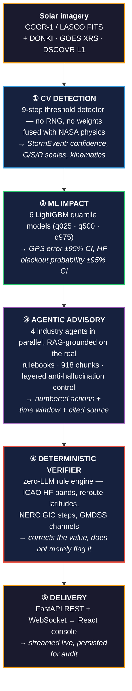
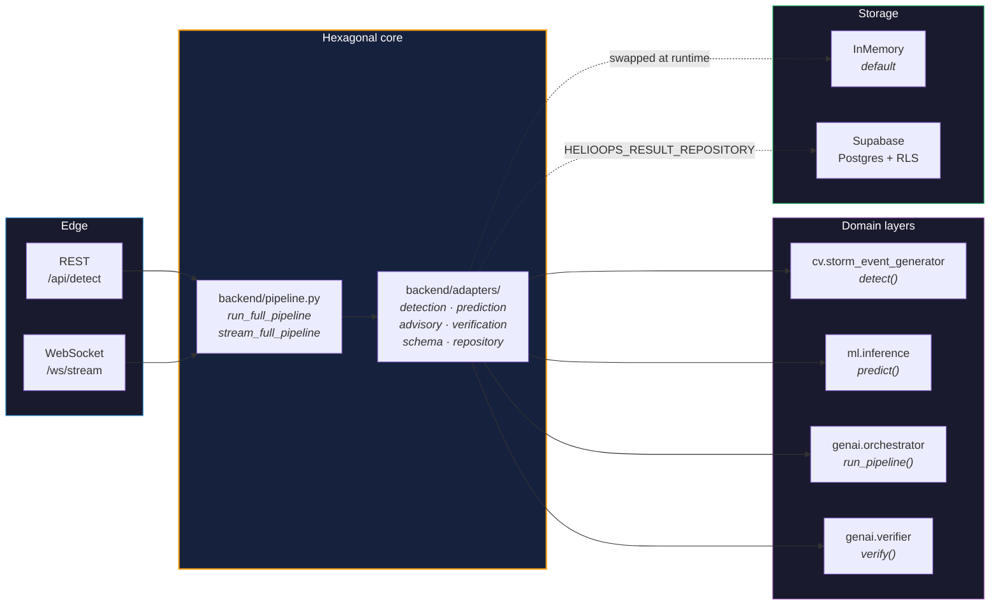
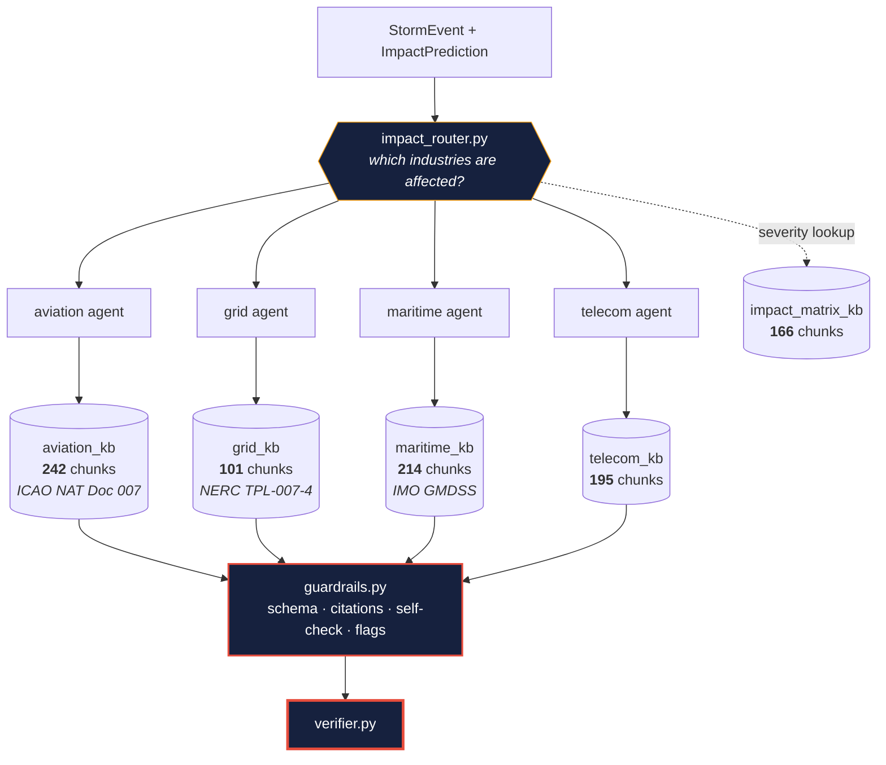
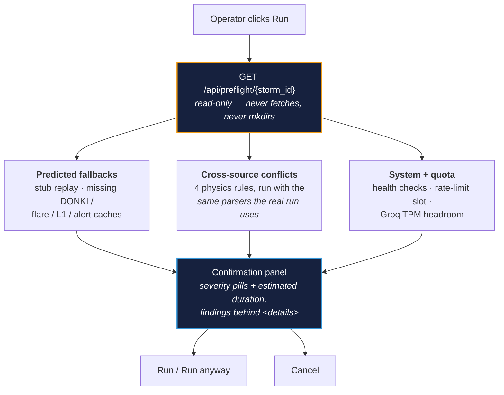
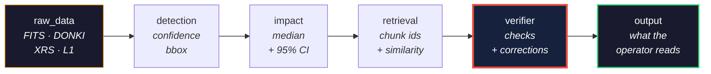
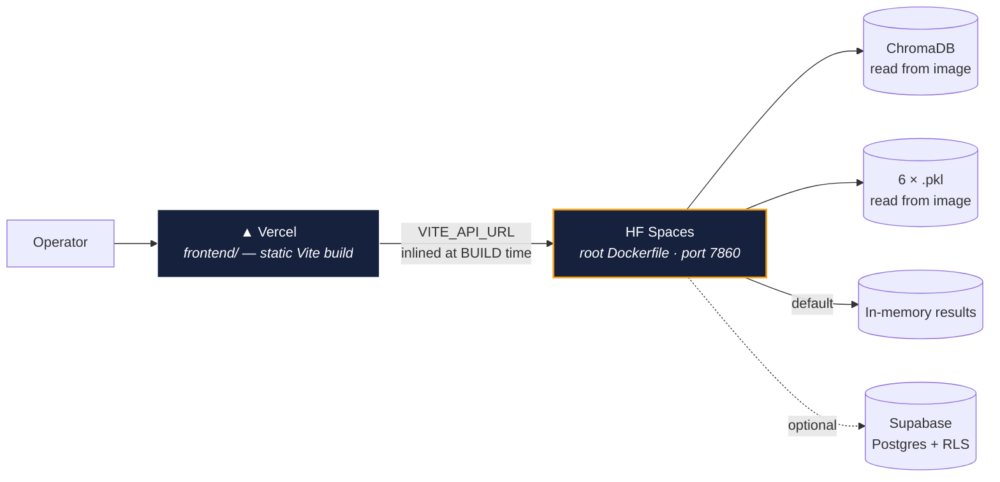

<!-- Front matter note: this block IS the Space config, so do not "tidy" it.
     sdk was `docker` with `app_port: 7860`. Docker Spaces now require a paid
     plan, so the API is served through the Gradio SDK instead — see app.py.
     `app_port` is a Docker-only key and does not apply here; a Gradio Space
     always serves on 7860. `sdk_version` is intentionally omitted so the Space
     uses its own pinned gradio rather than one this repo guesses wrong. -->


<div align="center">

# HelioOps

### From coronagraph pixels to a cited, machine-verified operator instruction — in one pipeline.

**A space-weather operations platform that watches the Sun, predicts what a solar storm will do to
critical infrastructure, and hands operators regulator-cited action lists with a full audit trail.**

<br/>

[](https://python.org)
[](https://fastapi.tiangolo.com)
[](https://react.dev)
[](https://lightgbm.readthedocs.io)
[](https://trychroma.com)
[](https://groq.com)

[](#quality-gates)
[](#quality-gates)
[](#the-pipeline)
[](#deployment)
[](#cost-profile)

<br/>

`POST /api/detect/2024-10-G4` → **5 stages · 4 industries · 918 grounded chunks · 6-step provenance**

</div>

---

## The problem

When the Sun throws a coronal mass ejection at Earth, four industries lose capability within hours.

| Industry | What breaks | Operational consequence |
|---|---|---|
| **Aviation** | HF radio over polar routes, GPS accuracy, crew radiation dose | Polar tracks close; flights reroute or cancel |
| **Power grid** | Geomagnetically induced currents in transformers | Transformer heating, voltage instability, blackout risk |
| **Maritime** | GMDSS distress comms, GNSS positioning | Degraded safety-of-life comms in remote waters |
| **Telecom** | HF / satellite links, timing signals | Link outages, timing drift |

The raw signal is already free — NOAA/SWPC alerts, NASA DONKI kinematics, GOES X-ray flares, DSCOVR
solar wind at L1. **The last mile is what does not exist:**

```
X  "G4 Watch, Kp 8.3"          ->  tells a dispatcher nothing about which of 40 polar flights to move
X  The rulebooks are PDFs      ->  ICAO NAT Doc 007, NERC TPL-007-4, IMO GMDSS - nobody reads them at 3am
X  Generic LLMs invent numbers ->  a wrong HF frequency in an aviation advisory is a safety incident
X  Nothing is auditable        ->  regulated operators cannot act on output they cannot trace
```

---

## The pipeline

Five stages. **Deterministic where safety demands it, generative only where language is needed.**



> **Every advisory that reaches an operator carries a 6-step provenance trace:**
> `raw_data → detection → impact → retrieval → verifier → output`

---

## Quickstart

```bash
# ── Backend ──────────────────────────────────────────────
pip install -r backend/requirements-dev.txt    # requirements.txt alone = serving only
cp .env.example .env                           # set GROQ_API_KEY
PYTHONPATH=. uvicorn backend.app:app --reload  # API on :8000

# ── Frontend ─────────────────────────────────────────────
cd frontend && npm ci && npm run dev           # console on :3000 (proxies /api + /ws to :8000)

# ── Or the whole stack in containers ─────────────────────
docker compose -f deployment/docker-compose.yml up --build
```

**Fire a storm:**

```bash
curl -X POST localhost:8000/api/detect/2024-10-G4   # 65-80s end to end - the LLM pass dominates
curl localhost:8000/health/ready                    # readiness asserts the knowledge base holds chunks
```

Two anchor storms replay deterministically: **`2024-10-G4`** and **`2024-05-G5`**.

---

## Repository map

Three folders. One deployable unit.

```
HelioOps/
├── backend/                        FastAPI monolith — all four layers, one process
│   ├── app.py                      routes · CORS · middleware · WebSocket manager
│   ├── pipeline.py                 5-stage orchestration; owns the adapter singletons
│   ├── paths.py                    every runtime path — never resolved from cwd
│   ├── health.py                   3-tier health + Prometheus /metrics
│   ├── preflight.py                read-only pre-run conflict check — never fetches, never mkdirs
│   ├── middleware.py               security headers · request IDs · rate limit · validation
│   │
│   ├── cv/                         LAYER 1 — deterministic CME detection
│   │   ├── data_ingestion/         FITS cache · DONKI · GOES flare · DSCOVR L1
│   │   ├── image_threshold_algorithm/  preprocessing + the 9-step detector
│   │   ├── storm_event_generator/  fusion -> StormEvent (the downstream contract)
│   │   └── stubs/                  deterministic fallback events
│   │
│   ├── ml/                         LAYER 2 — quantile impact regression
│   │   ├── 01_data_generation_eda.py  synthetic set (seed 42) + EDA plots
│   │   ├── 02_train_and_tune.py    Optuna TPE -> 6 checkpoints
│   │   ├── 03_anchor_test.py       physics gate — exits non-zero on failure
│   │   ├── inference.py            the serving path
│   │   └── checkpoints/            6 x .pkl, 527 KB total
│   │
│   ├── genai/                      LAYER 3+4 — advisory generation + verification
│   │   ├── agents/                 aviation · grid · maritime · telecom
│   │   ├── prompts/                one prompt module per industry
│   │   ├── orchestrator.py         parallel fan-out + streaming
│   │   ├── retriever.py            RAG over the rulebooks
│   │   ├── guardrails.py           schema · citations · self-check · safety flags
│   │   ├── verifier.py             the zero-LLM rule engine
│   │   └── llm.py                  the ONLY Groq call site
│   │
│   ├── embeddings/                 BGE-small · chunkers · 5 ingest CLIs · one Chroma client
│   ├── adapters/                   the seam — detection · prediction · advisory · repo · schema
│   ├── data/                       knowledge bases + chroma_db (918 chunks) + impact matrix
│   └── tests/                      271 tests across 11 modules
│
├── deployment/                     Dockerfile.backend · Dockerfile.frontend · compose · supabase/
├── frontend/                       Vite + React 18 SPA — marketing pages + live console
│   └── src/                        Home · Problem · Industries · About · Dashboard (three.js globe)
├── Dockerfile                      Hugging Face Spaces build (repo root — NOT deployment/)
└── docs/                           product brief · deep dive · CV+ML Q&A · deploy runbooks
```

---

## API surface

| | Endpoint | What it does |
|:--:|---|---|
| `POST` | **`/api/detect/{storm_id}`** | Runs all 5 stages. Validated + rate-limited. |
| `GET` | **`/api/preflight/{storm_id}`** | Read-only dry run: what will fall back, what disagrees, what the quota looks like. Never mutates. |
| `GET` | `/api/storms` | Available storms + summary of completed runs |
| `GET` | `/api/advisory/{advisory_id}` | Verified advisory + full provenance trace |
| `GET` | `/api/result/{storm_id}` | Complete stored pipeline result |
| `WS` | **`/ws/stream`** | Live event stream, stage by stage |
| `GET` | `/health` · `/health/live` · `/health/ready` | Liveness vs. readiness — readiness asserts the KB holds chunks |
| `GET` | `/metrics` | Prometheus text exposition format |

**WebSocket event vocabulary** — stable and typed on both ends:

```
pipeline.stage -> agent.thinking -> advisory.generated -> verifier.check -> pipeline.complete
                                              (agent.error | error)
```

The socket is a trust boundary too: origin is checked against `CORS_ORIGINS` before the handshake
completes, and a mismatch closes with code **`4003`** — not a CORS error.

---

## Architecture — hexagonal, one process

`backend/pipeline.py` **never imports `cv` / `ml` / `genai` directly.** It calls four adapter
instances it owns at module level; `app.py` imports those same instances. There is exactly one of
each in the process.



**The anti-corruption layer is the load-bearing part.** The CV layer and the GenAI layer were built by
different people with different schemas, and neither was rewritten to accommodate the other.
`adapters/schema_adapter.py` translates between them — integration cost paid **once, in one file**,
instead of smeared across four modules owned by four people.

| `cv…fusion.StormEvent` | `genai.models.StormEvent` | Transform |
|---|---|---|
| `storm_id` | `alert_id` | direct |
| `scales["G"]` (int) | `g_scale` (enum) | `GScale(f"G{v}")`, clamped to `[1,5]` |
| `scales["S"]` / `["R"]` | `s_scale` / `r_scale` | `"S{v}"` if `> 0`, else `None` |
| derived from G | `kp_index` | parsed from alert text, else the `G→Kp` map |
| `cme["arrival_estimate"]` | `estimated_arrival_utc` | ISO 8601 parse |

---

## The four layers

<details>
<summary><b>① Computer Vision — deterministic CME detection</b> &nbsp;·&nbsp; <i>click to expand</i></summary>

<br/>

Three named stages, not eight flat modules. The import path states which stage a symbol belongs to.

```
data_ingestion  ──►  image_threshold_algorithm  ──►  storm_event_generator
  FITS · DONKI          running-difference             fuse -> StormEvent
  XRS  · L1             9-step threshold detect        (the contract)
```

**No RNG. No trained weights. The same input frames produce byte-identical output every run.**

Confidence is a weighted fusion of four independent signals — not a model output:

| Weight | Signal | Source |
|:--:|---|---|
| **40%** | CME visual confidence | the threshold detector |
| **20%** | Flare detected | GOES XRS |
| **20%** | Bz southward (`< 0 nT`) | DSCOVR at L1 |
| **20%** | NOAA alert text present | SWPC |

**Physics comes from authoritative sources, not learned from thin air.** CME speed, angular width and
direction come from **NASA DONKI** — a human-reviewed database. Flare class from **GOES XRS**. Solar
wind from **DSCOVR**. We did not train a regressor to guess numbers a NASA API already publishes and a
regulator would accept.

**Every step falls back rather than failing:** missing PNGs → stub · no detection → stub bbox ·
no DONKI record → stub speed · `fuse()` raises → stub JSON. It never hard-fails.

</details>

<details>
<summary><b>② Machine Learning — quantile regression with calibrated intervals</b></summary>

<br/>

Six LightGBM models — three quantiles × two targets. **Uncertainty is a first-class output, not a
footnote.**

```
StormEvent  ──►  ┌ gps_q025 ┐              GPS L1 error   11.23 m
                 │ gps_q500 │  ──────►     95% CI         6.83 - 13.67 m
                 └ gps_q975 ┘
                 ┌ hf_q025  ┐              HF blackout    0.932
                 │ hf_q500  │  ──────►     95% CI         0.870 - 0.999
                 └ hf_q975  ┘
```

**Measured interval calibration** (printed by `02_train_and_tune.py`):

| Target | PICP *(nominal 95%)* | PINAW *(the cost of that coverage)* |
|---|:--:|:--:|
| GPS L1 error | **95.90%** | 0.0369 |
| HF blackout probability | **94.21%** | 0.1941 |

Both land within ~1 point of nominal at a narrow width — which is the entire claim the quantile
objective makes. PICP alone is trivially gamed (predicting `(−∞, +∞)` scores 100% and is useless);
**PINAW is what stops that.**

**Live on the two anchor storms:**

| Storm | Scales | GPS error | 95% CI | HF blackout | 95% CI |
|---|:--:|:--:|:--:|:--:|:--:|
| `2024-10-G4` | G4 S2 R3 | 11.23 m | 6.83 – 13.67 | 0.932 | 0.870 – 0.999 |
| `2024-05-G5` | G5 S3 R5 | 22.02 m | 13.34 – 25.92 | 0.947 | 0.928 – 1.000 |

**Training:** Optuna TPE, 15 trials per quantile, GroupKFold on `storm_id`, pinball-loss objective,
LightGBM early stopping. `03_anchor_test.py` is a **physics gate** — a G5 floor *and* a quiet baseline
*and* severity ordering — and it **exits non-zero on failure**, because a constant model passes any
single-storm floor.

> **Read the R² honestly.** The models train on 4,800 **synthetic** rows (120 storms × 40 frames,
> seed 42, committed). The reported R² measures how well LightGBM recovers hand-written,
> physics-shaped rules — **not** forecast skill against real space weather. What *is* non-circular:
> the interval calibration above, and the ordering gate. Full methodology in
> [`docs/CV_ML_QNA.md`](docs/CV_ML_QNA.md).

</details>

<details>
<summary><b>③ Agentic AI — four industry agents over the real rulebooks</b></summary>

<br/>

Four agents fan out in parallel, each with its own prompt module and its own knowledge base.



**918 chunks total**, embedded with **BGE-small (384-dim, CPU)** behind a single ChromaDB client —
two `PersistentClient` instances on one directory produce internal errors under concurrent access, so
`embeddings/collections.py::get_client()` is the only one.

**The severity matrix is a hard-coded lookup table, not a model output.** A G4 storm always produces
CRITICAL aviation status — never HIGH because a sampler rolled differently. The LLM's only job is the
part LLMs are actually good at: turning a severity tier plus retrieved regulatory text into readable,
numbered steps.

**One Groq call site** — `genai/llm.py::complete_json`. Two models, two TPM buckets:

| Role | Model | Why |
|---|---|---|
| Advisory generation | `openai/gpt-oss-120b` | reasoning effort `low` — CoT is billed against `max_tokens` |
| Self-check | `openai/gpt-oss-20b` | a separate model = a separate rate-limit bucket |

A **key pool** is supported (`GROQ_API_KEYS`): Groq meters TPM per `(key, model)`, so each extra key
is a full extra budget and cuts wall time roughly linearly. It buys throughput — never accuracy, and
never a larger context window.

</details>

<details>
<summary><b>④ The Verifier — the part that is genuinely hard to copy</b></summary>

<br/>

Anyone can wire an LLM to a vector store. **Almost nobody puts a deterministic rule engine downstream
of it that rewrites unsafe values and logs the correction.**

The canonical case — the **21 MHz block**:

```
  agent writes    ▸  "Switch HF to 21 MHz for polar operations"
                          │
  regex catches   ▸  21
                          │
  tested against  ▸  ICAO_NAT_HF_BANDS_MHZ = {3, 5, 8, 11, 17}
                          │
                REJECTED - 21 is not in the ICAO NAT valid set
                          │
  rewritten to    ▸  "Switch HF to 5 MHz for polar operations"    (G4+ default backup band)
                          │
  recorded        ▸  VerifierCheck{ blocked, reason, original, corrected }
                          │
  streamed        ▸  verifier.check  ->  a visible block event on the dashboard
```

The operator sees **both** what the model proposed and what the rules enforced.

Same treatment for maritime: `GMDSS_VALID_FREQUENCIES_KHZ` and `GMDSS_VALID_CHANNELS` — an invalid
distress frequency is snapped to the nearest valid one, with the reason recorded.

**Guardrails that run before the verifier**, and the flags they raise:

| Flag | Fires when |
|---|---|
| `LOW_COVERAGE` | too few retrieved chunks above the similarity threshold |
| `CITATION_GAP` | an action item cites a source not present in the retrieved chunks |
| `SEVERITY_MISMATCH` | advisory severity contradicts the G-scale lookup |
| `LOW_CONFIDENCE` | composite confidence score below threshold |

**Fail-safe, not fail-open.** All retries exhausted → the advisory says `ESCALATE TO SPECIALIST`
instead of guessing. Groq entirely down → detection and impact prediction still serve.

</details>

---

## Pre-flight — knowing what a run will do *before* it does it

A 65–80 second pipeline run that quietly falls back to a stub, or stalls on an exhausted token
budget, is worse than one that fails: the output looks identical either way.
**`GET /api/preflight/{storm_id}` answers the question first.**



**The four conflict rules** compare cached sources against each other and against the reference
severity — they catch data that is individually well-formed and jointly impossible:

| Rule | Fires when |
|---|---|
| `speed_disagreement` | L1 wind arrives **faster** than the CME launched (unphysical), or below 30 % of launch speed (beyond plausible drag deceleration) |
| `arrival_eta_mismatch` | DONKI's ballistic arrival and the L1-derived ETA are **> 12 h** apart — ballistic estimates carry ~10 h MAE, so beyond 12 h the sources genuinely conflict |
| `bz_northward_strong_g` | Cached Bz is **northward** behind a G3+ severity — northward IMF does not drive strong storms, and `fuse()` will drop its Bz confidence term |
| `flare_r_mismatch` | The GOES cache classifies below M-class behind an R2+ scale, or lands ≥ 2 R-levels from the reference |

Three design constraints make this trustworthy rather than decorative:

- **Strictly read-only.** Every cache file is `stat`-ed *before* any parser touches it, because the
  ingestion clients are cache-first-then-**network** and `mkdir` on entry. A test pins the
  no-mkdir/no-fetch guarantee.
- **It does not consume the thing it reports on.** `check_rate_limit()` records the call it checks,
  so preflight uses a non-mutating `peek_rate_limit()` — otherwise merely *looking* would burn the
  run slot. Likewise it never probes the Groq API: that would spend the quota it is there to protect,
  so headroom comes from this process's own TPM accounting.
- **It never hard-blocks.** The panel warns, summarises, and offers **Run anyway**. If preflight
  itself fails, the run starts directly — a diagnostic that can break the demo is not a diagnostic.

---

## Safety engineering



Auditability was designed in **from the schema up** — it is not a logging afterthought bolted on
later. For any advisory you can answer: *which chunk of which PDF grounded step 3? what did the model
originally propose before correction? what was the retrieval similarity? which safety flags fired?*

**At the HTTP boundary** (`backend/middleware.py`):

| Control | Detail |
|---|---|
| Security headers | `nosniff` · `X-Frame-Options: DENY` · `Referrer-Policy` · CSP `default-src 'self'` · HSTS 1y |
| Request IDs | `X-Request-ID` on request state **and** response — one log line ties to one client call |
| Rate limit | one pipeline run per storm per 30 s — the pipeline fans out four LLM calls; a refresh loop would exhaust the quota |
| Input validation | `^\d{4}-\d{2}-G[1-5]$`, allowlist-shaped, applied **before** the ID reaches any path or query |
| CORS | origins from settings; methods `GET`/`POST` only; production origins are **defaults**, not deploy-only secrets |

---

## Why choose it

| | Raw NOAA alerts | Generic LLM assistant | Consultancy desk | **HelioOps** |
|---|:--:|:--:|:--:|:--:|
| Per-industry actions | No | Partial | Yes | **Yes** |
| Grounded in real rulebooks | No | No | Yes | **Yes** *(ICAO / NERC / IMO / NOAA)* |
| Safety-critical values verified | n/a | No | Partial | **Yes** *(deterministic rule engine)* |
| Quantified uncertainty | No | No | Partial | **Yes** *(95% CIs, measured coverage)* |
| Full audit trail | No | No | Partial | **Yes** *(6-step provenance)* |
| Reproducible | Yes | No | No | **Yes** *(no RNG in detection or routing)* |
| Real time | Yes | n/a | No | **Yes** *(WebSocket streaming)* |
| Cost to run | free | low | very high | low |

**Three things are genuinely hard to copy:**

1. **The verifier** — a deterministic engine downstream of the LLM that *rewrites* unsafe values.
2. **The provenance chain** — designed in from the schema, not a logging afterthought.
3. **The honesty of the failure modes** — explicit safety flags mean the system tells you when to
   distrust it.

---

## Cost profile

**Runs entirely on CPU.** No GPU for detection *(threshold algorithm)*, none for impact
*(LightGBM)*, none for embeddings *(BGE-small, 384-dim)*. The only external paid dependency is the
LLM — and the self-check step deliberately uses a lighter 20B model to stay inside free-tier limits.

```
backend/ml/checkpoints/    527 KB     <- the 6 models (764 KB for the whole ml/ layer)
backend/data/chroma_db/    ~20 MB     <- 918 chunks across 5 collections
GPU hours                  0
```

---

## Deployment

One stateless container — a single FastAPI process, no queue, no worker, no second service.



| Target | Status | Notes |
|---|:--:|---|
| Frontend → **Vercel** | Live | `frontend-olive-six-50.vercel.app` |
| Backend → **HF Spaces** | Build-ready | root `Dockerfile`, free CPU tier |
| Also runs on | — | Cloud Run · Fly · Render, all with scale-to-zero |

> **Two deployment gotchas worth knowing.**
> **(1)** HF Spaces builds the **repo-root `Dockerfile`** — `deployment/Dockerfile.backend` is never
> picked up there; the two are kept in step by hand.
> **(2)** The frontend API base is **`VITE_API_URL`**, inlined at *build* time — a runtime env var
> does nothing. Empty default = relative paths, correct for the dev proxy and single-origin deploys,
> wrong on Vercel.

Cold start is dominated by loading the BGE embedder and ChromaDB (~10–20 s). If cold starts matter
more than idle cost, keep one warm instance.

Runbooks: [`docs/DEPLOYMENT.md`](docs/DEPLOYMENT.md) ·
[`docs/HOW_TO_DEPLOY_BACKEND.md`](docs/HOW_TO_DEPLOY_BACKEND.md)

---

## Quality gates

```bash
PYTHONPATH=. pytest backend/tests -q                      # 271 tests
PYTHONPATH=. ruff check backend/ --ignore=E501,F403,E402  # clean
PYTHONPATH=. python backend/ml/03_anchor_test.py          # physics gate - exits non-zero on failure
cd frontend && npm test                                   # data contract test
```

| Suite | What it pins |
|---|---|
| `test_pipeline.py` | schema adaptation · full pipeline · **WS event contract** · standalone-import guard |
| `test_option_c.py` | detector geometry · flare/DONKI math · the `fuse()` contract |
| `test_cv_preprocessing.py` | FITS fixes · **batch png/diff layout round-trip** |
| `test_runtime_paths.py` | **chroma path resolution** — the bug that silently emptied every KB |
| `test_verifier.py` | the ICAO / GMDSS rule engine |
| `test_security.py` · `test_middleware.py` | headers · rate limit · validation · CORS |
| `test_retrieval.py` · `test_llm_ratelimit.py` | RAG liveness · TPM key-pool behaviour |
| `test_preflight.py` | the read-only guarantee (no mkdir, no fetch), each conflict rule, and the e2e shape |
| `test_api_endpoints.py` | every REST route — includes the only live-network test in the suite |

CI (`.github/workflows/ci.yml`): `lint-backend` → `test-backend` → `docker-build`, alongside
`lint-frontend` → `build-frontend`.

---

## Current maturity — stated plainly

**Production-shaped, not yet production-proven.** What is real, and what is not:

**Real:** the detection algorithm · the DONKI/GOES/DSCOVR integrations · the trained models and
their calibration metrics · the four-agent pipeline · the verifier · the API · the console · the
Supabase schema · 271 passing tests.

**Caveats worth knowing before deploying:**

| Caveat |
|---|
| **Impact models are trained on synthetic data.** R² measures rule-recovery, not forecast skill. The real-data track *was* built against NASA OMNI2 and then **deleted** — permanently blocked on labels that no public dataset supplies in the required form (IONEX / GOES XRS+SEP). The design notes survive in git history. |
| **Two demo storms** are wired for replay. Live mode exists; the cached path is what the demo runs. |
| **No cached FITS/PNGs in the repo** (gitignored, too large) — `detect()` falls back to `backend/cv/stubs/*.json` until `cache_fits` + `preprocessing` are run. |
| **`/api/detect` takes 65–80 s**, not the 8–15 s once documented. Groq's `gpt-oss-120b` reasoning pass dominates; host CPU is nearly irrelevant. |
| **Rate limiting and metrics are per-process** — correct on a single replica; they need a shared store before horizontal scaling means anything. |
| **Known flake:** `test_retrieval.py` fails ~1 full-suite run in 3 with a chromadb segment-reader `InternalError`. Passes standalone (11/11) and KB counts stay correct — a pre-existing chromadb bug, mitigated by a retry, not fixed. |

**Failure is designed in, not discovered.** Every layer degrades instead of collapsing:

```
no cached imagery       ->  stub StormEvent
DONKI unreachable       ->  cached physics
ML checkpoints missing  ->  conservative defaults (20 m GPS, 85% HF blackout)
all LLM retries spent   ->  "ESCALATE TO SPECIALIST", never a guess
Groq entirely down      ->  detection + impact still serve
```

---

## Documentation

| Doc | For |
|---|---|
| [`docs/PRODUCT_BRIEF.md`](docs/PRODUCT_BRIEF.md) | the problem, the product, why it is built this way |
| [`docs/TECHNICAL_DEEP_DIVE.md`](docs/TECHNICAL_DEEP_DIVE.md) | per-domain implementation with file references |
| [`docs/CV_ML_QNA.md`](docs/CV_ML_QNA.md) | **judge-facing Q&A** — the 9-step detector, coupling functions, quantile/CQR methodology, glossary, hostile questions |
| [`docs/preflight/`](docs/preflight/README.md) | **the pre-flight story** — 13 files, fundamentals to expert: the problem, the conflict rules and their physics, the read-only invariants, what shipped broken and how it was fixed |
| [`docs/DEPLOYMENT.md`](docs/DEPLOYMENT.md) | HF Spaces + Vercel runbook, latency budget, failure modes |
| [`docs/HOW_TO_DEPLOY_BACKEND.md`](docs/HOW_TO_DEPLOY_BACKEND.md) | backend-only procedure: Dockerfile, secrets, verify, troubleshoot |
| [`AGENTS.md`](AGENTS.md) | project memory — architecture, conventions, gotchas, decisions log |

---

## Offline pipelines

Not needed to serve — their output is committed.

```bash
# Layer 1 — imagery and physics
PYTHONPATH=. python -m backend.cv.data_ingestion.cache_fits --storm 2024-10-G4
PYTHONPATH=. python -m backend.cv.data_ingestion.donki_client --prefetch --storm 2024-10-G4
PYTHONPATH=. python -m backend.cv.image_threshold_algorithm.preprocessing --storm 2024-10-G4
PYTHONPATH=. python -m backend.cv.storm_event_generator.detect --storm 2024-10-G4

# Layer 3/4 — knowledge bases
PYTHONPATH=. python -m backend.embeddings.ingest_aviation   # + grid / maritime / telecom / impact_matrix

# Layer 2 — the ML layer, in order
PYTHONPATH=. python backend/ml/01_data_generation_eda.py    # -> synthetic_storms.csv + eda_plots/
PYTHONPATH=. python backend/ml/02_train_and_tune.py         # -> the 6 checkpoints
PYTHONPATH=. python backend/ml/03_anchor_test.py            # physics gate
```

---

## Team

| Owner | Layer |
|---|---|
| **Neal** | Layer 1 — CV detection, ML pipeline |
| **Parshva** | Layer 2 — data engineering, impact models |
| **Priyanshu** | Layer 3 — GenAI advisory, backend pipeline, database |
| **Tirth** | Layer 4 — frontend console, DevOps, deployment |

<div align="center">
<br/>

**HelioOps** — *because "G4 Watch, Kp 8.3" is not a decision.*

</div>
