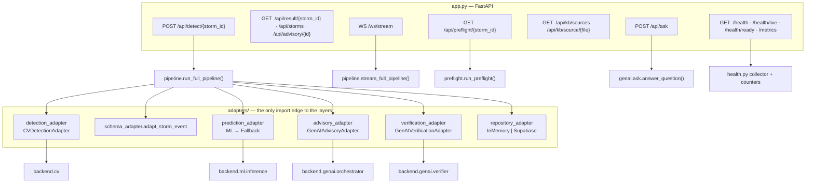
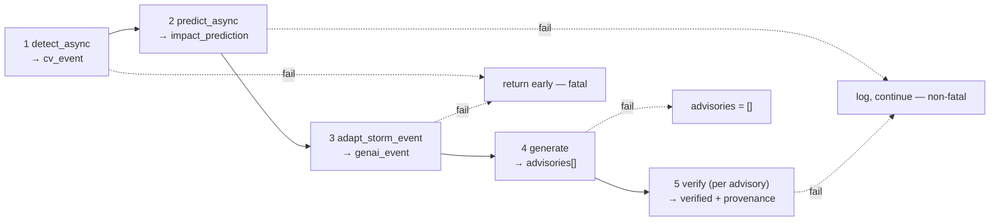

# Backend / API Layer — Architecture

**Job:** one FastAPI process that owns the pipeline, the adapters, the HTTP + WebSocket
surface, health, metrics and the pre-flight check. No queue, no worker, no second service.

**Hexagonal rule:** `pipeline.py` never imports `cv` / `ml` / `genai` directly — it calls
four adapter singletons it owns at module level. `app.py` imports those same instances,
so there is exactly one of each in the process.



## The five pipeline stages



`PipelineResult` accumulates `cv_event, impact_prediction, genai_event, advisories,
verified_advisories, provenance_traces, errors, completed_at`. Results are held in the
module-level `_RESULTS` dict and advisories in `_ADVISORY_INDEX`, which is what
`/api/result` and `/api/advisory` read.

Only detection and schema adaptation are fatal. Everything else degrades and reports.

## Pre-flight (`preflight.py`) — what a run will do, before it does it

`GET /api/preflight/{storm_id}` returns findings at `block` / `warn` / `info` plus a duration
estimate. The UI shows a confirm panel; it **never hard-blocks** — a preflight failure starts
the run directly.

| Group | Findings |
|---|---|
| Cache | `cv_stub_replay`, `donki_cache_missing`, `flare_cache_missing`, `l1_cache_missing`, `alert_cache_missing`, `*_stale_epoch` |
| Conflict | `stub_donki_speed_mismatch` (tol 25%), `stub_donki_arrival_mismatch` (±12 h), `speed_disagreement`, `arrival_eta_mismatch`, `flare_r_mismatch`, `bz_northward_strong_g`, `donki_no_match`, `l1_fallback_data` |
| System / quota | `no_groq_key`, `groq_tpm_low` (<4000), `rate_limited` |

Two invariants to keep:
- Read-only applies to the **storm caches only**. `_system_findings()` calls the health
  collector, which loads the ML pkls and counts Chroma — and Chroma writes on read.
  That cost 9.7 s per click until `health_snapshot()` got a 30 s TTL (`HEALTH_TTL_S`)
  warmed in `app.py`'s lifespan. Never restore a per-call `health_collector.run()`.
- `check_rate_limit()` **mutates** (it records the call). Read-only paths use
  `peek_rate_limit()`.
- Conflict findings demote `warn → info` when `cv_stub_replay` fires: `detect()` returns the
  stub before it ever reads DONKI/flare/L1, so a disagreement between them cannot change
  the output.

## WebSocket contract (`/ws/stream`)

```
pipeline.stage {stage, status: started|completed}   detection → impact_prediction
                                                    → schema_adaptation → advisory_generation
agent.thinking {industry, step, message}            per-agent progress
advisory.ready {advisory_id, severity, confidence, flags}
verifier.check {check, status}
pipeline.complete {total_advisories, industries}    exactly once, terminal
```

`stream_full_pipeline` re-labels genai's own terminal `pipeline.complete` as
`pipeline.stage/advisory_generation/completed`; forwarded raw it collides with the terminal
event and the client stops before verification. Pinned by `TestStreamEventContract`.

## Health and readiness

`/health/ready` runs four checks — `detection`, `ml_models`, `genai_module`,
`knowledge_base` — and answers **503 with the same body shape as 200** when degraded.
Any client must parse unconditionally, or every degraded state renders as "unreachable".
`/metrics` exposes plaintext counters (pipeline requests, errors, duration, detection,
advisory).

## Module map

| File | Role |
|---|---|
| `app.py` | routes, lifespan warmup, CORS, `ConnectionManager` for WS |
| `pipeline.py` | the 5 stages, adapter singletons, `PipelineResult`, result store |
| `preflight.py` | pre-run conflict check, TTL health snapshot |
| `health.py` | probes + counters |
| `paths.py` | `BACKEND_DIR / DATA_DIR / CHROMA_DIR / STUBS_DIR / CHECKPOINT_DIR` |
| `config.py` | `HELIOOPS_`-prefixed settings, CORS origin defaults |
| `middleware.py` | rate limiting (`check_rate_limit` / `peek_rate_limit`), request logging |
| `__init__.py` | loads `.env` for every entry point; sets `LOKY_MAX_CPU_COUNT` |
| `/app.py` (repo root) | HF Space entry — `gr.mount_gradio_app` mounts Gradio *into* this app; every route keeps its path, `/ui` is added |

## Gotchas

- Nothing under `adapters/` may import `backend.pipeline` at module level — it closes the
  import loop and `import backend.pipeline` fails on its own. Annotate as a string and
  import inside the function. Pinned by `TestNoCircularImports`.
- Never hardcode a runtime path; import from `backend.paths`.
- Production CORS origins are **defaults in `config.py`**, not deploy-only secrets: the env
  var *replaces* the list, so a partial secret silently 403s the WebSocket.
- `test_api_endpoints.py::test_valid_storm_id_returns_200_or_500_or_429` runs the real
  pipeline against the real Groq API — the only live-network test. With quota saturated it
  drags the suite from ~45 s to 9–12 min.
