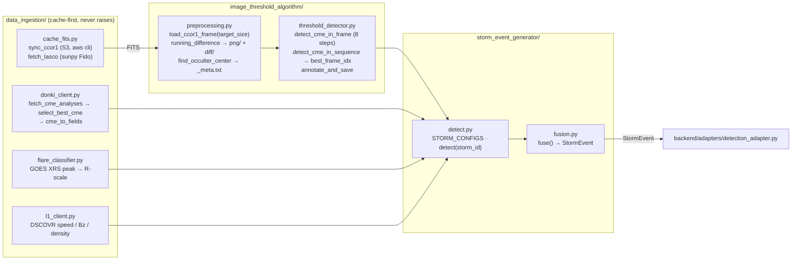
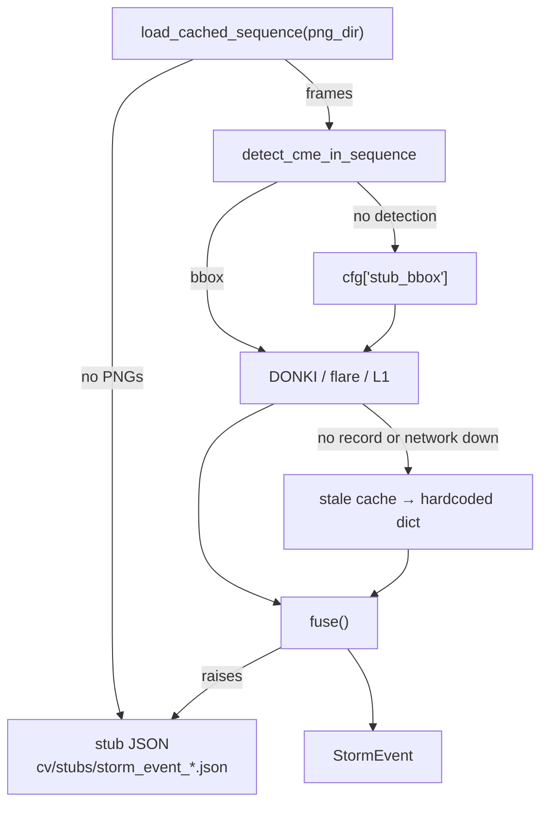

# CV Layer — Architecture

**Job:** turn coronagraph imagery + space-weather telemetry into one `StormEvent`.
**Contract out:** `backend.cv.storm_event_generator.fusion.StormEvent` — the only thing
downstream layers read. **Deterministic:** no RNG, no weights; same frames → same bytes.



## Detector — the 8 steps of `detect_cme_in_frame`

| # | Step | Detail |
|---|------|--------|
| 1 | Annular mask | ring from `occulter_r + ANNULAR_INNER_PAD` (10 px) to frame edge; blocks the occulter disc |
| 2 | Statistics | `mu`, `sigma` of the running-difference frame inside the mask only |
| 3 | Threshold | `diff > mu + k·sigma` |
| 4 | Morphology | open then close, to drop cosmic-ray specks and close CME interiors |
| 5 | Components | `cv2.connectedComponentsWithStats`, keep the largest |
| 6 | Bounding box | pixel bbox + `bbox_norm` (0–1, resolution independent) |
| 7 | CPA + width | circular mean / circular range of component pixel angles about the occulter centre |
| 8 | Confidence | `min(1, area/CONF_AREA_SCALE) · min(1, snr/CONF_SNR_SCALE)`, `snr = (mu_bright − mu_bg)/sigma_bg` |

`detect_cme_in_sequence` runs this per frame pair and returns `best_frame_idx` (max confidence).

## Fusion — how confidence is composed

`fuse(cme_result, flare_result, l1, noaa_alert, storm_id)`:

```
confidence = 0.40 · cme.confidence          (visual detection)
           + 0.20 · flare.detected          (binary)
           + 0.20 · (l1.bz_nt < 0)          (southward Bz = geoeffective)
           + 0.20 · (noaa_alert non-empty)
eta_minutes = 1_500_000 km / speed_km_s / 60   (L1 → Earth, ballistic)
```

`StormEvent` fields: `storm_id, detected_at, confidence, scales{G,R,S}, cme{}, flare{},
l1_solar_wind{}, timeline[], noaa_alert_raw`.

## Fallback ladder — it never hard-fails



Every fallback logs at WARNING and continues. On a fresh clone the PNG caches are
gitignored, so `detect()` returns the **stub** — which is exactly what preflight's
`cv_stub_replay` finding reports.

## Storms (`STORM_CONFIGS`)

| storm_id | Source | Window | Stub bbox |
|---|---|---|---|
| `2024-10-G4` | CCOR-1 (S3) | DONKI 2024-10-08 → 10-12 | `[.28,.18,.74,.62]` |
| `2024-05-G5` | SOHO/LASCO (sunpy) | DONKI 2024-05-08 → 05-12 | `[.12,.08,.88,.86]` |

## Entry points

```bash
python -m backend.cv.data_ingestion.cache_fits      --storm 2024-10-G4   # raw FITS
python -m backend.cv.data_ingestion.donki_client    --prefetch --storm 2024-10-G4
python -m backend.cv.image_threshold_algorithm.preprocessing --storm 2024-10-G4
python -m backend.cv.storm_event_generator.detect   --storm 2024-10-G4   # -> StormEvent JSON
```

## Gotchas

- Import the **full stage path** (`backend.cv.storm_event_generator.detect`); no re-export shims.
- `batch_preprocess_directory()` writes `<root>/png/` + `<root>/diff/`; `load_cached_sequence()`
  reads exactly that. Drift → silent stub. Pinned by `TestBatchLayoutRoundTrip`.
- `find_occulter_center()`'s radius must reach the `_meta.txt` sidecar, else every frame
  falls back to `DEFAULT_OCCULTER_R = 80`.
- Keep `load_ccor1_frame(target_size=…)`: the LASCO archive mixes 512² and 1024² frames and
  `running_difference()` broadcasts across them.
- All ingest CLIs resolve caches from `backend.paths.BACKEND_DIR`, never cwd.
- NOAA rtsw (L1) and xrays (GOES) are **real-time only** — the `l1/` and `xrs/` caches hold
  the day they were fetched, not the storm. Only DONKI serves 2024. This is why two X-class
  storms classify as C-class/R0.
