# Embeddings / Knowledge-Base Layer — Architecture

**Job:** turn the regulatory PDF corpus into a persistent ChromaDB store that the GenAI
layer can cite. Ingest is a one-shot **offline** operation; its output (`data/chroma_db/`)
is committed, so serving never ingests.

```mermaid
flowchart LR
  subgraph SRC["backend/data/<industry>/ — the corpus"]
    P1["aviation/ ICAO NAT Doc 007"]
    P2["grid/ NERC TPL-007-4, GMD benchmark, transformer thermal"]
    P3["maritime/ ITU-R M.493 / M.541 / M.1173 / M.1467, NGA Pub 117"]
    P4["telecom/ ITU-R P.372 / P.531 / P.533 / P.618, ITU-T G.8272"]
    P5["impact_matrix/ NOAA scales, NESDIS impacts, NOAA tech memo"]
  end
  SRC --> L["loaders.py<br/>load_pdf (pypdf)<br/>load_pdf_pdfplumber (scanned/complex)"]
  L --> C["chunker.py<br/>chunk_text(512 tok, overlap 64)<br/>paragraph-first, sentence split on overflow<br/>tiktoken"]
  C --> E["embedder.py<br/>BAAI/bge-small-en-v1.5 · 384-d<br/>batch 32 · lock-guarded singleton"]
  E --> S["store.py embed_and_upsert()"]
  S --> DB[("ChromaDB PersistentClient<br/>backend/data/chroma_db<br/>918 chunks")]
  DB --> Q["genai/retriever.py retrieve_chunks()<br/>cosine ≥ 0.35, top_k 3 (+2 impact)"]
```



## Collections

| Collection | Chunks | Fed by |
|---|---|---|
| `aviation_kb` | 242 | `ingest_aviation.py` |
| `maritime_kb` | 214 | `ingest_maritime.py` |
| `telecom_kb` | 195 | `ingest_telecom.py` |
| `impact_matrix_kb` | 166 | `ingest_impact_matrix.py` |
| `grid_kb` | 101 | `ingest_grid.py` |

`INDUSTRY_KB_MAP` in `genai/config.py` is what binds an agent to its collection.

## Client discipline

`collections.get_client()` is the **single** `chromadb.PersistentClient` in the process —
two clients on the same directory produce `Error executing plan: Internal error` under
concurrent access. Everything goes through the helpers:

- `with_collection(name, op, create=False)` — retries transient storage errors
  (`_QUERY_ATTEMPTS = 4`, matched by `is_transient_storage_error`).
- `query_collection(name, **kwargs)` / `count_collection(name)` / `init_all_collections()`.

## Query-side asymmetry

BGE models need an instruction prefix on the **query** side only:
`embed_query()` prepends `QUERY_PREFIX`; `embed_texts(is_query=False)` does not.
Losing that prefix silently degrades retrieval rather than erroring.

## Entry points

```bash
python -m backend.embeddings.ingest_aviation       # + _grid, _maritime, _telecom, _impact_matrix
python -m backend.embeddings.rebuild_kb            # wipe + re-ingest everything
```

Source provenance for the PDF corpus lives next to the files:
`backend/data/{maritime,telecom}/SOURCES.md` — the ingest scripts name those paths in their
"missing sources" error, so they stay in the tree.

## Gotchas

- `HELIOOPS_CHROMA_PERSIST_PATH` relative values resolve against the **repo root**. They
  once resolved against `backend/`, turning `backend/data/chroma_db` into
  `backend/backend/data/chroma_db` — a path Chroma happily *creates*. Every read returned 0,
  `retrieve_chunks()` swallowed it, and every advisory was ungrounded with nothing logged.
  Pinned by `test_runtime_paths.py`.
- `/health/ready` counts chunks per collection (`_check_knowledge_base`). An import probe
  cannot see an empty DB — that is exactly the failure that once shipped.
- Chroma **rewrites its own segment files even on a pure read**, so anything claiming to be
  read-only must not call it in a loop. See `preflight.health_snapshot`'s 30 s TTL cache.
- `test_retrieval.py` fails ~1 full-suite run in 3 with a chromadb segment-reader
  `InternalError`; passes standalone. Pre-existing chromadb bug, mitigated by the retry.
