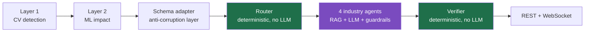
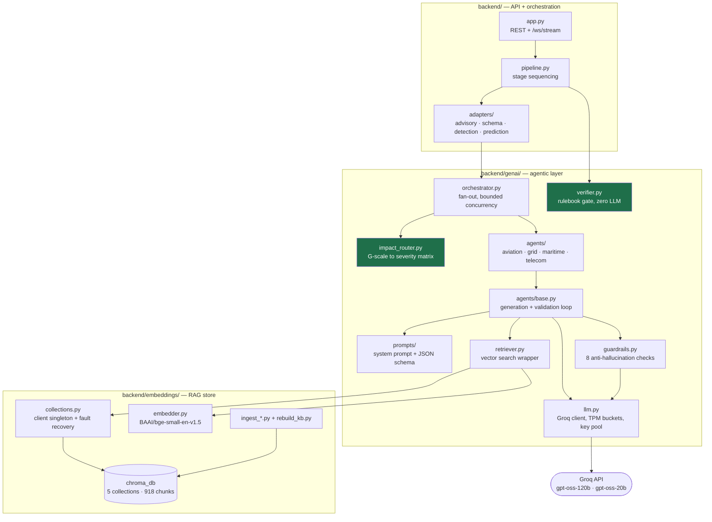
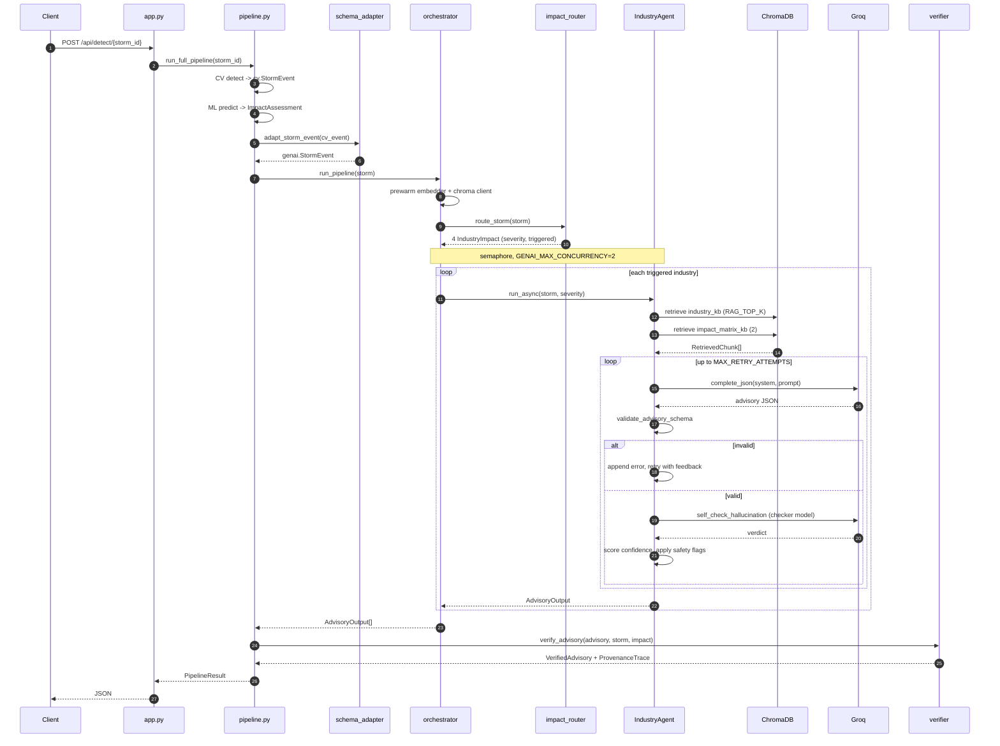
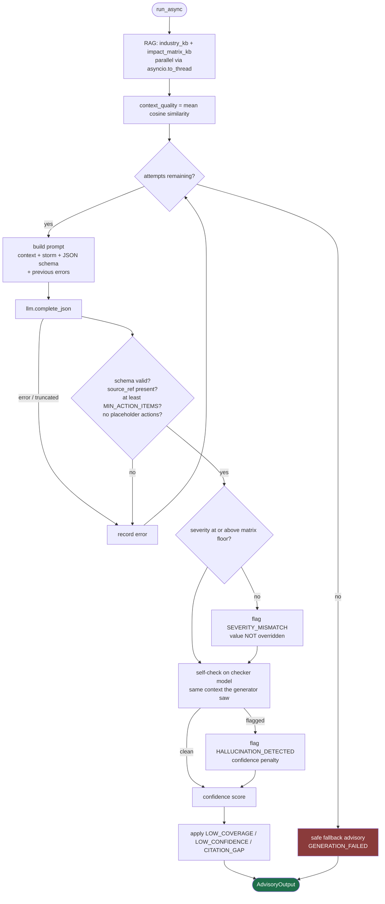
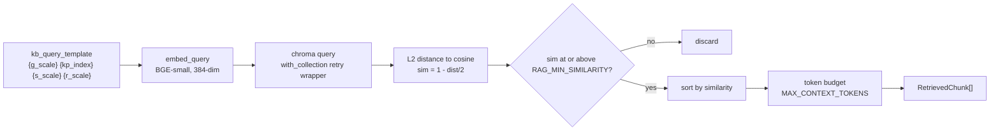
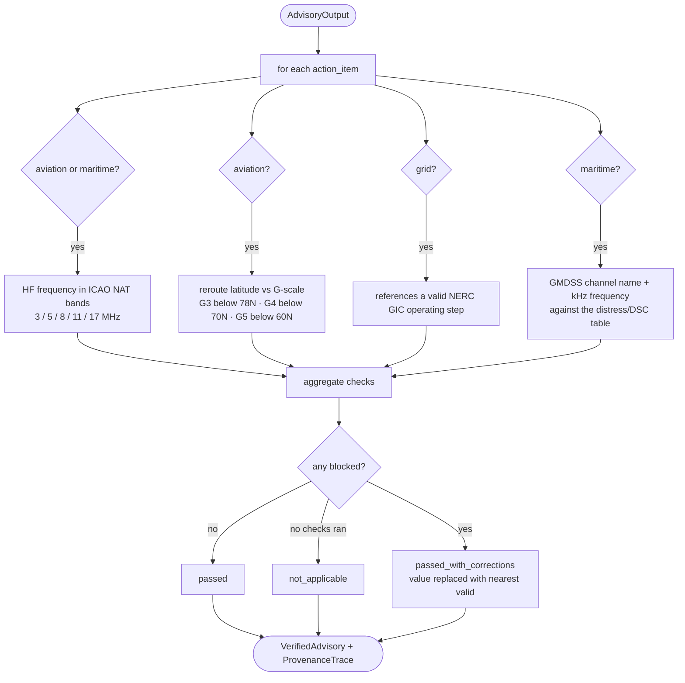
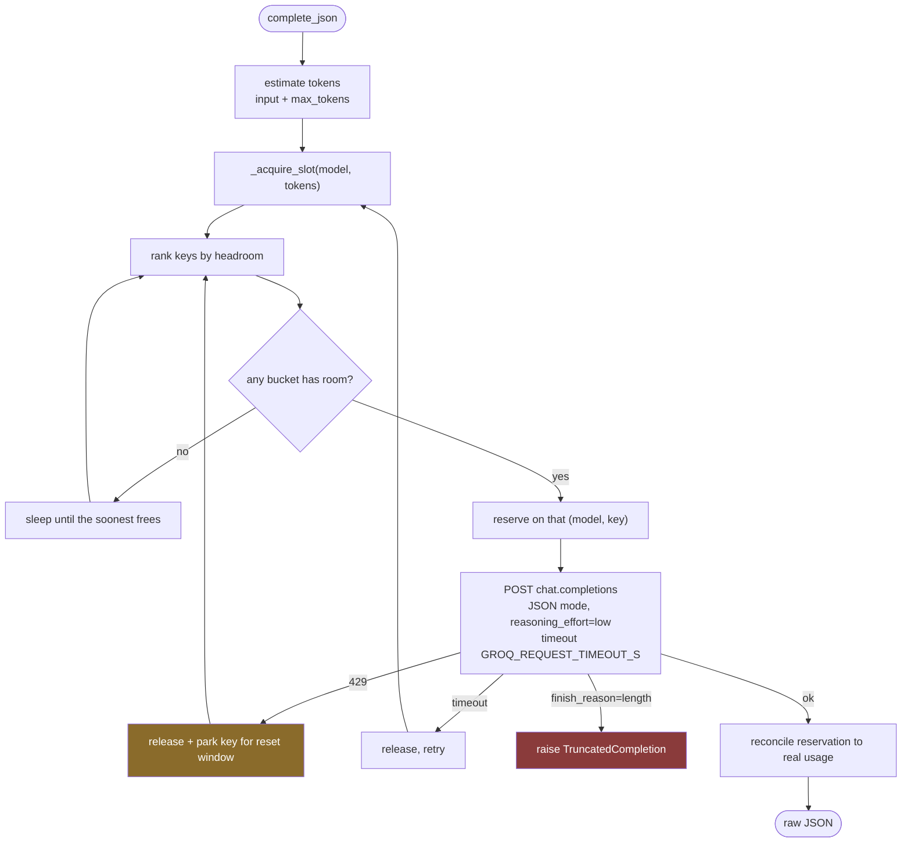

# GenAI / Agentic Layer — Architecture and Data Flow

How a detected storm becomes four verified operator advisories.

Scope: everything downstream of the ML impact prediction — `backend/genai/`,
`backend/embeddings/`, and the two adapters that connect them to the FastAPI
pipeline. Layers 1 (CV detection) and 2 (ML prediction) are covered only where
they hand data across the boundary.

Companion docs: [`IMPROVEMENTS.md`](IMPROVEMENTS.md) for known gaps and open
work, `REFACTOR_MAP.md` (repo root) for the change history behind these
decisions.

---

## 1. Ten-second version



The two green boxes contain **no LLM at all**. The purple box is the only place
a model is consulted, and everything it produces is re-checked by the green box
after it. That is the core design claim: the model writes prose, deterministic
code decides what is allowed to ship.

---

## 2. Component map



---

## 3. End-to-end data flow



---

## 4. Stage by stage

### 4.1 Boundary: schema adapter

`backend/adapters/schema_adapter.py` is an anti-corruption layer. The CV layer
and the GenAI layer both define a type called `StormEvent`, with incompatible
fields. The adapter translates:

| CV field | GenAI field | Notes |
|---|---|---|
| `scales["G"]` (int) | `g_scale` (`G1`–`G5`) | clamped to 1–5 |
| `scales["S"]`, `scales["R"]` | `s_scale`, `r_scale` | `None` when 0 |
| `noaa_alert_raw` | `kp_index` | regex-parsed; falls back to a G→Kp table |
| `cme["arrival_estimate"]` | `estimated_arrival_utc` | tolerant ISO parse |

Nothing downstream of this point knows the CV schema exists.

### 4.2 Routing — deterministic, no LLM

`impact_router.py` holds the authoritative G-scale × industry severity matrix,
derived from the NOAA space weather scales:

| | G1 | G2 | G3 | G4 | G5 |
|---|---|---|---|---|---|
| aviation | LOW | MEDIUM | HIGH | CRITICAL | CRITICAL |
| grid | LOW | MEDIUM | HIGH | CRITICAL | CRITICAL |
| maritime | NONE | LOW | MEDIUM | HIGH | CRITICAL |
| telecom | NONE | LOW | MEDIUM | HIGH | CRITICAL |

`NONE` means no advisory is generated. This matrix is also the floor the
guardrails enforce: if the model assigns a severity below it, the value is
raised to the floor, `SEVERITY_MISMATCH` is flagged and the original is recorded
in `generation_errors`. The model may raise severity above the floor — it can
see storm specifics the matrix cannot — but it cannot lower it.

### 4.3 Fan-out

`orchestrator.py` spawns one agent per triggered industry, bounded by
`GENAI_MAX_CONCURRENCY` (default 2). Two entry points share the logic:

- `run_pipeline(storm)` — batch, returns `list[AdvisoryOutput]`
- `stream_pipeline(storm)` — async generator of stream events for `/ws/stream`

Bounded fan-out exists because the token budget is per minute: four agents
firing at once put ~26k tokens into an 8k/min window and the last ones in were
guaranteed to be rate-limited.

### 4.4 Per-agent loop



Validation errors are fed back into the next prompt under a
`PREVIOUS ATTEMPT ERRORS (FIX THESE)` heading, so a retry is corrective rather
than a blind resample.

### 4.5 RAG retrieval



Five collections, 918 chunks:

| Collection | Chunks | Sources |
|---|---|---|
| `aviation_kb` | 242 | ICAO NAT Doc 007 (160pp) |
| `impact_matrix_kb` | 166 | NOAA tech memo, NESDIS, NOAA scales |
| `maritime_kb` | 214 | ITU-R M.541, M.493, M.1467, M.1173 + NGA Pub 117 (GMDSS block, pp. 542-581) |
| `telecom_kb` | 195 | ITU-R P.531, P.533, P.372, P.618 + ITU-T G.8272 (PRTC holdover) |
| `grid_kb` | 101 | NERC TPL-007-4, GMD benchmark, transformer thermal |

Every agent gets its industry KB **plus** `impact_matrix_kb`. That second set
is generic NOAA scale text, which matters for coverage accounting — see
`LOW_COVERAGE` below.

### 4.6 Guardrails

Eight checks in `guardrails.py`, applied in order:

| # | Check | On failure |
|---|---|---|
| 1 | JSON schema (pydantic strict) | retry with error feedback |
| 2 | JSON extraction (fences, prose, truncation) | retry |
| 3 | Every `action_item` has a `source_ref` | retry |
| 4 | No placeholder text used as an action | retry |
| 5 | `>= MIN_ACTION_ITEMS` steps | retry |
| 6 | Severity not below the router matrix | **clamp up to the floor**, flag `SEVERITY_MISMATCH`, record the original |
| 7 | LLM self-check for ungrounded claims | flag `HALLUCINATION_DETECTED` + confidence penalty |
| 8 | Citation resolves to a retrieved chunk | flag `CITATION_GAP` |

Checks 1–5 block and retry. Check 6 corrects. Checks 7–8 flag and ship, because
a flagged advisory a human can review beats no advisory at all.

**Numeric discipline** is enforced in the shared prompt rather than per
industry. Each industry prompt forbade inventing values by listing the
categories it cared about — GIC thresholds, HF bands, latitudes — and models
treated anything outside that list as fair game, producing "reduce loading by
20%" and "above 60,000 ft". The shared rule states it once for any quantity and
gives an explicit escape hatch: if the context has no figure, say the action
qualitatively. Measured on the G5 storm, that took grid and aviation from
flagged to 3/3 clean each while keeping the grounded numbers (225 A/phase,
8414.5 kHz, 121.5 MHz).

**Citation matching** is on the standard designator, not the filename. `ITU-R
M.541`, `M.541-11` and `itu_r_m541_….pdf` all reduce to `m541`. Sources without
a designator (`noaa_space_weather_scales.txt`) fall back to a three-word
overlap. Anything containing `SOURCE UNAVAILABLE` is rejected outright.

**Confidence score:**

```
score  = mean cosine similarity of retrieved chunks
       + CITATION_BONUS   per grounded action item      (+0.02)
       - CITATION_PENALTY per ungrounded action item    (-0.08)
       + COVERAGE_BONUS   if context_quality > 0.6      (+0.10)
       - SELF_CHECK_CONFIDENCE_PENALTY if flagged       (-0.25)
clamped to [0, 1]
```

**Safety flags:**

| Flag | Raised when |
|---|---|
| `SEVERITY_MISMATCH` | LLM severity below the router floor |
| `HALLUCINATION_DETECTED` | self-check found unsupported claims |
| `LOW_COVERAGE` | fewer than `RAG_LOW_COVERAGE_THRESHOLD` **industry** chunks |
| `LOW_CONFIDENCE` | final score below `LOW_CONFIDENCE_THRESHOLD` |
| `CITATION_GAP` | an action cites something not retrieved |
| `GENERATION_FAILED` | all retries exhausted, fallback emitted |

`LOW_COVERAGE` counts industry chunks only. Counting the combined set made the
flag unreachable, because every industry always receives 2 impact-matrix chunks.

### 4.7 Verifier — deterministic, zero LLM

`verifier.py` re-checks operational numbers against hard-coded rulebooks after
generation. Unlike the guardrails it can **rewrite** an action.



The demo case: a model proposing HF comms on **21 MHz** is blocked, because 21
is not in the ICAO NAT set, and corrected to the nearest valid band with the
substitution recorded in the provenance trace. Observed live on a real run: a
model proposed **500 MHz** and the verifier rewrote it to 5 MHz.

An industry with no matching rule set returns **`not_applicable`**, not
`passed`. Telecom still has no rules of its own; reporting `passed` for it
claimed a verification that never happened.

Verifier output is a `VerifiedAdvisory` — a flattened, dispatch-ready shape
(`numbered_actions`, `timing_window`, `cited_procedure`, `requires_human`) plus
a `ProvenanceTrace` linking every step back to its source.

---

## 5. LLM transport

`llm.py` is the only place the system talks to Groq.



Key facts that shape this design:

- Groq meters TPM **per `(key, model)`**. Verified empirically: burning 1.5k
  tokens on `gpt-oss-120b` left `gpt-oss-20b` untouched, and burning key 1 left
  keys 2 and 3 untouched.
- Therefore the self-check runs on a **different model** — it draws from its own
  budget instead of competing with advisory generation.
- Therefore `GROQ_API_KEYS` (comma-separated) multiplies throughput roughly
  linearly: 1 key ≈ 86s per storm, 3 keys ≈ 16s.
- gpt-oss are reasoning models. Chain-of-thought is returned separately but
  **billed against `max_tokens`**, so `GROQ_REASONING_EFFORT=low` is what keeps
  the advisory JSON from being truncated.

---

## 6. Streaming

`stream_pipeline` pushes agent events onto a queue that the generator drains, so
the WebSocket sees progress while agents are still running.

| Event | Emitted by | Carries |
|---|---|---|
| `pipeline.stage` | `pipeline.py` | `stage`, status |
| `agent.thinking` | agent `_emit` | `industry`, `step`, `message` |
| `advisory.generated` | orchestrator | full advisory dict |
| `agent.error` | orchestrator | failure message |
| `pipeline.complete` | orchestrator | total, industries |
| `pipeline.error` | `pipeline.py` | stage, error |

Per-agent steps: `start`, `rag_start`, `rag_done`, `gen_attempt_N`,
`validation_fail`, `severity_flag`, `self_check`, `self_check_fail`,
`advisory_ready`, `fallback`.

Clients connect to `/ws/stream` and send
`{"action": "run_pipeline", "storm_id": "2024-05-G5"}`. Origin is checked
against `CORS_ORIGINS` and `storm_id` against an allowlist.

---

## 7. Configuration

All knobs live in `backend/genai/config.py`, overridable by environment.

| Variable | Default | Effect |
|---|---|---|
| `GROQ_MODEL` | `openai/gpt-oss-120b` | advisory generation |
| `GROQ_CHECKER_MODEL` | `openai/gpt-oss-20b` | self-check, separate TPM budget |
| `GROQ_API_KEYS` | — | comma-separated pool; supersedes `GROQ_API_KEY` |
| `GROQ_TPM_LIMIT` | `8000` | per `(key, model)`; raise on a paid plan |
| `GROQ_REASONING_EFFORT` | `low` | keeps CoT from eating the output budget |
| `GROQ_MAX_TOKENS` | `1200` | advisory completion cap |
| `GROQ_REQUEST_TIMEOUT_S` | `90` | per-call wall clock |
| `GENAI_MAX_CONCURRENCY` | `2` | simultaneous agents |
| `MAX_PROMPT_TOKENS` | `3000` | whole-prompt ceiling |
| `RAG_TOP_K` | `3` | industry chunks per query |
| `MIN_ACTION_ITEMS` | `3` | quality floor |
| `GROQ_REQUEST_TIMEOUT_S` | `90` | per-call wall clock |
| `SELF_CHECK_BLOCKING` | `false` | flag rather than regenerate |
| `HELIOOPS_CHROMA_PERSIST_PATH` | `backend/data/chroma_db` | vector store location |
| `HELIOOPS_EMBED_DEVICE` | auto | force `cpu` / `cuda` |

With a pooled key set, `MAX_PROMPT_TOKENS=4300` + `RAG_TOP_K=5` is the better
pair — the extra latency is absorbed. See the measurement note in `config.py`.

---

## 8. Failure behaviour

The layer is built so that **no single failure produces a silently wrong
advisory**. What each failure does:

| Failure | Behaviour |
|---|---|
| KB collection missing or empty | log, retrieve nothing, `LOW_COVERAGE` |
| Transient chroma segment fault | re-acquire handle, retry (4 attempts) |
| Embedder fails on GPU | fall back to CPU at load *and* encode |
| LLM 429 | park that key, reroute to another, retry |
| LLM timeout | release reservation, retry |
| Output truncated | `TruncatedCompletion`, retry |
| Schema / citation / floor violation | retry with error feedback |
| All retries exhausted | `ESCALATE_TO_SPECIALIST` fallback, `GENERATION_FAILED`, confidence 0.0 |
| ML prediction fails | non-fatal, recorded in `errors`, pipeline continues |
| Verifier finds an invalid value | corrects it, records the substitution |

The fallback advisory is deliberately useless as operational guidance — it says
only "contact a specialist" — so a degraded run cannot be mistaken for a good
one.

---

## 9. The console

`frontend/src/Dashboard.jsx` at `/dashboard` is the operator-facing surface.
Deliberately plain — it exists to make the pipeline observable, and the UI is
expected to be redesigned. What matters is that it renders every field the
backend produces:

| Panel | Shows |
|---|---|
| Controls | storm selector, live (WebSocket) vs batch (REST) run, `/health/ready` status per subsystem |
| Pipeline stream | every event in order: stage transitions, per-agent RAG and generation steps, verifier checks, completion |
| Advisory cards | severity, confidence bar, guardrail flags, numbered actions with `time_window` and `source_ref`, rationale, verifier corrections, generation notes |
| ML impact | raw prediction payload |

`vite.config.js` proxies `/api`, `/health`, `/metrics` and `/ws` to
`127.0.0.1:8000`, so the client uses relative paths and the same code works in a
built deployment.

The two run modes exercise different code paths on purpose: batch calls
`run_pipeline`, live calls `stream_pipeline` over `/ws/stream`. Only the live
mode shows the agents working; only the persisted result carries verifier
output, so the console re-fetches `/api/result/{id}` once the stream completes.

---

## 10. Running it

```bash
pip install -r backend/requirements-dev.txt
cp .env.example .env                     # set GROQ_API_KEY or GROQ_API_KEYS

PYTHONPATH=. uvicorn backend.app:app --reload
curl -s -X POST http://localhost:8000/api/detect/2024-05-G5

PYTHONPATH=. python -m backend.embeddings.rebuild_kb --verify   # KB health
PYTHONPATH=. python -m pytest backend/tests -q
```

Rebuilding the knowledge base after changing a source document:

```bash
python -m backend.embeddings.rebuild_kb          # all five collections
python -m backend.embeddings.ingest_maritime     # or just one
```
