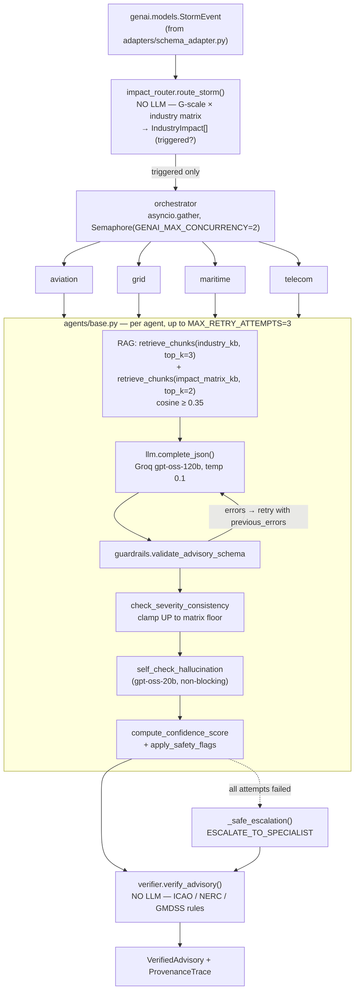
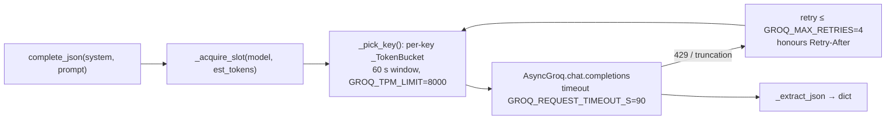

# GenAI Layer — Architecture

**Job:** turn one `StormEvent` into per-industry advisories that are grounded (RAG-cited),
schema-valid, severity-floored, hallucination-checked and **deterministically verified**
against published operational limits.

Two of the four stages use no LLM at all: routing and verification are code.

## Stage 1 — routing (deterministic)

`impact_router._MATRIX` maps G1–G5 × {aviation, grid, maritime, telecom} to a severity tier.
It is the authoritative floor, sourced from the NOAA scales — not from the model.

| | G1 | G2 | G3 | G4 | G5 |
|---|---|---|---|---|---|
| aviation | LOW | MEDIUM | HIGH | CRITICAL | CRITICAL |
| grid | LOW | MEDIUM | HIGH | CRITICAL | CRITICAL |
| maritime | NONE | LOW | MEDIUM | HIGH | CRITICAL |
| telecom | NONE | LOW | MEDIUM | HIGH | CRITICAL |

`NONE` ⇒ `triggered=False` ⇒ no agent, no LLM call.

## Stage 2 — the agent loop

- **Retrieval** hits two collections concurrently (`asyncio.to_thread`, Chroma is sync).
  Empty collection → logged loudly and returns `[]`; a retrieval failure must not look
  like a normal ungrounded answer.
- **Validation** failures feed back into the next prompt as `previous_errors`.
- **Severity** is clamped *upward* only. A model that reads G5 as MEDIUM is wrong, and
  under-reporting is the dangerous direction; raising above the floor is allowed because
  the model can see specifics the matrix cannot. Adds `SEVERITY_MISMATCH`.
- **Self-check** (`SELF_CHECK_ENABLED`) runs a smaller model as an auditor. Non-blocking by
  default (`SELF_CHECK_BLOCKING=false`) — it flags `HALLUCINATION_DETECTED` and subtracts
  `SELF_CHECK_CONFIDENCE_PENALTY = 0.25`, so a flagged advisory can never outscore a clean one.
- **Fallback**: all attempts exhausted → `_safe_escalation()` emits a valid
  ESCALATE_TO_SPECIALIST advisory. The pipeline never returns nothing.

## Stage 3 — verifier (deterministic, zero LLM)

Parses the free-text action items and checks them against published limits:

| Check | Rule source |
|---|---|
| `_check_hf_frequencies` | ICAO NAT HF bands {3, 5, 8, 11, 17} MHz vs G-scale |
| `_check_reroute_latitude` | polar-route latitude thresholds by G-scale |
| `_check_gic_steps` | NERC GIC operating steps |
| `_check_gmdss_channels` | GMDSS distress frequencies (kHz) and channels |

Output is a `VerifierCheck[]` with a status summary, plus stream events via
`verifier_stream_events()` so the console can render each check as it lands.

## Citations

The advisory field is **`sources_cited`**, not `citations`. `guardrails.citation_is_grounded`
matches a reference to the retrieved chunks by filename + shared significant words
(`_MIN_SHARED_WORDS = 3`), tolerating page suffixes. Unmatched → citation penalty.

## LLM transport (`llm.py` — the only Groq call site)

Key config (`genai/config.py`): `GROQ_MODEL=openai/gpt-oss-120b`, `GROQ_TEMPERATURE=0.1`,
`GROQ_MAX_TOKENS=1200`, `GROQ_REASONING_EFFORT=low`, `GROQ_CHECKER_MODEL=openai/gpt-oss-20b`,
`MAX_PROMPT_TOKENS=3000`, `RAG_TOP_K=3`, `RAG_MIN_SIMILARITY=0.35`.

## Streaming

`stream_pipeline()` yields `agent.thinking` / `advisory.ready` / `pipeline.complete`.
`backend/pipeline.py:stream_full_pipeline` **re-labels** the terminal `pipeline.complete`
as a stage event — forwarded raw it would collide with the pipeline's own terminal event
and the frontend would stop before verification. Pinned by `TestStreamEventContract`.

## Gotchas

- `GROQ_API_KEY` is read via `os.getenv` (loaded by `backend/__init__.py`), **not** from
  `settings.GROQ_API_KEY` — settings uses the `HELIOOPS_` prefix, so that field is always
  empty and its warning is spurious.
- `self_check_hallucination()` swallows every exception: a broken call site silently
  degrades to "self-check skipped". Pinned by `TestGuardrailsWiring`.
- `_pick_key()` waits for TPM budget in an unbounded loop — with every key parked,
  `/api/detect` stalls for minutes with no error.
- One Groq client site only. Do not add a second LLM wrapper.
- `/api/detect` takes 65–80 s end to end; the reasoning pass dominates, host CPU barely matters.
