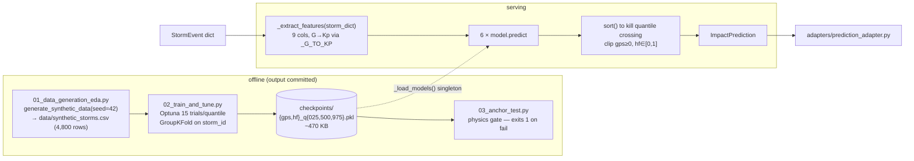

# ML Layer — Architecture

**Job:** map a `StormEvent` to operational impact with calibrated uncertainty —
GPS positioning error (m) and HF blackout probability — as a median plus a 95% interval.
**Shipped model:** 6 LightGBM quantile regressors trained on **synthetic** storms.
There is one ML pipeline in this tree; the real-data track was deleted (blocked on labels).



## Feature vector (`_FEATURE_COLS`, order matters)

| Feature | Source path in `StormEvent` | Note |
|---|---|---|
| `g_scale` | `scales.G` | 0–5 |
| `kp_index` | derived | `_G_TO_KP = {0:0, 1:5, 2:6, 3:7, 4:8.3, 5:9}` |
| `bz_nt` | `l1_solar_wind.bz_nt` | negative = geoeffective |
| `wind_speed_km_s` | `l1_solar_wind.speed_km_s` | default 400 |
| `cme_speed_km_s` | `cme.speed_km_s` | default 500 |
| `cme_width_deg` | `cme.angular_width_deg` | default 90 |
| `r_scale` | `scales.R` | flare radio-blackout scale |
| `geomag_lat_bin` | constant `1` | mid-latitude — not yet wired to a sector |
| `local_time_bin` | constant `1` | dayside |

## Outputs and failure mode

`ImpactPrediction`: `gps_error_m`, `gps_error_ci_{low,high}`, `hf_blackout_prob`,
`hf_blackout_ci_{low,high}`.

If fewer than 6 checkpoints load, `predict()` returns a **conservative fallback**
(GPS 20 m [8–35], HF 0.85 [0.60–0.95]) and logs a warning — it never raises. That fallback
is indistinguishable from a real prediction in the payload, so `/health/ready`'s `ml_models`
check is the signal that matters.

## Calibration and honesty

- Measured PICP: **95.9% GPS / 94.2% HF** against the nominal 95% interval.
- R² measures **rule recovery on synthetic data**, not forecast skill. The generator's
  physics coupling is the ground truth; the model is learning that function back.
- `03_anchor_test.py` is the gate: a G5 floor, a quiet-day baseline (a constant model
  passes any single-storm floor), and ordering across scales. It runs through
  `inference.predict()`, not the pkls directly, so train/serve skew cannot slip past.

## Entry points

```bash
python backend/ml/01_data_generation_eda.py    # synthetic set + EDA plots (seed 42)
python backend/ml/02_train_and_tune.py         # regenerates the 6 checkpoints (~2 min)
python backend/ml/03_anchor_test.py            # physics gate
```

## Gotchas

- The `0*.py` numeric prefix is load-bearing: `.dockerignore` excludes training scripts by
  that glob. Renaming them ships them in the image.
- Paths come from `backend.paths` (`CHECKPOINT_DIR`, `DATA_DIR`), never from cwd.
- `_MODELS` is a process-level singleton — first `predict()` pays the load cost;
  `app.py`'s lifespan and `/health/ready` warm it.
- joblib probes physical cores via `wmic`, absent on Windows 11 26xxx —
  `backend/__init__.py` sets `LOKY_MAX_CPU_COUNT` strictly below `os.cpu_count()`.
