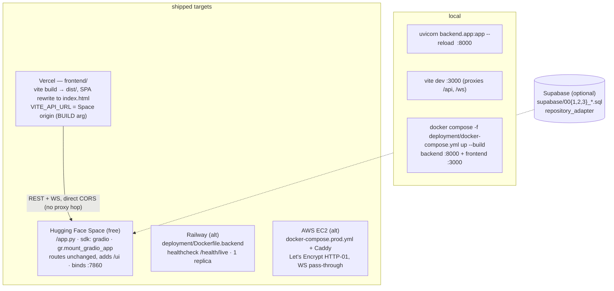

# Deployment Layer — Architecture

**Job:** ship one FastAPI process and one static bundle. Everything here is a variation on
that; there is no cluster, no queue, no second service.



## Which Dockerfile builds where

| File | Consumer | Shape |
|---|---|---|
| `/Dockerfile` (repo root) | **HF Spaces only** | UID 1000, port 7860, embedder baked *after* `USER user`, `COPY --chown=user` |
| `deployment/Dockerfile.backend` | Railway, docker-compose, AWS | platform-neutral multi-stage |
| `deployment/Dockerfile.frontend` | docker-compose, AWS | `VITE_API_URL` as a **build arg** |

Spaces builds the file named `Dockerfile` at the repo root — `deployment/Dockerfile.backend`
is never picked up there. **The two must be kept in step by hand.**

## Load-bearing details

- `COPY --chown=user` is not style: Chroma opens `chroma.sqlite3` read-write (sqlite WAL).
  Without it UID 1000 cannot write, `retrieve_chunks()` swallows the error, and every
  advisory is silently ungrounded. `/health/ready`'s `knowledge_base` check is the catch.
- Bake the embedder **after** `USER user`, or it caches to `/root/.cache` and costs a silent
  ~90 s re-download on the first request.
- Healthcheck is `/health/live`, deliberately **not** `/health/ready` — readiness answers 503
  when any dependency is cold, which is dashboard information, not a restart trigger.
- **One replica, deliberately.** `pipeline.py` keeps results in a process-local dict; a second
  replica 404s `/api/result/{id}` for whichever half of the requests lands on the wrong one.
- `python:3.12-slim` has no `curl` — container healthchecks must use python/node.
- Caddy's `reverse_proxy` passes `Upgrade`/`Connection` through unchanged, so `/ws/stream`
  needs no extra config; timeouts must outlast the 65–80 s `/api/detect` pass.

## Frontend/backend wiring

Direct CORS, not a Vercel rewrite: a rewrite adds a hop, cannot proxy `/ws/stream`, and would
split REST and WS across two paths. One origin + one CORS list covers both. The CORS
production origins are **defaults in `backend/config.py`** because the env var *replaces* the
list — a partial secret silently 403s the WebSocket.

## Files

```
deployment/
  Dockerfile.backend        platform-neutral API image
  Dockerfile.frontend       vite build → static server, VITE_API_URL build arg
  docker-compose.yml        local full stack (backend :8000 + frontend :3000)
  docker-compose.prod.yml   AWS: API + Caddy TLS terminator
  Caddyfile                 {$HELIOOPS_DOMAIN}, gzip, WS pass-through
  smoke_space.py            post-deploy verification against a live Space
  infra/                    Terraform: EC2 + IAM + user_data (alternative to Spaces)
  supabase/00{1,2,3}_*.sql  schema, RLS, seed — only for SupabaseResultRepository
```

## Verify a deploy

```bash
curl -s $API/health/ready | python -m json.tool     # 4 checks; 503 body is still JSON
python deployment/smoke_space.py $API               # end-to-end against a live Space
```
