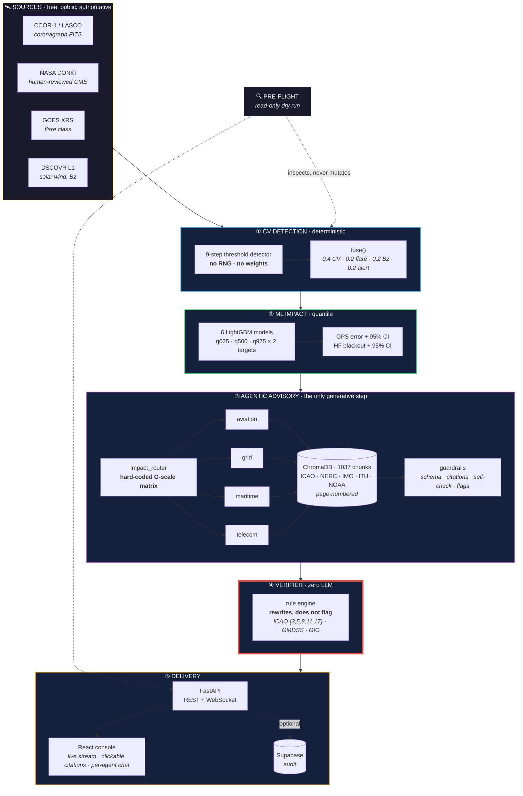
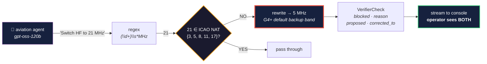
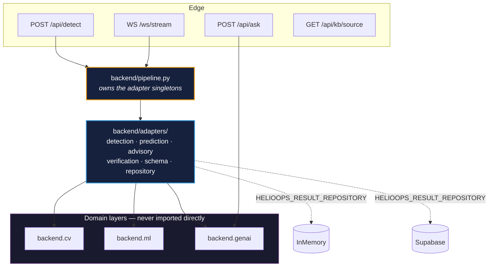

# HelioOps — Architecture Diagram Pack

Everything needed to draw HelioOps on a whiteboard, in draw.io, or on a slide —
and to answer the question a judge actually asks, which is never "what are the
boxes" but **"why is that box there and not a model call?"**

Source of truth: `backend/genai/ARCHITECTURE.md` (layer 3/4 detail) and
`docs/TECHNICAL_DEEP_DIVE.md` (all four layers). This file is the drawable
distillation of both.

---

## 0. The one-sentence version

> **Deterministic where safety demands it, generative only where language is
> needed, and a rule engine downstream of the model that rewrites unsafe values
> rather than flagging them.**

If a diagram communicates only that, it has done its job.

---

## 1. Hero diagram — the whole system

This is the one to put on the slide.



**Read it in one breath:** free public data goes in on the left, a deterministic
detector turns pixels into a typed `StormEvent`, six quantile models attach
uncertainty, four agents write language grounded in the real rulebooks, a rule
engine with no model in it corrects anything unsafe, and the operator gets a
numbered list they can trace back to a page in a PDF.

---

## 2. The diagram that wins the room

If you only draw one *detail*, draw this. It is the part nobody else has.



**The line to say out loud:** *"Anyone can put an LLM in front of a vector
store. Almost nobody puts a deterministic rule engine behind it that rewrites
the unsafe value and shows the operator what the model originally said."*

---

## 3. The seam — why the code survives four people



**The point:** the CV layer and the GenAI layer were built by different people
with different `StormEvent` schemas and **neither was rewritten**.
`adapters/schema_adapter.py` translates between them — integration cost paid
once, in one file, instead of smeared across four modules owned by four people.

The abstract `ports/` package was **deleted**: one interface per implementation
is ceremony. What actually enforces the boundary is a test
(`TestNoCircularImports`), not an inheritance tree.

---

## 4. Draw.io build guide

Import-ready settings so the drawn version matches the rendered one.

### Canvas

| Setting | Value |
|---|---|
| Page | A4 landscape / 1600 × 900 |
| Background | `#0A0917` (matches the product) |
| Grid | 10 px, snap on |
| Default font | Helvetica 12, `#E9E9F6` |
| Connector style | orthogonal, rounded 6, arrow `classic`, width 2 |

### Palette — one colour per layer, used consistently

| Layer | Stroke | Fill | Meaning to convey |
|---|---|---|---|
| Sources | `#F39C12` amber | `#1A1A2E` | outside our control, free |
| ① CV | `#3498DB` blue | `#16213E` | deterministic |
| ② ML | `#2ECC71` green | `#16213E` | quantified uncertainty |
| ③ Agents | `#9B59B6` violet | `#16213E` | the only generative step |
| ④ Verifier | `#E74C3C` red, **4 px** | `#16213E` | the safety gate — make it heaviest |
| ⑤ Delivery | `#F39C12` amber | `#16213E` | what the operator touches |
| Pre-flight | `#95A5A6` grey, **dashed** | `#1A1A2E` | read-only, side-car |

> Make the verifier's border visibly thicker than everything else. On a slide
> the eye lands on line weight before it reads a word, and the verifier is the
> thing you want it to land on.

### Shapes

| Element | draw.io shape |
|---|---|
| Layer group | Rounded rectangle, container, 12 px radius |
| Process step | Rectangle |
| Decision (`21 ∈ set?`) | Rhombus |
| Knowledge base / DB | Cylinder |
| External source | Rectangle, dashed top edge |
| Stream / async edge | Dashed connector |
| "never mutates" edge | Dotted connector, grey |

### Layout order (left → right, or top → bottom on a portrait slide)

```
SOURCES → ① CV → ② ML → ③ AGENTS ⇄ CHROMA → ④ VERIFIER → ⑤ DELIVERY
                                                   ↑
                                          PRE-FLIGHT (dashed, below)
```

Keep the four agents as a vertical stack inside the ③ container so the
**parallel fan-out is visible as a shape**, not just a label. That is the
cheapest way to show concurrency on a static diagram.

### Labels worth putting on edges

- Sources → ①: `cache-first, network fallback, stub floor`
- ① → ②: `StormEvent (the contract every layer reads)`
- ② → ③: `median + 95% CI`
- ③ → ④: `4 advisories, each with sources_cited`
- ④ → ⑤: `passed | passed_with_corrections | blocked`
- Pre-flight → ①: `stat() only — never fetch, never mkdir`

---

## 5. Numbers to put on the diagram

Judges remember figures attached to a picture. These are all measured, not
estimated.

| Figure | Value | Where it comes from |
|---|---|---|
| Knowledge base | **1037 chunks**, 5 collections, page-numbered | `rebuild_kb` |
| Interval calibration | **PICP 95.90 % / 94.21 %** vs nominal 95 % | `02_train_and_tune.py` |
| Interval width | PINAW 0.0369 / 0.1941 | same |
| Detection determinism | byte-identical output, **0 RNG** | threshold algorithm |
| Tests | **307 passing** | `pytest backend/tests` |
| ML checkpoints | 527 KB, **CPU only** | `backend/ml/checkpoints/` |
| End-to-end run | **65–80 s**, ~99 % of it Groq | measured, both storms |
| GPU hours | **0** | — |

---

## 6. Three questions the diagram should pre-empt

**"Where is the AI?"**
Exactly one box — ③. Detection is a threshold algorithm, routing is a lookup
table, impact is gradient boosting, verification is regex against a constant
set. The LLM does the one job LLMs are good at: turning a severity tier plus
retrieved regulation into readable numbered steps.

**"What stops it hallucinating a frequency?"**
Four things in series, and only the first is the model: RAG grounding →
guardrails (schema, citation resolution, self-check on a second model) → the
zero-LLM verifier that rewrites the value → an operator who can click the
citation and read the page it came from.

**"What happens when something is down?"**
Every arrow has a fallback and none of them raise. No frames → stub StormEvent.
No DONKI → cached physics. No checkpoints → conservative defaults (20 m GPS,
85 % HF). Groq exhausted → `ESCALATE TO SPECIALIST`, never a guess. Draw those
as small grey stubs hanging off each layer if you have room — "designed to
degrade" is a claim, and the stubs are the evidence.
