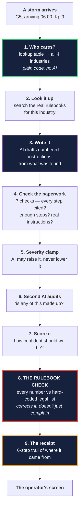
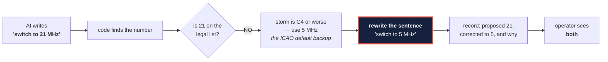
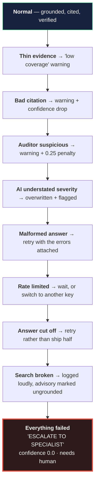

# The GenAI Layer, Explained Simply

**This is the plain-English twin of
[`GENAI_TECHNICAL_DEEP_DIVE.md`](GENAI_TECHNICAL_DEEP_DIVE.md).** Same ground,
same depth, no code required.

You do not need to know what an LLM, a vector database or an embedding is. Every
term is explained the first time it appears. If you read this whole document you
will be able to explain — out loud, to a room — exactly what happens between
"the Sun did something" and "here is what you should do about it."

---

## Contents

1. [The one-paragraph version](#1-the-one-paragraph-version)
2. [The problem we are actually solving](#2-the-problem-we-are-actually-solving)
3. [The rule that shapes everything](#3-the-rule-that-shapes-everything)
4. [The nine steps, start to finish](#4-the-nine-steps-start-to-finish)
5. [Step 1 — Who needs to hear about this?](#step-1--who-needs-to-hear-about-this)
6. [Step 2 — Look it up in the actual rulebook](#step-2--look-it-up-in-the-actual-rulebook)
7. [Step 3 — Write the briefing](#step-3--write-the-briefing)
8. [Step 4 — Check the paperwork](#step-4--check-the-paperwork)
9. [Step 5 — The severity clamp](#step-5--the-severity-clamp)
10. [Step 6 — A second AI audits the first](#step-6--a-second-ai-audits-the-first)
11. [Step 7 — Score the confidence](#step-7--score-the-confidence)
12. [Step 8 — The rulebook check that cannot be argued with](#step-8--the-rulebook-check-that-cannot-be-argued-with)
13. [Step 9 — The receipt](#step-9--the-receipt)
14. [The chatbot](#the-chatbot)
15. [What happens when things go wrong](#what-happens-when-things-go-wrong)
16. [The bugs we found, and what they taught us](#the-bugs-we-found-and-what-they-taught-us)
17. [Why we built it this way and not another way](#why-we-built-it-this-way-and-not-another-way)
18. [What is still weak](#what-is-still-weak)
19. [Explaining this in 60 seconds](#19-explaining-this-in-60-seconds)

---

# 1. The one-paragraph version

A solar storm is heading for Earth. Our system already knows how big it is. This
layer's job is to turn *"a G5 storm is arriving at 06:00"* into four separate,
specific, numbered instruction sheets — one for airlines, one for power grids,
one for ships, one for telecom — where every instruction is taken from the real
legal rulebook for that industry, carries a link to the exact page it came from,
and has had every number in it **mechanically re-checked against a hard-coded
list of legal values before an operator ever sees it.** The AI writes the
sentences. Plain code decides everything that could hurt someone if it were
wrong.

---

# 2. The problem we are actually solving

## 2.1 The data already exists. Nobody can use it.

When the Sun throws a coronal mass ejection at Earth, the warnings are already
public and free. NOAA publishes alerts. NASA publishes the speed and direction.
GOES publishes the X-ray flare class.

The problem is that an alert saying **"G4 Watch, Kp 8.3"** tells a flight
dispatcher precisely nothing about which of their forty polar flights to move.

## 2.2 The instructions exist too. In PDFs nobody reads at 3am.

What to actually *do* is written down — in ICAO NAT Doc 007 for aviation, NERC
TPL-007-4 for the power grid, ITU-R and GMDSS documents for ships and telecom.
These are hundreds of pages of dense regulatory text. During an actual event, at
three in the morning, nobody is reading them.

## 2.3 So why not just ask ChatGPT?

Because of one specific, non-negotiable fact:

> **A wrong radio frequency in an aviation advisory is not an embarrassing
> mistake. It is a safety incident.**

Ask a general chatbot for a backup HF frequency and it will confidently give you
one. It might be right. It might be a number that sounds exactly like the right
kind of number and is completely made up. You cannot tell by looking, and neither
can the dispatcher.

**That single fact is the reason this layer is built the way it is.**

---

# 3. The rule that shapes everything

Here is the whole design philosophy in one sentence:

> **Use ordinary code for anything that could be dangerous if it were wrong. Use
> AI only for the one thing AI is genuinely better at — writing clear English.**

In practice that splits the work like this:

| Decision | Who decides | Why |
|---|---|---|
| Which industries are affected? | **Plain code** — a lookup table | NOAA already published this. It is a fact, not an opinion. |
| How bad is it for each one? | **Plain code**, with a safety catch | A G5 must never show as "moderate" because the AI had an off day |
| What does the rulebook say? | **Looked up** in the real PDFs | The documents are the authority, not the AI's memory |
| How do we phrase the instruction? | **The AI** | This is the only part AI does better than code |
| Are the numbers legal? | **Plain code** — hard-coded lists | The AI never gets the last word |

Notice the AI appears exactly **once** in that table, in the least dangerous row.

---

# 4. The nine steps, start to finish



Green is plain code. Purple is the AI. **Red is the gate that can overrule the
AI.** Amber is the audit trail.

**The important thing about that picture:** the purple box — the only place the
AI has any say — is surrounded on both sides by code. It cannot reach the
operator without passing through checks it does not control. **That containment
is the whole design.**

---

# Step 1 — Who needs to hear about this?

**What happens:** the system looks up the storm size in a table and reads off how
serious it is for each of the four industries.

That table looks like this:

| Storm | Aviation | Power grid | Maritime | Telecom |
|---|---|---|---|---|
| G1 (minor) | Low | Low | — | — |
| G2 | Medium | Medium | Low | Low |
| G3 | High | High | Medium | Medium |
| G4 (severe) | **Critical** | **Critical** | High | High |
| G5 (extreme) | **Critical** | **Critical** | **Critical** | **Critical** |

**Why a table and not AI?** Four reasons:

1. **NOAA already published this.** Building an AI to guess at a mapping that
   already officially exists would be worse than just using the mapping.
2. **It must never change.** The same storm must produce the same answer today
   and in a thousand runs. Tables do that. AI does not.
3. **It gives us something to check against later.** Step 5 only works because
   this table exists — without an official answer, there is nothing to compare
   the AI's answer to.
4. **A regulator can read it.** Thirty lines. Anyone can audit the entire
   severity policy in a minute.

**One nice detail:** at G1, ships and telecom get *nothing*. No advisory is
better than an advisory that says "nothing much is happening" — those train
people to ignore the channel.

---

# Step 2 — Look it up in the actual rulebook

## 2.1 What "look it up" means here

We loaded **17 real regulatory documents** into a searchable store:

- **Aviation** — ICAO NAT Doc 007 (the North Atlantic operations manual)
- **Power grid** — three NERC standards on geomagnetic disturbance and
  transformer heating
- **Maritime** — five ITU-R and NGA publications on distress calling and
  radio navigation
- **Telecom** — five ITU documents on radio propagation and timing
- **Impact reference** — the NOAA space weather scales themselves

These are the actual publications. Not summaries, not our notes on them.

## 2.2 Searching by meaning, not by keyword

Ordinary search matches words. If the rulebook says *"frequency reassignment"*
and you search *"change the radio channel"*, keyword search finds nothing.

So instead, every paragraph was converted into a **list of numbers that
represents its meaning** — think of it as a coordinate, so that passages about
similar things end up near each other in space. The question gets converted the
same way, and we return whatever sits closest.

That is why a search for *"HF radio backup procedures polar route deviation"*
finds the right passage even when the document phrases it completely
differently.

## 2.3 Two searches, not one

Each industry's AI agent runs **two searches at the same time**:

1. **"What does my rulebook say to do?"** → searches that industry's documents
2. **"What does NOAA say a storm this size does?"** → searches the scales
   reference

Two genuinely different questions. Asking one search to answer both makes it
worse at each.

## 2.4 The page-number trick

Here is a detail worth understanding, because it is why our citations actually
work.

When you split a 200-page PDF into searchable paragraphs, the obvious approach is
to glue all the pages together into one long stream and then cut it up. **That
destroys the page numbers.** And once they are gone at loading time, no amount of
clever work later can bring them back.

We cut the documents up **one page at a time** and carry the page number all the
way through:

```
PDF page 54  →  stored with "page: 54"  →  the AI is shown "…p.54"
             →  the AI writes "nat_doc_007_2025.pdf p.54"
             →  the console turns that into a link that opens the PDF at page 54
```

**That is why clicking a citation in HelioOps opens the real document at the
right page**, rather than just showing you a filename.

It cost us something. Re-cutting the documents this way made search very slightly
worse — the biggest drop was about 2% on aviation, because a passage can no
longer span a page break. We accepted it deliberately, and here is the reasoning:
*a quote that straddles two pages cannot point at one page anyway.* We measured
before and after rather than guessing.

---

# Step 3 — Write the briefing

Now the AI finally does something.

## 3.1 What it is given

The AI receives a single, carefully ordered package:

1. **The rulebook passages we just found** — first, so it reads the evidence
   before the task
2. **A strict rule about numbers** (below — the most important part)
3. **The storm details** — size, arrival time, peak window
4. **Which industry, and the official severity** from Step 1
5. **The exact output format** required
6. **Any mistakes it made on a previous attempt**, if this is a retry

## 3.2 The rule about numbers — our single most valuable piece of prompt writing

Here is a real problem we measured. On the G5 storm, the AI invented these:

| It wrote | Was it in the rulebook? |
|---|---|
| *"reduce loading by at least 20%"* | **No** |
| *"increase VAR reserve by 15%"* | **No** |
| *"above 60,000 ft"* | **No** |
| *"north of 78°N"* | **No** |

Every one sounds like exactly the kind of number a professional would say. Every
one was made up.

**Our first fix did not work.** Each industry's instructions already said "don't
invent values" — but each one said it by *listing the kinds of numbers it cared
about* (radio frequencies, current thresholds, latitudes). The AI treated
anything not on that list as fair game. We could have kept extending those lists
forever and kept losing, because the failure is always the same shape: **the AI
wants to say something concrete, and will manufacture something concrete unless
you tell it what else to do.**

**What worked** was to say it once, cover everything, and — crucially — **give it
a legal alternative**:

> Any quantity you state — percentage, frequency, altitude, latitude, current,
> voltage, temperature, distance, duration, count — must appear in the rulebook
> text above, and you must cite where it came from.
>
> If the rulebook does not give you a figure, **do not invent one and do not
> estimate. Write the instruction in words instead.**
>
> ✗ *"Reduce transformer loading by at least 20%."*
> ✓ *"Reduce transformer loading in line with the thermal limits given in the
> referenced standard."*
>
> A vague instruction that is fully grounded is worth more than a precise-sounding
> one that is invented. **This is checked automatically after you write it.**

Three things are happening there. We list every category so nothing is "not
covered." We give it something else to say, because the urge to be specific is
the actual problem. And we **tell it that it will be audited** — which measurably
reduces invention on its own.

## 3.3 Four specialists, not one generalist

There are four separate agents, and each has its own persona and its own
rulebook. The aviation one is told it is a Flight Dispatch Supervisor. The grid
one knows about transformers.

**But underneath, all four are the same 289 lines of code.** They differ by
exactly two things: their instructions and their search phrasing. Adding a fifth
industry means writing a prompt and pointing at a set of documents — no new
machinery.

They all run **at the same time**, which is why the console shows four agents
thinking in parallel rather than a progress bar.

---

# Step 4 — Check the paperwork

The AI's answer now goes through seven mechanical checks. **No AI involved** —
this is ordinary code inspecting the output.

| # | Check | Why we added it |
|---|---|---|
| 1 | Is the answer even readable? | AI sometimes wraps output in extra text; we dig the real answer out |
| 2 | Are all the required fields there, correct types? | |
| 3 | Does **every** step name its source? | An instruction with no source is unusable in a regulated industry |
| 4 | **Is any step actually a placeholder?** | See below — the best one |
| 5 | Are there at least 3 steps? | We caught maritime shipping a **one-step** advisory. One step is not an advisory. |
| 6 | Is the sources list non-empty? | |
| 7 | Does the finished object assemble correctly? | The ID and timestamp are added **by us**, never by the AI |

## Check 4 deserves its own explanation

We tell the AI: *"if we found you nothing at all, write 'SOURCE UNAVAILABLE —
consult a specialist'."* Sensible instruction.

The AI then started using that phrase **mid-advisory** — for individual steps
where the rulebook did not cover that particular point. So an operator would get:

> Step 3: SOURCE UNAVAILABLE — consult space weather specialist

...presented as an actual operational instruction, sitting between two real ones.

The AI followed our instruction correctly, in a place we had not thought about.
**No format check could catch this** — it is a perfectly valid sentence in a
perfectly valid field. Only a check that understands *meaning* catches it. Now we
reject it and retry, and the retry produces a real, grounded step instead.

## If a check fails

The advisory is not thrown away. It goes back to the AI **with the specific
errors attached**:

> === MISTAKES FROM YOUR PREVIOUS ATTEMPT ===
> - Only 2 steps — at least 3 are required, ordered by urgency
> - Sources list is empty
> Do not repeat these.

Up to three attempts. The retry is **informed**, not just the same question asked
again — which matters, because we run the AI at a near-deterministic setting
where simply asking again would mostly reproduce the same answer.

---

# Step 5 — The severity clamp

**This is the most safety-critical rule in the entire layer.**

The AI is told the official severity from Step 1. Sometimes it disagrees and
writes something lower.

**We do not let it.**

> **The AI may raise the severity. It may never lower it.**

If it writes "MEDIUM" for a storm the official table says is "CRITICAL", we
overwrite it with CRITICAL, attach a warning flag, and record what it originally
said.

## Why this is deliberately one-directional

**Under-reporting is the dangerous direction.** If we ship "medium" for an
extreme storm, an operator reads "moderate" and acts accordingly. That is the
scenario this whole product exists to prevent.

**Over-reporting is fine.** If the AI wants to raise the severity, we let it —
because it can see specifics the table cannot. The table only knows the storm's
*G* number. The AI has also been shown the radiation scale, the radio blackout
scale and the CME speed. It might have a genuine reason.

## We used to get this wrong

The original version **flagged the disagreement and shipped the AI's lower
value.** That was wrong for a reason worth stating: the flag is one entry in a
list of flags, and **a dashboard might not show that list at all.** The operator
would see "MEDIUM" in large text and a warning they never noticed.

Correcting the value is loud. Flagging it is quiet. For the dangerous direction,
loud is required.

---

# Step 6 — A second AI audits the first

A **different** AI model now reads the advisory and the same rulebook passages
the writer saw, and answers one question: *does this advisory state any specific
fact that is not in this text?*

It is given a precise brief:

- **Flag:** invented numbers, invented regulation codes, invented procedure names
- **Do not flag:** sensible reasoning, severity matching the storm, timing derived
  from arrival, ordinary industry vocabulary

## Why a different model?

Not because it is smarter. Because of a billing detail that turns out to be
architecturally important.

Our AI provider limits how many words per minute you can use — **separately for
each model.** So running the auditor on a different model means it draws from a
**completely separate budget** and **can never slow down or starve the main
advisory work.** We verified this: heavily using the big model left the small
model's allowance completely untouched.

A bonus: a different model has different blind spots, so it is more likely to
notice something the writer missed.

## The bug that made this whole check worthless

Originally the auditor was shown only a *portion* of the evidence — we measured
it at **one chunk out of five, about a third of what the writer had seen.**

Think about what that means. The auditor is asked "is this claim supported?" while
being shown a third of the support. Of course it says no.

And it did. **The "possible hallucination" warning fired on almost every advisory
in almost every run.**

> **A warning that is always on carries no information.** It stops being a signal
> and becomes wallpaper.

Now the auditor sees **everything the writer saw**, and if anything did get
dropped, we log that its verdict may over-flag.

## And when it does flag something, we do not regenerate

Originally, a flag triggered a complete rewrite. That was **the single most
expensive thing in the layer**:

| | Cost |
|---|---|
| Advisories flagged on the G5 storm | 3 out of 4 |
| Extra AI usage | **3×** |
| Run time | ~90 seconds → **344 seconds** |
| Did rewriting help? | **Almost never** |

The auditor flags specific numbers. The writer re-derives the same numbers from
the same rulebook on the retry. So the retry gets flagged too — and the code keeps
the flagged version anyway once attempts run out. **Identical output, three times
the cost, four times the wait.**

So now we flag it, **subtract 0.25 from its confidence score**, and ship it for
human review. That penalty matters: without it, a flagged advisory could appear
with a 96% confidence score right next to a clean one. **The flag has to cost
something, or it is decoration.**

---

# Step 7 — Score the confidence

Every advisory gets a number from 0 to 1.

| Factor | Effect |
|---|---|
| How well the rulebook search matched | the starting point |
| Each step with a source that checks out | **+0.02** |
| Each step with a source that does not | **−0.08** |
| Search quality above a good threshold | **+0.10** |
| The auditor flagged something | **−0.25** |

**Notice the asymmetry.** A missing source costs **four times** what a good one
earns. That is intentional: citing your source is the *baseline expectation*, not
an achievement. You do not get much credit for it — you lose a lot for skipping
it.

## The citation-matching problem, which was harder than it sounds

The AI cites the way a person would: *"ICAO NAT Doc 007"*. The file on disk is
called `nat_doc_007_2025.pdf`. Those are the same document and completely
different strings.

Our first version compared them literally. So:

| The AI wrote | The real file | Old verdict |
|---|---|---|
| ITU-R M.541 | `itu_r_m541_dsc_operational_procedures.pdf` | ✗ wrong |
| NERC TPL-007-4 | `nerc_tpl007_4.pdf` | ✗ wrong |
| ICAO NAT Doc 007 | `nat_doc_007_2025.pdf` | ✗ wrong |

Every one of those is **correct**. And every one was marked wrong *and* docked
confidence — meaning **advisories were being punished for citing correctly.**

The fix: pull out the **standard's identifying code** — the letters-then-numbers
pattern — from both sides. `M.541`, `m541` and `M.541-11` all reduce to `m541`,
which matches the filename.

Three traps we had to handle inside that:

- **`ITU-R P.618`** — ITU standards are *named* with a letter and a number. A
  naive "strip the trailing page number" rule reads `618` as a page and mangles
  the whole citation into `"ITU-R"`. So we only strip a page number when the
  citation actually names a file, or explicitly says "page".
- **A file failing to match itself.** After stripping, a short name like `x.pdf`
  had too few real words left to match its own filename. We added an exact-match
  shortcut.
- **The placeholder nearly counting as a real citation.** *"SOURCE UNAVAILABLE —
  consult space weather specialist"* shares the words *space* and *weather* with
  `noaa_space_weather_scales.txt`. With a two-word matching bar, the placeholder
  would have passed as a valid source. We raised the bar to three.

## The maritime discovery

This one is worth telling in full, because of what it reveals.

Every industry automatically receives 2 general NOAA reference passages on top of
its own rulebook results. Our "not enough evidence" warning counted **all**
passages together — so the floor was always at least 2, and the warning could
essentially never fire.

Meanwhile, the maritime rulebook search was returning exactly **2** passages —
and both came from **a publisher's catalogue page, not the GMDSS manual itself.**

Add the 2 generic ones, you get 4. The threshold was 3. It passed.

**So maritime was shipping as the highest-confidence, zero-warning industry in
every single run — while being the least grounded of the four.**

The fix was one line: count only the industry's own passages. But the lesson is
bigger — **we had a metric that averaged two different things together and hid
the one that mattered.**

---

# Step 8 — The rulebook check that cannot be argued with

**This is the part nobody else has, and it involves no AI whatsoever.**

Before any advisory reaches a human, plain code reads every number in it and
checks it against a hard-coded list of legally valid values.

## The example we demo

The North Atlantic HF radio bands are, by ICAO regulation, exactly:

> **3, 5, 8, 11, and 17 MHz.**

That is the complete list. Nothing else is legal.

Suppose the AI writes *"switch to 21 MHz."* Sounds plausible. Is wrong.



**It fixes the sentence. It does not just complain about it.**

That distinction is the whole point. A warning saying "this might be wrong" hands
the problem to a stressed operator at 3am. Rewriting the instruction and showing
both values hands them an answer *and* the evidence.

## What else gets checked

| Check | Industry | Can it correct? |
|---|---|---|
| HF radio frequencies | aviation, maritime | **Yes** |
| Rerouting latitudes (G3→78°N, G4→70°N, G5→60°N) | aviation | **Yes** |
| Named grid procedures from NERC | power grid | Recognition only |
| Distress channels (Ch.16, NAVTEX, EPIRB…) | maritime | Recognition only |
| **Distress frequencies in kHz** | maritime | **Yes** |

## Three real bugs found in this checker

**The distress-frequency table was written and never used.** The list of valid
maritime distress frequencies sat in the code, correctly, and **nothing ever read
it.** So an instruction telling a ship to keep a distress watch on a frequency
*that does not exist* produced no complaint at all — and the advisory came back
marked **"passed."**

Of every value in this system, a **distress frequency** is the one that must not
be wrong.

**The correction was nearly thrown away.** When we wired that check up, the first
version recorded the correction in the audit trail **but shipped the original bad
number anyway.** That is the worst possible combination — the paperwork shows a
fix that never happened.

**Two bad numbers in one sentence lost the first fix.** If an instruction
contained two illegal frequencies, the code fixed each one against the *original*
sentence, so only the last fix survived. The advisory shipped with one bad value
still in it.

## "Not applicable" is not the same as "passed"

Telecom has no number-checking rules at all yet. The original code reported
telecom advisories as **"passed"** — having checked precisely nothing.

We added a separate result: **"not applicable."**

> A checker that reports success for work it did not do is worse than no checker,
> because it manufactures confidence out of nothing.

---

# Step 9 — The receipt

Every advisory carries a **six-step trail** showing where it came from, each with
its own confidence:

| Step | What it records |
|---|---|
| **Raw data** | the original NOAA alert text |
| **Detection** | which storm, and how sure the detector was |
| **Impact** | the predicted effects and their confidence interval |
| **Retrieval** | which document and which page grounded this |
| **Verifier** | e.g. *"3 passed; 1 blocked (21 → 5)"* |
| **Output** | the final advisory and its confidence |

This exists because **regulated operators cannot act on something they cannot
trace.** A safety officer reviewing an incident can follow the chain from the
final instruction back to the raw satellite alert.

> ⚠️ **Honest note:** this trail is produced and stored correctly, and it is
> included in the data the dashboard receives — **but the current dashboard does
> not display it.** This is a known gap, written up in
> `docs/dashboard_features.md`.

---

# The chatbot

At the bottom of each advisory card there is a collapsed "Ask the aviation agent
about this advisory" box.

**It is scoped to one agent and one advisory.** It already knows which industry
and which advisory you are looking at, so it never has to open by asking *"which
domain are you asking about?"* — which is the worst possible first question. A
floating help widget in the corner would have to.

**It runs on the small model** — the same separate-budget trick from Step 6 — so
**chatting can never slow down or starve an actual storm run.**

**It refuses three things:**

1. **It will not invent.** It is explicitly allowed to say *"the knowledge base
   does not cover that."*
2. **It will not cite something we did not actually find.** Answers are filtered
   against the passages retrieved — otherwise you would click the citation and
   get a broken link.
3. **It will not break the card.** If the AI is unreachable you get a polite
   "couldn't answer that", never an error.

It also works **before** you run anything, so the console is not dead on arrival.

---

# What happens when things go wrong

Nothing in this layer ever crashes to the operator. Every failure has a defined
next-best answer.



**Even the bottom rung is a usable advisory.** If everything fails, the operator
still gets: the storm size, the official severity **from the lookup table** (not
from any AI), one instruction — *escalate to a specialist immediately* — a
confidence score of exactly zero, and a "requires human review" marker.

That floor matters. It means a total AI outage during a real G5 storm still
produces something correct on the operator's screen, carrying a severity that
came from NOAA.

---

# The bugs we found, and what they taught us

Each of these was real, was found, and changed the design.

| What broke | What it taught us |
|---|---|
| Auditor saw 1/5 of the evidence, flagged everything | **A warning that is always on carries no information** |
| Rewriting on every flag: 90s → 344s, same output | **Retrying does not help when the retry re-derives the same answer** |
| Correct citations marked wrong, confidence docked | **We were punishing the model for doing the right thing** |
| Maritime: highest confidence, least grounded | **A metric averaging two things can hide the one that matters** |
| Distress-frequency table written, never read | **Unused safety code is indistinguishable from absent safety code** |
| Telecom reporting "passed" with zero checks run | **Claiming verification you did not perform is worse than none** |
| Placeholder text shipped as an operational step | **An instruction followed correctly in the wrong place** |
| Two bad numbers, only the second fixed | **Corrections must build on each other, not the original** |
| Correction recorded but bad value shipped | **The worst outcome: paperwork showing a fix that never happened** |
| Model IDs decommissioned → every advisory fell back | **External dependencies expire without telling you** |
| Reasoning tokens ate the budget → truncated JSON | **The invisible part of the output still costs you** |
| Four agents at once = 3.3× over the rate limit | **Parallelism has a budget, not just a speed** |

---

# Why we built it this way and not another way

## "Why not just train an AI on the rulebooks?"

- **You could not click a citation.** Our operator clicks and lands on page 54 of
  the actual PDF. A trained-in model gives you fluent text with nothing to check.
- **Rulebooks get revised.** Re-loading documents takes minutes. Re-training is a
  project.
- **It makes the rules unverifiable** — exactly the property a regulated operator
  cannot accept.
- **It is not enough text to justify it.** 17 documents. Nowhere near the scale
  where training beats looking things up.

## "Why not let the AI decide how severe it is?"

NOAA already published that mapping. It must be reproducible. And without an
official answer to compare against, **the safety clamp in Step 5 would have
nothing to check** — the table is what makes the guardrail possible at all.

## "Why hand-written rules instead of a smarter AI to catch bad numbers?"

Four reasons, all specific to this problem:

1. **The valid answers are a short, closed, published list.** Checking whether 21
   is in {3,5,8,11,17} is not a judgement call. Using a probabilistic system for a
   membership test is strictly worse than using a membership test.
2. **Rules cannot hallucinate.** An AI checking an AI has the same failure mode as
   the thing it is checking. Our verifier contains no AI at all — and that is
   *structurally verifiable*, not a promise.
3. **Rules correct; checkers only opine.** The verifier rewrites the sentence.
4. **Free and instant.** Microseconds, zero cost, no rate limit — so it runs on
   every advisory, including the emergency fallback.

## "Why warn instead of blocking a suspicious advisory?"

**During a G5 storm, no advisory is worse than a flagged one.** An operator with
a flagged, cited, verified advisory and a visible "needs human review" marker is
better off than an operator with a blank screen.

And the *dangerous* direction is already closed by code — severity can never be
understated. Warnings cover the rest.

---

# What is still weak

Stated plainly, so nothing here oversells it.

1. **Telecom has no number-checking rules.** It honestly reports "not applicable"
   — but one of four industries ships without that safety net.
2. **The maritime rulebook coverage is genuinely thin.** It returns two passages,
   from a catalogue page rather than the GMDSS manual. The warning now fires
   correctly, but the underlying gap is real.
3. **The telecom document collection may be empty.** A code comment says it is;
   five telecom PDFs and a loading script exist. **Check before claiming either
   way.**
4. **The grid procedure check cannot correct anything.** It only recognises valid
   procedure names.
5. **The auditor is advisory.** A flagged advisory still ships, with a penalty.
   That is the right economic trade — but it is a trade.
6. **The confidence score is a sensible heuristic, not a calibrated probability.**
   0.86 does not mean "86% likely to be correct."
7. **The six-step receipt is not shown in the dashboard yet.**
8. **Budget tracking is per-process.** Another machine sharing the same key is
   invisible to us.
9. **Our search-depth measurements are one sample each.** We say so rather than
   presenting them as settled.

---

# 19. Explaining this in 60 seconds

If someone asks what the GenAI layer does, say this:

> A solar storm is coming. A lookup table — not an AI — decides which industries
> are affected and how badly, because NOAA already published that and it has to
> be the same answer every time.
>
> For each industry we search the real regulatory PDFs by meaning, then an AI
> writes numbered instructions using only what we found. It is told that every
> number it states must come from that text, and that if the text has no number,
> it must write the instruction in words instead.
>
> Then we check it. Seven format checks. A rule that lets the AI raise the
> severity but never lower it. A second, different AI that audits the first for
> invented facts. And finally — the part that matters — **plain code reads every
> number in the advisory and checks it against hard-coded lists of legally valid
> values.** If the AI says "switch to 21 MHz" and ICAO only permits 3, 5, 8, 11
> and 17, the code **rewrites it to 5** and shows the operator both what the AI
> proposed and what the rules enforced.
>
> Every advisory carries a six-step trail from the raw satellite alert to the
> final instruction. And if every single part fails, the operator still gets a
> valid advisory saying "escalate to a specialist", carrying a severity that came
> from NOAA rather than from any AI.
>
> **The AI writes the sentences. Code decides everything that could hurt someone.**

---

*Companion to [`GENAI_TECHNICAL_DEEP_DIVE.md`](GENAI_TECHNICAL_DEEP_DIVE.md),
which covers the same material with source references. Both were written from a
full read of `backend/genai/`.*
