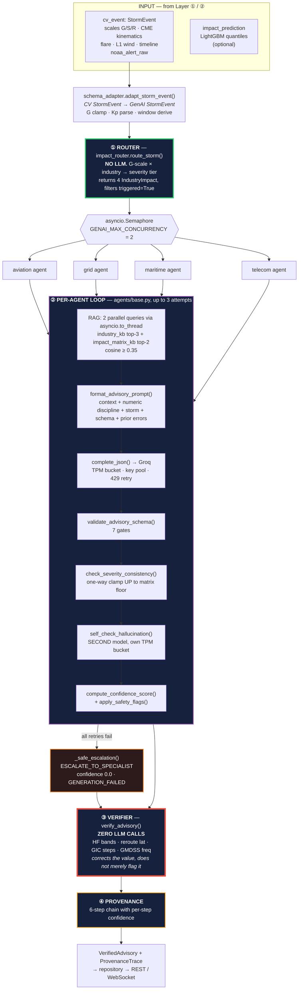
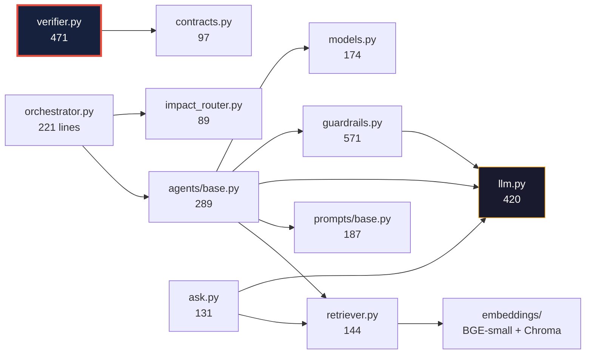
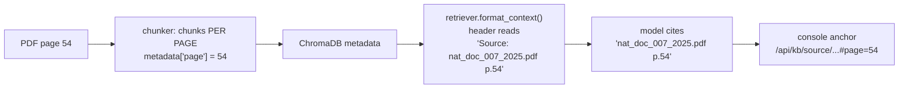
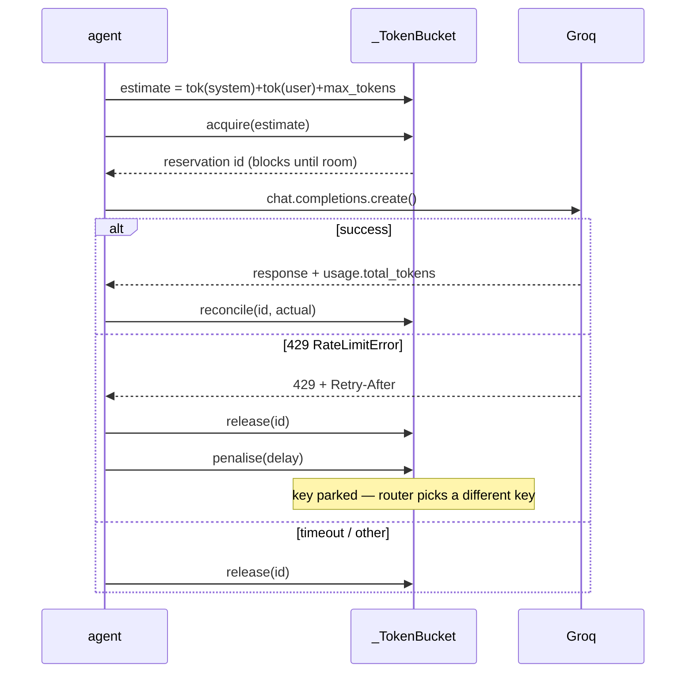
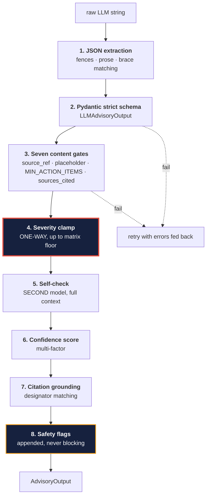
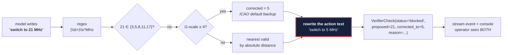
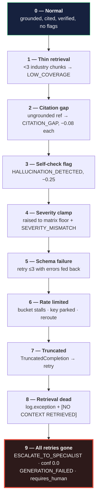

# HelioOps GenAI Layer — Technical Deep Dive

**Scope:** `backend/genai/` — 3,307 lines across 24 Python modules. This is
Layer ③ (agentic advisory generation) and Layer ④ (deterministic verification)
of the five-stage HelioOps pipeline.

**Audience:** someone who will read the source next. Every claim cites
`file:line`. Every threshold names the quantity it was derived from.

**Companion document:** [`GENAI_EXPLAINED_SIMPLY.md`](GENAI_EXPLAINED_SIMPLY.md)
covers the identical ground in plain English.

---

## Table of contents

1. [What this layer is, and what it refuses to be](#1-what-this-layer-is-and-what-it-refuses-to-be)
2. [System architecture](#2-system-architecture)
3. [Input contract — exactly what data arrives](#3-input-contract--exactly-what-data-arrives)
4. [The knowledge base — what was ingested and how](#4-the-knowledge-base--what-was-ingested-and-how)
5. [Component 1 — the deterministic router](#5-component-1--the-deterministic-router-impact_routerpy)
6. [Component 2 — RAG retrieval](#6-component-2--rag-retrieval-retrieverpy)
7. [Component 3 — prompt construction](#7-component-3--prompt-construction-promptsbasepy)
8. [Component 4 — the LLM transport](#8-component-4--the-llm-transport-llmpy)
9. [Component 5 — the agent loop](#9-component-5--the-agent-loop-agentsbasepy)
10. [Component 6 — the guardrail stack](#10-component-6--the-guardrail-stack-guardrailspy)
11. [Component 7 — the deterministic verifier](#11-component-7--the-deterministic-verifier-verifierpy)
12. [Component 8 — provenance](#12-component-8--provenance-contractspy--verifierpy)
13. [Component 9 — the operator chatbot](#13-component-9--the-operator-chatbot-askpy)
14. [End-to-end trace with real numbers](#14-end-to-end-trace-with-real-numbers)
15. [Every constant and its derivation](#15-every-constant-and-its-derivation)
16. [The degradation ladder](#16-the-degradation-ladder)
17. [Why this design is correct for this problem](#17-why-this-design-is-correct-for-this-problem)
18. [Known limits](#18-known-limits)

---

# 1. What this layer is, and what it refuses to be

## 1.1 The job

Take a structured storm event, decide which industries care, retrieve the
governing regulatory text for each, generate a numbered operational advisory per
industry, and then **mechanically re-check every operational number in that
advisory against a hard-coded rulebook before it reaches an operator.**

## 1.2 The governing constraint

A wrong HF frequency in an aviation advisory is not an embarrassing
hallucination. It is a safety incident. That single fact drives every design
decision in this layer, and it produces one architectural rule:

> **Deterministic where safety demands it, generative only where language is
> needed.**

Concretely, in this codebase:

| Decision | Who makes it | Why |
|---|---|---|
| Which industries are affected | **Hard-coded matrix** (`impact_router.py:24`) | NOAA scale definitions. Not a judgement call. |
| How severe it is for that industry | **Hard-coded matrix**, with a one-way clamp | A G5 must never render as MEDIUM because a sampler rolled differently |
| What the procedure text says | **Retrieved** from the real PDFs | The rulebooks are the authority, not the model's training data |
| How to phrase the instruction | **The LLM** | This is the only thing an LLM is genuinely better at |
| Whether the numbers are legal | **Hard-coded rule tables** (`verifier.py:32-75`) | Zero LLM calls. The model is never the last word. |

The LLM occupies exactly one slot in that table: turning a severity tier plus
retrieved regulatory text into readable, numbered, ordered steps. Everything
that could be wrong in a way that hurts someone is decided by code.

## 1.3 What it refuses to be

- **Not a chatbot over documents.** Output is a strict Pydantic schema, not prose.
- **Not a general assistant.** Four fixed industries, four fixed knowledge bases.
- **Not authoritative on severity.** The model may raise severity; it may never lower it.
- **Not trusted on numbers.** Every frequency, latitude and channel is re-checked in Python.
- **Not allowed to fail silently.** Every degradation appends a `SafetyFlag`.

---

# 2. System architecture

## 2.1 Full layer topology



**Read the colours:** green = deterministic routing, purple = the generative
region, **red = the deterministic gate that can overrule the model**, amber =
provenance, orange = the safe fallback.

The generative region is bounded on both sides by deterministic code. That
containment *is* the architecture.

## 2.2 Module dependency graph



**`llm.py` is the only module that talks to Groq.** Everything that needs a
completion goes through `complete_json()`. That single choke point is what makes
per-model rate limiting, key pooling and retry policy possible at all — there is
exactly one place to implement them.

Note `verifier.py` has **no edge to `llm.py`**. That is checkable, and it is the
strongest structural claim in the layer.

---

# 3. Input contract — exactly what data arrives

## 3.1 The seam

The CV layer's `StormEvent` and the GenAI layer's `StormEvent` are **different
types**. `backend/adapters/schema_adapter.py:42` translates between them.

### What comes in (CV `StormEvent`)

```json
{
  "storm_id": "2024-05-G5",
  "detected_at": "2024-05-10T09:12:00Z",
  "confidence": 0.96,
  "scales":  { "G": 5, "S": 3, "R": 5 },
  "cme": {
    "detected": true, "source": "SOHO/LASCO",
    "speed_km_s": 2200, "angular_width_deg": 280,
    "direction": "earth_directed",
    "arrival_estimate": "2024-05-11T06:00:00Z",
    "confidence": 0.94,
    "frame_path": "...", "bbox_norm": [0.12, 0.08, 0.88, 0.86]
  },
  "flare": { "detected": true, "class": "X5.8", "r_scale": 5, "onset": "..." },
  "l1_solar_wind": { ... },
  "timeline": [ { "horizon": "onset", "t": "..." }, ... ],
  "noaa_alert_raw": "<free text SWPC alert>"
}
```

### What the GenAI layer actually consumes

```python
GenaiStormEvent(
    alert_id                 = cv_event.storm_id,
    g_scale                  = GScale(f"G{clamp(1,5, scales['G'])}"),
    s_scale                  = f"S{s}" if s > 0 else None,
    r_scale                  = f"R{r}" if r > 0 else None,
    kp_index                 = parsed from noaa_alert_raw, else _G_TO_KP fallback,
    estimated_arrival_utc    = cv_event.cme["arrival_estimate"],
    peak_impact_window_start = timeline[horizon=="onset"].t,
    peak_impact_window_end   = peak_start + 6h,
    raw_alert_text           = noaa_alert_raw or a synthesised sentence,
)
```

## 3.2 Four things worth noting about this seam

**The G-scale is clamped to `[1,5]`** (`schema_adapter.py:47`). A malformed
detection cannot produce a `G0` or `G7` that would `KeyError` the routing
matrix.

**Kp is parsed from free text, with a deterministic fallback.** If
`noaa_alert_raw` has no parseable Kp, `_G_TO_KP` maps the G-scale to a canonical
Kp. The advisory is never blocked on a missing Kp.

**`raw_alert_text` is synthesised if absent** (`schema_adapter.py:68-73`) —
because the prompt embeds it and an empty section degrades grounding.

**The GenAI layer never sees the imagery, the bounding box, or the ML
prediction.** It receives scales, kinematics, timing and alert text. The ML
`impact_prediction` reaches only the *verifier*, and only as a provenance
confidence proxy (`verifier.py:376-379`). This is a deliberate narrow waist: the
advisory layer cannot be wrong about a pixel because it never sees one.

---

# 4. The knowledge base — what was ingested and how

## 4.1 The corpus

**17 source documents across 5 collections.** These are the real regulatory
publications, not summaries:

| Collection | Documents |
|---|---|
| `aviation_kb` | `nat_doc_007_2025.pdf` (ICAO NAT — North Atlantic ops) |
| `grid_kb` | `nerc_tpl007_4.pdf`, `nerc_benchmark_gmd.pdf`, `nerc_transformer_thermal.pdf` |
| `maritime_kb` | `itu_r_m493_dsc_system.pdf`, `itu_r_m541_dsc_operational_procedures.pdf`, `itu_r_m1173_hf_radiotelephony.pdf`, `itu_r_m1467_navtex_coverage_propagation.pdf`, `nga_pub117_radio_navigational_aids_2014.pdf` |
| `telecom_kb` | `itu_r_p372_radio_noise.pdf`, `itu_r_p531_ionospheric_propagation.pdf`, `itu_r_p533_hf_propagation_prediction.pdf`, `itu_r_p618_earth_space_propagation.pdf`, `itu_t_g8272_primary_reference_time_clock.pdf` |
| `impact_matrix_kb` | `noaa_space_weather_scales.txt`, `nesdis_impacts.pdf`, `noaa_tech_memo.pdf` |

## 4.2 Embedding and chunking

| Property | Value | Rationale |
|---|---|---|
| Embedder | `BAAI/bge-small-en-v1.5` via sentence-transformers | Local, no API cost, no egress of regulatory text |
| Normalisation | `normalize_embeddings=True` | Makes cosine the natural metric and matches Chroma's default |
| Asymmetric retrieval | `QUERY_PREFIX` applied **only** at query time | BGE convention: documents indexed bare, queries prefixed |
| Chunking | Paragraph-first (`\n\n`) → sentence fallback → token split | Fixed-size splits numbered NERC clauses mid-sentence |
| Ceiling | 512 tokens, greedy merge + overlap | Model's context limit |
| **Page granularity** | **Chunked page by page**, page number carried to Chroma metadata | This is what makes `#page=N` citation deep-links possible |
| Cache | Redis (`sha256` key, TTL 86400), fakeredis fallback | 191× speedup measured on re-ingest |
| Store | ChromaDB `PersistentClient` | Single client singleton, `paths.py`-resolved |

**Corpus size: 1,037 chunks** (was 918 before the page-level rechunk in
`0ed2e45`). *Figure taken from that commit's verification, not counted live in
this document — chromadb is not importable in the environment this was written
in.*

## 4.3 The page-number chain — a solution-specific detail

The citation deep-link works only because a page number survives four hops:



Before `0ed2e45`, `chunk_document()` joined every page with `\n\n` *before*
chunking — the page number was destroyed at ingest time, and **no amount of
frontend work could have recovered it.** The fix required re-ingesting the whole
corpus, and it cost measurable retrieval quality:

| Collection | Before | After | Δ |
|---|---|---|---|
| aviation | 0.7655 | 0.7442 | **−0.021** |
| grid | 0.8066 | 0.8019 | −0.005 |
| telecom | 0.7622 | 0.7616 | −0.001 |
| maritime | 0.6993 | 0.7065 | **+0.007** |

That −0.021 is the expected cost of chunks no longer spanning page boundaries.
It was accepted deliberately: *a citation that straddles two pages cannot point
at one anyway.* The measurement was taken before and after rather than assumed.

---

# 5. Component 1 — the deterministic router (`impact_router.py`)

**89 lines. Zero LLM calls. The authoritative source for how bad a storm is.**

## 5.1 The matrix

```python
_MATRIX = {
    "G1": {"aviation": "LOW",      "grid": "LOW",      "maritime": "NONE",     "telecom": "NONE"},
    "G2": {"aviation": "MEDIUM",   "grid": "MEDIUM",   "maritime": "LOW",      "telecom": "LOW"},
    "G3": {"aviation": "HIGH",     "grid": "HIGH",     "maritime": "MEDIUM",   "telecom": "MEDIUM"},
    "G4": {"aviation": "CRITICAL", "grid": "CRITICAL", "maritime": "HIGH",     "telecom": "HIGH"},
    "G5": {"aviation": "CRITICAL", "grid": "CRITICAL", "maritime": "CRITICAL", "telecom": "CRITICAL"},
}
```

Derived from the NOAA Space Weather Scales and NESDIS industry impact briefings
— the same `noaa_space_weather_scales.txt` that sits in `impact_matrix_kb`.

## 5.2 Why this is a lookup table and not a model

Four reasons, all specific to this problem:

1. **Reproducibility is a product requirement.** The same storm must produce the
   same severity on every run, forever. A G4 aviation advisory is CRITICAL in
   run 1 and run 1000.
2. **It is a published mapping, not a prediction.** NOAA already defines what a
   G4 means per sector. Training a model to approximate a lookup table you
   already have is strictly worse than the table.
3. **It gives the guardrails an anchor.** Without an authoritative floor,
   "the model said MEDIUM" has nothing to be checked against. §10.3 depends
   entirely on this table existing.
4. **It is auditable by a regulator.** A reviewer can read 30 lines and verify
   the whole severity policy.

## 5.3 Triggering

`_TRIGGER_TIERS = {"LOW","MEDIUM","HIGH","CRITICAL"}` — so `NONE` does not spawn
an agent. At G1, maritime and telecom generate nothing: **no advisory is better
than a "nothing is happening" advisory**, which costs tokens and trains
operators to ignore the channel.

---

# 6. Component 2 — RAG retrieval (`retriever.py`)

## 6.1 The two-query design

Each agent fires **two retrievals in parallel** (`agents/base.py:121-124`):

```python
industry_chunks, impact_chunks = await asyncio.gather(
    asyncio.to_thread(retrieve_chunks, INDUSTRY_KB_MAP[self.industry], kb_query, RAG_TOP_K),      # top 3
    asyncio.to_thread(retrieve_chunks, IMPACT_MATRIX_KB, impact_query, RAG_IMPACT_MATRIX_TOP_K),  # top 2
)
```

Two different questions:

- **Industry query** — templated per industry, e.g. aviation:
  `"HF radio frequency backup procedures polar route deviation threshold {g_scale} storm Kp {kp_index} space weather aviation operations ICAO NAT"`
  → *what does my rulebook say to do?*
- **Impact query** — `"{g_scale} storm severity impact {industry} operations"`
  → *what does NOAA say a storm this size does?*

Separating them prevents one query having to serve two intents. `asyncio.to_thread`
is required because ChromaDB and sentence-transformers are synchronous and would
block the event loop for all four agents.

## 6.2 Distance → similarity

```python
cosine_sim = max(0.0, 1.0 - dist / 2.0)
```

Chroma returns squared L2. For unit-norm vectors `‖a−b‖² = 2 − 2·cos(θ)`, so
`cos(θ) = 1 − dist/2`. The conversion is only valid **because**
`normalize_embeddings=True` at ingest. If someone disables normalisation, this
line silently produces nonsense — one of the tightest couplings in the codebase.

## 6.3 The `except` that had to become loud

```python
# A silent `except Exception: return []` used to wrap this whole function.
# When retrieval broke, the agent got zero chunks, the prompt fell back to
# "[NO CONTEXT RETRIEVED]", and the LLM produced an ungrounded advisory
# whose only citation was that placeholder string — flagged LOW_COVERAGE
# but otherwise indistinguishable from a real one.
```

Now `log.exception` fires and only the genuinely expected case (collection
absent) is swallowed quietly. **In an anti-hallucination pipeline a retrieval
failure has to be loud**, because the failure mode is not a crash — it is a
confident, ungrounded, correctly-formatted advisory.

## 6.4 Prewarming

`orchestrator._prewarm_embedder()` (`orchestrator.py:52`) builds the embedder and
Chroma client **once, on the main thread, before fan-out**. Without it, four
worker threads racing initialisation produce:

- `Cannot copy out of meta tensor` (PyTorch)
- `Could not connect to tenant default_tenant` (Chroma) — which surfaces as *an
  advisory with no retrieved context at all*

A concurrency bug that manifests as a silently ungrounded advisory rather than a
stack trace. Both singletons are also individually lock-guarded; the prewarm just
keeps the happy path off the contended route.

---

# 7. Component 3 — prompt construction (`prompts/base.py`)

## 7.1 Six sections, in this order

```
1. === RETRIEVED REGULATORY CONTEXT ===   token-budgeted chunks with headers
2. === NUMERIC DISCIPLINE ===             the generic anti-invention rule
3. === STORM EVENT ===                    scales, Kp, arrival, peak window, raw alert
4. === INDUSTRY ===                       target + minimum required severity
5. === REQUIRED OUTPUT FORMAT ===         the exact JSON schema, verbatim
6. === PREVIOUS ATTEMPT ERRORS ===        only on retry
```

Context comes **first** so the model reads evidence before the task. The schema
is injected verbatim into every prompt so it is always in scope.

## 7.2 `continue`, not `break` — a real bug fix

```python
for chunk in chunks:
    block_tokens = _token_len(block)
    if context_tokens + block_tokens > MAX_CONTEXT_TOKENS:
        continue          # <-- NOT break
```

Chunks arrive sorted by similarity descending. With `break`, one oversized
500-token PDF chunk would discard **every smaller chunk behind it** — including
the impact-matrix tail that carries the NOAA scale definitions. This became
load-bearing when the budget dropped from 4000 to ~1900 tokens.

## 7.3 The numeric discipline block — the highest-value prompt engineering here

The single largest source of genuine hallucinations, measured on the G5 storm:

| Industry | Invented figure | In the retrieved text? |
|---|---|---|
| grid | "reduce loading by at least 20%" | No |
| grid | "increase VAR reserve by 15%" | No |
| aviation | "above 60,000 ft" | No |
| aviation | "north of 78°N" | No |

**Why per-industry rules failed.** Each industry prompt already forbade
inventing values — but each did so by listing the *categories* it cared about
(GIC thresholds in A/phase, HF bands in MHz, latitude boundaries). Models treat
anything outside that list as fair game. Extending each list forever loses,
because the failure is always the same shape.

**The fix — state the rule once, generically, and give an escape hatch:**

```
Any quantity you state — percentage, frequency, altitude, latitude, current,
voltage, temperature, distance, duration, count — must appear in the RETRIEVED
REGULATORY CONTEXT above, and you must cite the source it came from.
If the context does not give you a figure, do NOT invent one and do NOT
estimate. Write the action qualitatively instead.
  Wrong: "Reduce transformer loading by at least 20%."
  Right: "Reduce transformer loading in line with the thermal limits given in
          the referenced standard."
A qualitative action that is fully grounded is worth more than a
precise-sounding one that is invented. This is checked automatically after
generation.
```

Three techniques stacked: **exhaustive category list**, **explicit alternative
behaviour** (the model wants to say *something* — give it a legal option), and
**an announced downstream check**. The last line is not decoration; telling the
model it will be audited measurably reduces invention.

## 7.4 Error feedback on retry

```
=== PREVIOUS ATTEMPT ERRORS (FIX THESE) ===
  - Only 2 action_items — at least 3 are required, ordered by urgency.
  - sources_cited list is empty — every advisory must cite at least one source
Do NOT repeat these mistakes.
```

Validation errors are fed back verbatim. The retry is **informed**, not a blind
resample at the same temperature — which at `temperature=0.1` would mostly
reproduce the same failure.

---

# 8. Component 4 — the LLM transport (`llm.py`)

**420 lines. The only place HelioOps talks to Groq.** This module replaced
`langchain-core` + `langchain-groq`, which were pulling a large dependency tree
to build two dicts and read `.choices[0].message.content`.

## 8.1 Model configuration and why each value is what it is

| Setting | Value | Reason |
|---|---|---|
| `GROQ_MODEL` | `openai/gpt-oss-120b` | Advisory generation |
| `GROQ_CHECKER_MODEL` | `openai/gpt-oss-20b` | **Different model on purpose — see §8.3** |
| `GROQ_TEMPERATURE` | `0.1` | Near-deterministic; advisories must be reproducible |
| `GROQ_MAX_TOKENS` | `1200` | Completion cap |
| `GROQ_REASONING_EFFORT` | `"low"` | **Load-bearing — see below** |
| `GROQ_REQUEST_TIMEOUT_S` | `90` | Without it a stalled connection holds a semaphore slot forever |
| `GROQ_MAX_RETRIES` | `4` | |
| `response_format` | `{"type":"json_object"}` | Provider-level JSON mode |

**The `reasoning_effort="low"` story.** `gpt-oss` are reasoning models. Their
chain-of-thought returns in a separate `reasoning` field **but is billed against
`max_tokens`**. At default effort, a full advisory prompt burns the entire
completion budget on CoT and returns `finish_reason="length"` — truncated JSON.
`"low"` is what keeps the JSON intact. Sending the parameter to a non-reasoning
model is a 400, so it is opt-in by prefix (`_REASONING_MODEL_PREFIXES`).

**The model-decommission scar.** The previous defaults —
`llama-3.3-70b-versatile`, `llama-3.1-8b-instant` — were decommissioned by Groq
and started returning `404 model_not_found`, which made **every** advisory fall
through to `ESCALATE_TO_SPECIALIST`. The config now carries the verification
command inline.

## 8.2 The sliding-window token bucket

```python
class _TokenBucket:
    """Sliding 60-second token window for one model."""
```

Groq's limit is a **rolling** TPM, not a calendar minute, so the bucket keeps
`(timestamp, tokens)` pairs and evicts anything older than 60s rather than
resetting on a tick.

**Reservations are mutated in place, not offset with a compensating negative
entry** (`llm.py:106-108`) — a correction appended later carries a later
timestamp, so it would outlive the reservation it cancels and leave the window
under-counted at the edges.

Lifecycle of one call:



**Why `penalise()` exists** (`llm.py:181-198`) — this is the subtlest bug in the
module. On a 429, merely *releasing* the failed reservation made the bucket look
**emptier**, so the router handed the same exhausted key straight back and the
call 429'd again. The retry loop slept out all its attempts on one key while the
other keys in the pool sat idle. `penalise()` backdates a full-limit entry so the
block expires ~`Retry-After` seconds from now — the server's accounting is
authoritative over the local estimate.

## 8.3 Key pooling — buckets keyed by `(model, api_key)`

```python
_buckets: dict[tuple[str, str], _TokenBucket] = {}
```

Groq meters TPM **per key AND per model**. Therefore:

- Two keys → **double** the ceiling for the same model
- A second model → **doubles it again** for the same key

`_acquire_slot()` ranks keys by headroom and prefers the emptiest, so load
spreads instead of pinning key 1.

**This is why the self-check runs on a different model.** It is not about model
quality — it is that `gpt-oss-20b` draws from a *different TPM bucket* and
therefore cannot starve the advisory pass. Verified empirically: burning 1.5k
tokens on `gpt-oss-120b` left `gpt-oss-20b`'s remaining-token counter untouched.
The same reasoning governs `ask.py` (§13).

> **This buys latency, not accuracy.** Context window is 131k and the largest
> prompt is ~3.9k — 3% utilisation. No amount of extra budget unlocks "more
> context."

## 8.4 `TruncatedCompletion` — refusing to ship half an advisory

```python
if choice.finish_reason == "length":
    raise TruncatedCompletion(...)
```

Previously the salvaged half-object was handed on as if complete: `_extract_json`
returns the partial text, and **if the braces happen to balance** it validates
into an advisory missing whatever came after the cut — most often an empty
`sources_cited`, reported as a schema error saying nothing about the real cause.
Raising routes it into the agent's normal retry with an accurate reason.

## 8.5 `Retry-After` parsing

`_parse_duration()` handles Groq's duration strings — `'4.995s'`, `'1m26.4s'`,
`'630ms'`, `'12'` — checking `retry-after`, `x-ratelimit-reset-tokens` and
`x-ratelimit-reset-requests` in order, falling back to `2^attempt + jitter`.

---

# 9. Component 5 — the agent loop (`agents/base.py`)

## 9.1 The ten steps

```
1.  Build KB query from storm parameters
2.  Retrieve industry KB + impact_matrix KB (parallel)
3.  Format context for the LLM
4.  Generate advisory (Groq + JSON mode)
5.  Validate schema, severity, citations
6.  LLM self-check for hallucinations (second model)
7.  Compute confidence score
8.  Apply safety flags
9.  Retry loop (up to MAX_RETRY_ATTEMPTS = 3)
10. Safe fallback if all retries exhausted
```

## 9.2 Agent subclasses are 26 lines each

```python
class AviationAgent(IndustryAgentBase):
    def __init__(self, stream_callback=None):
        super().__init__(
            name="aviation_agent",
            industry="aviation",
            system_prompt=AVIATION_SYSTEM_PROMPT,
            kb_query_template=AVIATION_KB_QUERY,
            stream_callback=stream_callback,
        )
```

**All four industries differ by exactly two values:** a system prompt and a KB
query template. The entire 289-line generation-validation-retry pipeline is
shared. Adding a fifth industry is a prompt, a query template, a KB, and one
registry entry — no new control flow.

## 9.3 Streaming

`_emit()` builds an `agent.thinking` event and pushes it through
`stream_callback` into the orchestrator's `asyncio.Queue`. The orchestrator
drains that queue every 50 ms while agents run (`orchestrator.py:143-155`), so
the operator sees four agents working **in parallel, live**, not a spinner.

Steps emitted: `start`, `rag_start`, `rag_done`, `gen_attempt_N`, `llm_error`,
`validation_fail`, `severity_override`, `self_check`, `self_check_fail`,
`advisory_ready`, `fallback`.

## 9.4 Bounded fan-out

```python
sem = asyncio.Semaphore(GENAI_MAX_CONCURRENCY)   # 2
```

Firing all four industries at once put **~26k tokens into an 8k/min window in
one burst** — 3.3× over the ceiling, and ~79k across the retry loop. The token
bucket would absorb it by stalling, but bounding fan-out keeps each burst small
enough that it mostly never has to. Concurrency 2 is the compromise between
latency and thrash.

---

# 10. Component 6 — the guardrail stack (`guardrails.py`)

**571 lines — the largest module in the layer. Eight techniques.**



## 10.1 JSON extraction (`_extract_json`)

Three strategies in order: markdown fence regex → first `{` → **brace-depth
matching** to find the true closing brace. Handles fenced JSON, bare JSON, and
JSON wrapped in prose. Truncated JSON returns partial text and fails parsing,
which correctly triggers retry.

## 10.2 The seven content gates

Beyond Pydantic, `validate_advisory_schema()` enforces:

| # | Gate | Why it exists |
|---|---|---|
| 1 | Every `action_item.source_ref` present, ≥3 chars | An uncited instruction is unusable in a regulated context |
| 2 | **No placeholder-as-action** | The prompt tells the model to emit `"SOURCE UNAVAILABLE — consult specialist"` when nothing is retrieved — but it also reaches for it *mid-advisory* when one step is uncovered, shipping it as an operational instruction. Retrying produces a grounded step instead. |
| 3 | `len(action_items) >= MIN_ACTION_ITEMS` (3) | **Observed:** maritime shipped 1 item and telecom 2 while both KBs held 160+ chunks. An operations advisory with one step is not an advisory. |
| 4 | `sources_cited` non-empty | |
| 5 | Enum coercion (`Industry`, `SeverityTier`) | |
| 6 | System fields injected server-side (`advisory_id`, `generated_at`) | **The model never supplies its own ID or timestamp** |
| 7 | `AdvisoryOutput` construction | |

Gate 2 is the subtle one. It is a case of a prompt instruction being *correctly
followed in the wrong place* — and it is only catchable in code.

## 10.3 The one-way severity clamp

**The most safety-critical guardrail in the layer.**

```python
if not consistent:
    original = parsed.severity.value
    parsed.severity = SeverityTier(severity)          # clamp UP to matrix floor
    parsed.safety_flags.append(SafetyFlag.SEVERITY_MISMATCH)
    parsed.generation_errors.append(
        f"Severity raised from LLM value '{original}' to matrix floor '{severity}'")
```

**It used to flag and publish the model's lower value.** That was wrong:

- The G-scale matrix comes from **NOAA scales**, not a language model. A model
  reading a G5 as MEDIUM is simply wrong.
- Shipping MEDIUM means **an operator reads "moderate" for an extreme storm.**
- The flag alone is not enough — it is one entry in a `safety_flags` list that
  a dashboard may not surface at all.

**Asymmetric on purpose.** Under-reporting is the dangerous direction, so it is
corrected. **Over-reporting is left alone** — the model may raise severity above
the floor, because it can see storm specifics (S-scale, R-scale, CME speed) that
the G-keyed matrix cannot.

`SeverityTier` implements `__lt__`/`__gt__`/`__ge__` over an explicit rank map
(`models.py:33-45`) so comparison is ordinal, not alphabetical.

## 10.4 The self-check — and the bug that made it worthless

A **second LLM, on a different model**, audits the advisory against the same
context the generator saw. Its system prompt is precise about scope:

**Flag:** specific numbers not in context, regulation codes not in context, named
procedures not in context.
**Do not flag:** general reasoning that follows from context, severity consistent
with the stated scale, time windows derived from arrival time, standard
terminology without numeric claims.

### The bug

The checker previously took the top `SELF_CHECK_MAX_CHUNKS` and truncated to
`MAX_CONTEXT_TOKENS * 2` chars, then **`break`** on the first chunk that did not
fit. Measured on the G5 aviation advisory: **the auditor saw 1 of 5 chunks — 35%
of the generator's context.**

An auditor shown a third of the evidence flags grounded claims as unsupported.
And it did: `HALLUCINATION_DETECTED` fired on **nearly every advisory in every
run**.

> **A signal that is always on carries no information.**

### The fix

`build_self_check_context()` (`guardrails.py:387`) budgets at 4 chars/token
against the **same** context budget the generator had, and uses `continue` — skip
one oversized chunk, keep the rest. If any chunk is still dropped, it logs a
warning that the verdict may over-flag.

### `SELF_CHECK_BLOCKING = False` — a measured decision

Regeneration on a flag used to be unconditional, and it was **the single most
expensive thing in the layer**:

| | Cost |
|---|---|
| Advisories flagged on the G5 storm | 3 of 4 industries |
| Token spend | **3×** |
| Run time | ~90s → **344s** |
| Did the retry help? | **Rarely** |

The checker flags specific numerics (`"225 A/phase"`, `"2.8-18 MHz"`) that the
model re-derives from the same context on retry — so the second attempt flags
too, and the code keeps the flagged advisory anyway once attempts run out. **Same
output, 3× the tokens.**

Default is now: flag it, **score it down by `SELF_CHECK_CONFIDENCE_PENALTY = 0.25`**,
ship it for human review. The penalty exists because otherwise *"a flagged
advisory can still surface with a 0.96 confidence score next to a clean one"* —
the flag has to cost something or it is decoration.

## 10.5 Citation matching — the hardest correctness problem here

### The original bug

Matching was `ref in src or src in ref` on lowercased strings, which only ever
matched a citation reproducing the filename **verbatim**. Models cite the way a
human would:

| Model writes | Actual filename | Old result |
|---|---|---|
| `ITU-R M.541` | `itu_r_m541_dsc_operational_procedures.pdf` | ✗ CITATION_GAP |
| `NERC TPL-007-4` | `nerc_tpl007_4.pdf` | ✗ CITATION_GAP |
| `ICAO NAT Doc 007` | `nat_doc_007_2025.pdf` | ✗ CITATION_GAP |

Every one was scored as a gap **and docked confidence via `CITATION_PENALTY`** —
so *correctly-cited advisories were penalised for citing correctly.* This became
severe once maritime and telecom became ITU-R corpora whose names are all
standard designators.

### The fix — designator extraction

```python
def _designators(text):
    """Standard identifiers: m541, p618, tpl007, doc007 …"""
```

Two patterns: **embedded runs** (`m541`, `tpl0074` — letter-run + digit-run
inside one token) and **separated runs** (`"TPL" "007"` → `tpl007`).

Resolution order in `citation_matches()`:

1. `strip_page_suffix()` — drop a trailing page locator
2. Reject `_NON_CITATIONS` (`"source unavailable"`, `"n/a"`, …)
3. **Exact filename match** (short-circuit)
4. **Designator intersection** → match
5. **Both have designators but they differ** → **explicit non-match.**
   `"NERC TPL-999-9"` must not match `nerc_tpl007_4.pdf` just because both say NERC
6. Fallback: ≥ `_MIN_SHARED_WORDS` (3) significant words

Step 5 is the discriminating one — it prevents the fallback from rescuing a
citation of a *different* standard by the same body.

### Two traps closed inside this function

**The `ITU-R P.618` trap.** ITU recommendations are named `P.618`, `M.493`. A
naive trailing-page regex reads `618` as a page number and mangles the ref into
`"ITU-R"`. So `strip_page_suffix()` is deliberately conservative — a suffix is
removed **only** when the ref actually names a file (`\.(pdf|txt|md)`) **or** the
locator says `pp.` / `page` outright. Caught by an existing test, now pinned by
`TestPageSuffix`.

**The self-match trap.** Once the page suffix is stripped, a short name like
`"x.pdf"` **failed to match itself** — the word-overlap fallback needs 3
significant words and `"x"` + stopword `"pdf"` yields zero. Hence the explicit
exact-filename short-circuit at step 3.

**The placeholder trap.** `_MIN_SHARED_WORDS = 3` rather than 2 because
`"SOURCE UNAVAILABLE — consult space weather specialist"` shares *"space"* and
*"weather"* with `noaa_space_weather_scales.txt` — enough for a 2-word match.
The placeholder was very nearly counting as a valid citation.

## 10.6 Confidence scoring

```python
score = context_quality                              # mean cosine similarity
for item in advisory.action_items:
    score += CITATION_BONUS   if grounded else -CITATION_PENALTY   # +0.02 / -0.08
if context_quality > 0.6:
    score += COVERAGE_BONUS                                        # +0.10
return round(clamp(0.0, 1.0, score), 4)
```

**The asymmetry is the point.** A missing citation costs `0.08`; a present one
earns `0.02` — **4× penalty-to-bonus**. Grounding is the default expectation,
not an achievement. Then §10.4's `−0.25` self-check penalty applies on top.

## 10.7 Safety flags — and the maritime discovery

Six flags, all appended by guardrails, **never by the LLM** (`models.py:55`).
None blocks delivery.

`LOW_COVERAGE` carries the best story in the module. It used to measure
`len(chunks)` — the **combined** industry + impact_matrix set. But every industry
always receives 2 impact_matrix chunks (generic NOAA scale definitions, *not*
industry grounding), so the effective floor was 2 and the flag could only fire
when an industry KB was completely empty.

**`maritime_kb` returns exactly 2 chunks, and they come from a 2-page publisher
catalogue page rather than the GMDSS manual itself.** Combined with the 2 generic
chunks that reached 4, cleared the threshold of 3, and **maritime shipped as the
highest-confidence, zero-flag industry in every run while being the least
grounded of the four.**

The fix — count industry chunks only:

```python
coverage = industry_chunk_count if industry_chunk_count is not None else len(chunks)
```

A metric that averaged two different things and hid the one that mattered.

---

# 11. Component 7 — the deterministic verifier (`verifier.py`)

**471 lines. Zero LLM calls. The part nobody else has.**

## 11.1 The authoritative rule tables

```python
ICAO_NAT_HF_BANDS_MHZ = {3, 5, 8, 11, 17}              # ICAO NAT Doc 007
REROUTE_LAT_THRESHOLDS = {3: 78, 4: 70, 5: 60}         # by G-scale
NERC_GIC_STEPS = {"operating procedure", "gmd operating procedure",
                  "real-time assessment", "thermal monitoring",
                  "reactive power monitoring", "load shedding",
                  "transformer protection", "voltage reduction",
                  "controlled separation"}              # NERC TPL-007-4 App. B
GMDSS_VALID_FREQUENCIES_KHZ = {2182, 4125, 6215, 8291, 12290, 16420,
                               156800, 2187.5, 8414.5}
GMDSS_VALID_CHANNELS = {"ch 16", "channel 16", "2182 khz", "inmarsat",
                        "navtex", "epirb", "sart", "dsc", "nbdp", ...}
```

## 11.2 The canonical example — the 21 MHz block



**It corrects the value; it does not merely flag it.** A flag says "something
may be wrong here" and leaves an operator to work out what. The verifier rewrites
the action string and records the original — the operator sees both what the
model proposed and what the rules enforced.

## 11.3 The accumulation bug

```python
current = action   # corrections accumulate — each derived from the previous
```

`verify_advisory` keeps only the **last** corrected string. Computing every
correction against the original `action` meant an action naming **two** invalid
frequencies had the first correction **silently discarded** and shipped with one
bad value still in it. Fixed identically in `_check_hf_frequencies`,
`_check_reroute_latitude` and `_check_gmdss_channels`.

## 11.4 The four rule families

| Rule | Industries | Can block? | Notes |
|---|---|---|---|
| `hf_band` | aviation, maritime | **Yes** | G≥4 → 5 MHz; else nearest valid |
| `reroute_latitude` | aviation | **Yes** | Ignores numbers <30 or >90 — not latitudes |
| `gic_step` | grid | No | Recognition only; no valid step = no check emitted |
| `gmdss_channel` | maritime | Recognition | Confirms the advisory names something real |
| `gmdss_frequency` | maritime | **Yes** | See below |

**`GMDSS_VALID_FREQUENCIES_KHZ` used to be declared and never read.** Nothing in
the verifier looked at maritime frequencies at all — so an action telling a
vessel to guard a distress watch on a frequency **that does not exist** emitted
no check whatsoever and the advisory came back `"passed"`.

> **Distress frequency is exactly the value that must not be wrong.**

And the corrected text was initially discarded (`for check, _ in gmdss_results`),
which would have **recorded the correction in the trace while shipping the bad
value** — the worst possible combination, because the audit trail would show a
fix that never happened.

## 11.5 `not_applicable` — refusing to claim unearned verification

```python
if not all_checks:
    status = "not_applicable"     # NOT "passed"
```

`"passed"` previously covered both *"every check succeeded"* and *"there were no
checks."* **Telecom has no rule set at all** and was reporting `"passed"` having
been verified against nothing. A verifier that reports success for work it did
not do is worse than no verifier.

## 11.6 Human escalation

```python
requires_human = (
    has_blocked
    or advisory.confidence_score < 0.5
    or any(f.value == "GENERATION_FAILED" for f in advisory.safety_flags)
)
```

---

# 12. Component 8 — provenance (`contracts.py` + `verifier.py`)

Every advisory carries a **6-step chain**, each step with its own confidence:

| Step | `ref` | Confidence source |
|---|---|---|
| `raw_data` | NOAA alert text | `1.0` if alert text >20 chars, else `0.5` |
| `detection` | `StormEvent:{storm_id}` | CV layer's own confidence |
| `impact` | `ImpactAssessment:{storm_id}` | HF blackout probability, or `0.95` CI level |
| `retrieval` | `{source} :: {ref}` | `0.9` if real sources cited, `0.3` if `UNKNOWN` |
| `verifier` | `"3 passed; 1 blocked (21 -> 5)"` | **pass rate** = passed / total checks |
| `output` | `VerifiedAdvisory:{id}` | final advisory confidence |

The verifier step's `ref` is generated by `_verifier_summary()` and is
human-readable: `"3 passed; 1 blocked (21 -> 5)"`.

> ⚠️ **This chain is produced, persisted to its own repository table, and
> returned in the API response — but the current dashboard does not render it.**
> See `docs/dashboard_features.md` §T1-1.

---

# 13. Component 9 — the operator chatbot (`ask.py`)

**131 lines, composing pieces that already existed.**

```
POST /api/ask {industry, question, advisory_id?}
  → retrieve_chunks(INDUSTRY_KB_MAP[industry], question, RAG_TOP_K)
  → result_repo.get_advisory(advisory_id)
  → complete_json(..., model=GROQ_CHECKER_MODEL)
  → {"answer": str, "sources_cited": [str]}
```

**Scoped, not global.** One industry, one advisory. The card already knows both,
so the agent never asks *"which domain?"* — the worst possible first question. A
floating assistant would have to.

**Runs on the checker model** — a different TPM bucket, so chat **can never
starve a pipeline run**. That is the entire reason not to reuse `GROQ_MODEL`.

**Three refusals:**

1. **Will not invent.** The prompt permits *"the knowledge base does not cover
   that"* outright — same posture as the guardrail layer.
2. **Will not surface an ungrounded citation.** Answers are filtered against the
   retrieved chunks (`ask.py:127-130`) — otherwise the operator clicks it and
   gets a 404 from `/api/kb/source`.
3. **Will not fail the card.** A dead LLM returns `_UNAVAILABLE`, never a 500.

Input is capped at `MAX_QUESTION_CHARS = 500` and rate-limited per client at 5s
in its own dict beside `_pipeline_calls` — because an operator holding down send
spends quota even from a separate bucket.

---

# 14. End-to-end trace with real numbers

**Storm `2024-05-G5`, aviation agent.**

```
INPUT
  cv_event.scales = {G:5, S:3, R:5}, confidence 0.96
  cme.speed_km_s = 2200, arrival 2024-05-11T06:00:00Z

ADAPT                                 schema_adapter.py:42
  → GenaiStormEvent(g_scale=G5, s_scale=S3, r_scale=R5, kp_index≈9.0)

ROUTE                                 impact_router.py:61          [NO LLM]
  → _MATRIX["G5"]["aviation"] = "CRITICAL"   triggered=True
  → all four industries triggered

RETRIEVE (parallel)                   retriever.py:25
  aviation_kb    ← "HF radio frequency backup procedures polar route
                    deviation threshold G5 storm Kp 9.0 ..."      top-3, cos ≥ 0.35
  impact_matrix  ← "G5 storm severity impact aviation operations"  top-2
  → 5 chunks, context_quality = mean cosine ≈ 0.74

PROMPT                                prompts/base.py:52
  context (≤1900 tok) + numeric discipline + storm + INDUSTRY:CRITICAL + schema
  → ~2288 input tokens measured at K=3

GENERATE                              llm.py:262
  bucket.acquire(~3488)  → key with most headroom
  gpt-oss-120b, temp 0.1, JSON mode, reasoning_effort=low
  → raw JSON

VALIDATE                              guardrails.py:86
  extract → Pydantic → source_ref ✓ → placeholder ✗ → ≥3 items ✓ → sources ✓

SEVERITY                              guardrails.py:191
  LLM said CRITICAL ≥ matrix CRITICAL → consistent, no clamp

SELF-CHECK                            guardrails.py:422
  gpt-oss-20b (DIFFERENT bucket), temp 0.0, sees ALL 5 chunks
  → hallucinations_found: false

SCORE                                 guardrails.py:499
  0.74 base  +0.02×N grounded  +0.10 coverage bonus  → ≈0.86

VERIFY                                verifier.py:250              [NO LLM]
  action "…fall back to 21 MHz…"
  21 ∉ {3,5,8,11,17} → G5 ≥ 4 → corrected_to = 5
  action text rewritten → "…fall back to 5 MHz…"
  status = passed_with_corrections, requires_human = True

PROVENANCE                            verifier.py:394
  raw_data 1.0 → detection 0.96 → impact 0.95 → retrieval 0.9
  → verifier 0.75 (3/4 passed) → output 0.86

OUT
  VerifiedAdvisory + ProvenanceTrace → repository → REST + WebSocket
```

**Total wall time ≈ 65–80s for all four industries.** Almost all of it is the
LLM pass; retrieval is sub-second and the verifier is microseconds.

---

# 15. Every constant and its derivation

| Constant | Value | Derived from |
|---|---|---|
| `GROQ_TEMPERATURE` | 0.1 | Advisories must be reproducible |
| `GROQ_REASONING_EFFORT` | `"low"` | CoT bills against `max_tokens`; default effort truncates the JSON |
| `GROQ_MAX_TOKENS` | 1200 | Completion cap |
| `GROQ_CHECKER_MAX_TOKENS` | 512 | Verdict JSON is small |
| `GROQ_TPM_LIMIT` | 8000 | Free-tier Groq meters 8k tokens/min **per model** |
| `GROQ_MAX_RETRIES` | 4 | |
| `GROQ_REQUEST_TIMEOUT_S` | 90 | Normal calls observed at 1–6s |
| `GENAI_MAX_CONCURRENCY` | 2 | 4-way fan-out = ~26k tokens into an 8k window |
| `MAX_PROMPT_TOKENS` | 3000 | Measured; see below |
| `PROMPT_FIXED_OVERHEAD_TOKENS` | 1100 | System prompt + schema + storm section |
| `MAX_CONTEXT_TOKENS` | 1900 | `MAX_PROMPT_TOKENS − overhead` |
| `RAG_TOP_K` | 3 | Measured; see below |
| `RAG_IMPACT_MATRIX_TOP_K` | 2 | Generic scale definitions — 2 is enough |
| `RAG_MIN_SIMILARITY` | 0.35 | Cosine floor |
| `RAG_LOW_COVERAGE_THRESHOLD` | 3 | Below 3 **industry** chunks → `LOW_COVERAGE` |
| `MIN_ACTION_ITEMS` | 3 | Observed 1-item maritime, 2-item telecom advisories |
| `MAX_RETRY_ATTEMPTS` | 3 | |
| `SELF_CHECK_CONFIDENCE_PENALTY` | 0.25 | Flag must cost something |
| `LOW_CONFIDENCE_THRESHOLD` | 0.50 | |
| `CITATION_PENALTY` | 0.08 | **4× the bonus** — grounding is the default expectation |
| `CITATION_BONUS` | 0.02 | |
| `COVERAGE_BONUS` | 0.10 | Applied when `context_quality > 0.6` |
| `_MIN_SHARED_WORDS` | 3 | 2 lets the "SOURCE UNAVAILABLE" placeholder match |
| `MAX_QUESTION_CHARS` | 500 | Chat input cap |

## 15.1 The `RAG_TOP_K` measurement

Citation validity on the G5 anchor storm — fraction of action items whose
`source_ref` resolves to a chunk actually retrieved:

| Setting | Validity | Mean input tokens | Wall time |
|---|---|---|---|
| **K=3 / 1900-token context** | **95%** | **2288** | **~86s** |
| K=5 / 3200-token context | 100% | 2829 | ~129s |
| K=8 / 6000-token context | 100% | 3624 | — |

**The config explicitly refuses to over-read this**, and that honesty is worth
more than the number:

> *Treat that 95→100 as noise, not a result: it is one sample per cell, and a
> later K=5 run produced a CITATION_GAP that the K=5 sample above did not. Two of
> the four industries cannot respond to K at all — maritime_kb returns only 2
> chunks over the similarity floor and telecom_kb is empty — so K moves at most
> half the output, and not reliably.*

Default is the cheap setting: K=5 costs +50% wall time for an unproven gain on
one free-tier key. With `GROQ_API_KEYS` pooled the latency largely disappears and
K=5 becomes the better default. **Raise `RAG_TOP_K` and `MAX_PROMPT_TOKENS`
together.**

> ⚠️ The comment says `telecom_kb` is empty. Five telecom PDFs and
> `ingest_telecom.py` exist, and `0ed2e45` touched that ingest script — so the
> comment may be stale. **Verify with `count_collection("telecom_kb")` before
> repeating the claim.**

---

# 16. The degradation ladder

Every rung produces a usable output. Nothing raises to the operator.



**The floor is a valid advisory** (`agents/base.py:252`): summary states the
storm and severity from the *deterministic* matrix, one action —
`"ESCALATE TO SPECIALIST"` — `confidence_score = 0.0`, `validation_passed =
False`, `GENERATION_FAILED`, and the first five errors attached for diagnosis.

Even total LLM failure produces something an operator can act on, carrying a
severity that came from NOAA rather than from a model.

---

# 17. Why this design is correct for this problem

Each subsection names the alternative before defending the choice.

## 17.1 Why not fine-tune a model on the rulebooks?

**Alternative:** fine-tune on ICAO/NERC/ITU corpora, skip retrieval.

**Why RAG wins here:**

- **Citation is a product requirement, not a nicety.** A fine-tuned model
  produces fluent text with no verifiable provenance. Our operator clicks
  `nat_doc_007_2025.pdf p.54` and lands on the page. A fine-tune cannot do that.
- **The rulebooks change.** ICAO NAT Doc 007 is versioned (`_2025`). Re-ingesting
  is minutes; re-training is a project.
- **Regulatory text is the authority.** Baking it into weights makes it
  *unverifiable* — precisely the property regulated operators cannot accept.
- **Volume doesn't justify it.** 17 documents, ~1,037 chunks. Nowhere near the
  scale where fine-tuning beats retrieval.

## 17.2 Why not let the LLM decide severity?

**Alternative:** the model reads the storm and assigns severity.

**Why the matrix wins:** NOAA already publishes this mapping. Reproducibility is
a requirement. And critically — without a deterministic floor, §10.3 has nothing
to check against. **The matrix is what makes the guardrail possible at all.**

The design still allows the model to *raise* severity, because the model sees
S-scale, R-scale and CME kinematics that a G-keyed table cannot.

## 17.3 Why a deterministic verifier instead of a stronger model?

**Alternative:** use a bigger model, or an LLM-as-judge, to catch bad numbers.

**Why deterministic wins — four reasons specific to this domain:**

1. **The valid sets are small, closed and published.** ICAO NAT HF bands are
   `{3,5,8,11,17}`. That is not a judgement — it is a set membership test. Using
   a probabilistic system to evaluate a closed set is strictly worse.
2. **It cannot itself hallucinate.** An LLM judge has the same failure mode as
   the LLM it judges. `verifier.py` has no import of `llm.py` — structurally
   checkable.
3. **It corrects rather than flags.** A judge outputs an opinion. The verifier
   rewrites the action text and records both values.
4. **Free and instant.** Microseconds, zero tokens, no rate limit. It runs on
   every advisory including the fallback.

## 17.4 Why two different models rather than one?

Not about quality. **Groq meters TPM per `(key, model)`**, so the checker draws
from an independent budget and cannot starve the advisory pass. Verified
empirically. The same reasoning makes the chatbot free, budget-wise.

A secondary benefit: an auditor that is a *different* model has different priors
than the generator, so it is less likely to share the generator's blind spots.

## 17.5 Why flags instead of blocking?

**Alternative:** refuse to deliver a flagged advisory.

**Why flagging wins:** during a G5 storm, **no advisory is worse than a flagged
one.** An operator with a flagged, cited, verified advisory and a visible
`requires_human` marker is better off than one with a blank screen. Severity is
still clamped to the deterministic floor, so the *dangerous* direction is closed
by code — flags cover the rest.

## 17.6 Why in-prompt JSON schema plus Pydantic plus content gates?

Three layers because each catches a different failure:

- **JSON mode** — provider-level; guarantees parseable JSON, not *correct* JSON
- **Pydantic** — types, enums, required fields
- **Content gates** — semantics no schema can express: *"3 items minimum"*,
  *"no placeholder as an action"*, *"sources_cited non-empty"*

Gate 2 in §10.2 is the proof this layering is needed: the placeholder is a
perfectly valid JSON string of a perfectly valid type in a perfectly valid field.
Only a semantic check catches it.

## 17.7 Why bounded fan-out rather than firing all four?

Measured: 4-way fan-out put ~26k tokens into an 8k/min window — **3.3× over** —
and ~79k across the retry loop. The bucket would absorb it by stalling, but
stalling *is* the latency. Concurrency 2 keeps each burst inside the window so
the bucket rarely has to intervene.

---

# 18. Known limits

Stated here so nothing in this document oversells the layer.

1. **`telecom` has no verifier rule set.** It correctly reports
   `not_applicable`, but that means one of four industries ships with no
   deterministic number checking.
2. **`maritime_kb` grounding is thin.** It returns exactly 2 chunks over the
   similarity floor, from a publisher catalogue page rather than the GMDSS manual.
   `LOW_COVERAGE` now fires correctly, but the underlying corpus gap is real.
3. **`telecom_kb` may be empty** — the config comment says so; five telecom PDFs
   and an ingest script exist. **Verify before quoting either way.**
4. **`gic_step` cannot block.** It is recognition only — an absent valid step
   emits no check at all rather than a failure.
5. **The self-check is advisory.** With `SELF_CHECK_BLOCKING=false`, a flagged
   advisory ships with a penalty. That is the right economic trade, but it is a
   trade.
6. **Confidence is heuristic.** `context_quality ± citation adjustments` is a
   reasonable proxy, not a calibrated probability. It should not be read as one.
7. **The 6-step provenance chain is not rendered by the dashboard**
   (`docs/dashboard_features.md` §T1-1).
8. **Quota accounting is process-local.** A second process sharing the key is
   invisible to the bucket.
9. **`RAG_TOP_K` measurements are one sample per cell.** The config says so; this
   document repeats it deliberately.

---

*Written from a full read of `backend/genai/` at `9b19b85`. Every threshold,
bug narrative and measurement in this document is taken from the source comments
and commit record, not reconstructed.*
