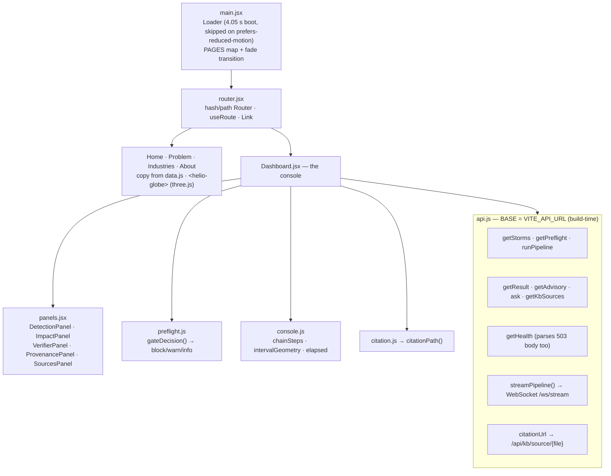
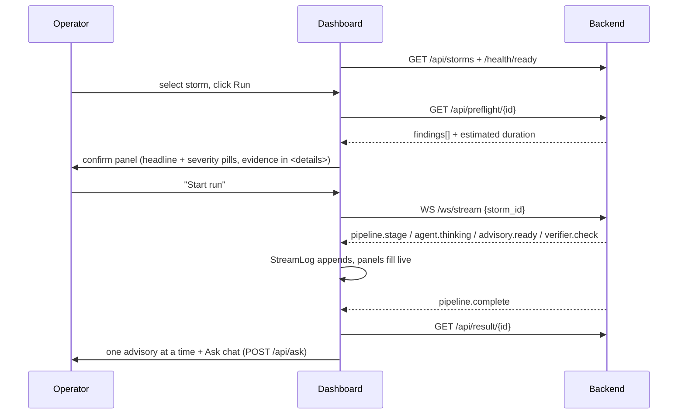

# Frontend Layer — Architecture

**Job:** a static Vite + React 18 SPA that is two things at once — a marketing site
(hardcoded copy in `src/data.js`) and a live operator console (`src/Dashboard.jsx`)
driving the real backend over REST + WebSocket. No framework router, no state library,
no CSS framework. Three dependencies: `react`, `react-dom`, `three`.



## Console run flow



Preflight **warns, never blocks**: if the preflight call itself fails, the run starts anyway.

## API base — the one configuration that matters

`BASE = import.meta.env.VITE_API_URL ?? ''`, inlined at **build** time.

| Deployment | `VITE_API_URL` | Why |
|---|---|---|
| dev | empty | `vite.config.js` proxies `/api`, `/health`, `/metrics`, `/ws` to `127.0.0.1:8000` |
| single origin (one container) | empty | relative paths already hit the API |
| split (Vercel SPA + Space API) | **the API origin** | `vercel.json` rewrites `/(.*)` → `/index.html`, so `fetch('/api/storms')` returns the HTML shell with a **200** and dies in `res.json()` |

The variable is `VITE_API_URL` — not the Next-era `NEXT_PUBLIC_API_URL`, which nothing reads.
A runtime env var does nothing; pass it as a Docker build arg / Vercel build env.

## Conventions

- Plain `useState`/`useEffect`; the only shared context is the router's.
- CSS is per-area files (`index.css`, `home.css`, `pages.css`, `shell.css`, `dashboard.css`,
  `loader.css`). Timing constants are duplicated in JS and CSS and marked with a comment —
  keep them in step (`LEAVE_MS` ↔ `helioPageOut`, `BOOT_MS` ↔ loader timeline).
- `helio-globe.js` registers a `<helio-globe>` custom element and pins `window.THREE`;
  the model is `public/models/earth.glb`, cache-immutable via `vercel.json` headers.
- Citation parsing lives in `citation.js`, separate from `api.js`, so `npm test`
  (`node src/data.test.mjs`) can reach it without `import.meta.env`.

## Commands

```bash
npm ci && npm run dev      # :3000, proxying to uvicorn on :8000
npm run build              # -> dist/
npm test                   # node src/data.test.mjs
```

## Gotchas

- `getHealth()` must **not** go through the throwing `json()` helper: `/health/ready`
  answers 503 with the same body when degraded, and routing it through `json()` made every
  degraded state render as "unreachable" with no check pills.
- The backend's CORS origin list must contain the SPA origin, or the WebSocket 403s and it
  reads as a backend fault.
